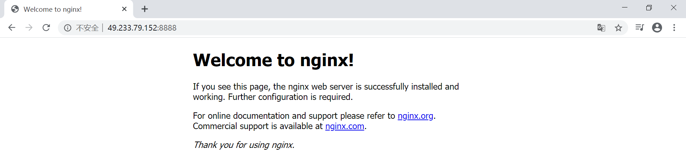

### 1.搜索nginx镜像
```shell
ubuntu@VM-0-4-ubuntu:~$ sudo docker search nginx
NAME                               DESCRIPTION                                     STARS               OFFICIAL             AUTOMATED
nginx                              Official build of Nginx.                        13374               [OK]
jwilder/nginx-proxy                Automated Nginx reverse proxy for docker con…   1828                [OK]
richarvey/nginx-php-fpm            Container running Nginx + PHP-FPM capable of…   778                 [OK]

. . . . . .
```

### 2.下载nginx镜像
```shell
# 查看本地所有镜像
ubuntu@VM-0-4-ubuntu:~$ sudo docker images
REPOSITORY          TAG                 IMAGE ID            CREATED             SIZE
ubuntu              latest              74435f89ab78        7 days ago          73.9MB
ubuntu              18.04               8e4ce0a6ce69        7 days ago          64.2MB
mysql               latest              be0dbf01a0f3        2 weeks ago         541MB
hello-world         latest              bf756fb1ae65        5 months ago        13.3kB

# 从远程仓库中下载 nginx 镜像
ubuntu@VM-0-4-ubuntu:~$ sudo docker pull nginx
Using default tag: latest
latest: Pulling from library/nginx
8d69e59170f7: Pull complete
3f9f1ec1d262: Pull complete
d1f5ff4f210d: Pull complete
1e22bfa8652e: Pull complete
Digest: sha256:21f32f6c08406306d822a0e6e8b7dc81f53f336570e852e25fbe1e3e3d0d0133
Status: Downloaded newer image for nginx:latest
docker.io/library/nginx:latest

# 再次查看本地所有镜像，验证是否下载成功
ubuntu@VM-0-4-ubuntu:~$ sudo docker images
REPOSITORY          TAG                 IMAGE ID            CREATED             SIZE
ubuntu              latest              74435f89ab78        7 days ago          73.9MB
ubuntu              18.04               8e4ce0a6ce69        7 days ago          64.2MB
nginx               latest              2622e6cca7eb        2 weeks ago         132MB
mysql               latest              be0dbf01a0f3        2 weeks ago         541MB
hello-world         latest              bf756fb1ae65        5 months ago        13.3kB
```

### 3. 启动nginx
```shell
# 以后台运行的方式启动nginx : docker run -d <image name>
# -d : 后台运行， 
# --name : 为容器起别名
# -p 8888:88 : 暴露端口，-p 宿主机端口:容器内部端口
ubuntu@VM-0-4-ubuntu:~$ sudo docker run -d --name MyNginx -p 8888:80 nginx
8438eaf75dbdcae96602fd91035cf550e8a3a4634bfc17a92e63f2325fc15064

# 查看当前正在运行的容器，验证 nginx 服务是否已启动
ubuntu@VM-0-4-ubuntu:~$ sudo docker ps
CONTAINER ID        IMAGE               COMMAND                  CREATED             STATUS              PORTS              NAMES
8438eaf75dbd        nginx               "/docker-entrypoint.…"   9 seconds ago       Up 7 seconds        0.0.0.0:8888->80/tcp   MyNginx

# 使用 curl <ip:port> 进行本地测试，从返回的结果发现 nginx 部署成功 
# 也可以通过外网访问连接 http://ip:8888 来测试，如下图所示
ubuntu@VM-0-4-ubuntu:~$ sudo curl localhost:8888
<!DOCTYPE html>
<html>
<head>
<title>Welcome to nginx!</title>
<style>
    body {
        width: 35em;
        margin: 0 auto;
        font-family: Tahoma, Verdana, Arial, sans-serif;
    }
</style>
</head>
<body>
<h1>Welcome to nginx!</h1>
<p>If you see this page, the nginx web server is successfully installed and
working. Further configuration is required.</p>

<p>For online documentation and support please refer to
<a href="http://nginx.org/">nginx.org</a>.<br/>
Commercial support is available at
<a href="http://nginx.com/">nginx.com</a>.</p>

<p><em>Thank you for using nginx.</em></p>
</body>
</html>
```

*通过外网访问连接 http://ip:8888 来测试 nginx 是否部署成功*




### 4. 修改nginx配置
```shell
# 查看当前正在运行的容器
ubuntu@VM-0-4-ubuntu:~$ sudo docker ps                                                                               
CONTAINER ID        IMAGE               COMMAND                  CREATED             STATUS              PORTS                   NAMES
8438eaf75dbd        nginx               "/docker-entrypoint.…"   14 minutes ago      Up 14 minutes       0.0.0.0:8888 80/tcp     MyNginx                  

# 根据容器 NAME 进入当前正在运行的 nginx 容器( docker exec -it : 特征为进入容器后开启一个新的终端 )
ubuntu@VM-0-4-ubuntu:~$ sudo docker exec -it MyNginx /bin/bash       

# 查找 nginx 的配置文件目录
root@8438eaf75dbd:/# whereis nginx                                                                                   
nginx: /usr/sbin/nginx /usr/lib/nginx /etc/nginx /usr/share/nginx       

# 进入 nginx 中用于存储 html 的文件目录
root@8438eaf75dbd:/# cd /usr/share/nginx/
root@8438eaf75dbd:/usr/share/nginx# cd html/                                                                         
root@8438eaf75dbd:/usr/share/nginx/html# ls                                                                          
50x.html  index.html                 

# 查看 index.html 文件中的内容
root@8438eaf75dbd:/usr/share/nginx/html# cat index.html                                                              
<!DOCTYPE html>                                                                                                      
<html>                                                                                                               
<head>                                                                                                               
<title>Welcome to nginx!</title>                                                                                     
<style>                                                                                                              
    body {                                                                                                           
        width: 35em;                                                                                                 
        margin: 0 auto;                                                                                              
        font-family: Tahoma, Verdana, Arial, sans-serif;                                                             
    }                                                                                                                
</style>                                                                                                             
</head>                                                                                                              
<body>                                                                                                               
<h1>Welcome to nginx!</h1>                                                                                           
<p>If you see this page, the nginx web server is successfully installed and                                          
working. Further configuration is required.</p>                                                                      
                                                                                                                     
<p>For online documentation and support please refer to                                                              
<a href="http://nginx.org/">nginx.org</a>.<br/>                                                                      
Commercial support is available at                                                                                   
<a href="http://nginx.com/">nginx.com</a>.</p>                                                                       
                                                                                                                     
<p><em>Thank you for using nginx.</em></p>                                                                           
</body>                                                                                                              
</html>                         

# 重写 index.html 中内容
root@8438eaf75dbd:/usr/share/nginx/html# echo "<h1 align="center">hey guy welcome back,coffee time</h1>" > index.html          

# 再次查看 index.html 中的内容
root@8438eaf75dbd:/usr/share/nginx/html# cat index.html
<h1 align=center>hey guy welcome back,coffee time</h1>

# 使用 curl <ip:port> 进行本地测试，从返回的结果发现修改 index.html 后 nginx 依旧部署成功( 配置文件可动态修改 )
# 也可以通过外网访问连接 http://ip:8888 来测试，如下图所示
root@8438eaf75dbd:/usr/share/nginx/html# curl http://49.233.79.152:8888
<h1 align=center>hey guy welcome back,coffee time</h1>
```

*通过外网访问连接 http://ip:8888 来测试修改 index.html 后 nginx 是否部署成功( 配置文件可动态修改 )*


### 5. 停止nginx运行
```shell
# 查看当前正在运行的容器
ubuntu@VM-0-4-ubuntu:~$ sudo docker ps
CONTAINER ID        IMAGE               COMMAND                  CREATED             STATUS              PORTS                  NAMES
8438eaf75dbd        nginx               "/docker-entrypoint.…"   38 minutes ago      Up 38 minutes       0.0.0.0:8888->80/tcp   MyNginx

# 根据id停止指定容器的运行
ubuntu@VM-0-4-ubuntu:~$ sudo docker stop 8438eaf75dbd
8438eaf75dbd

# 再次查看当前正在运行的容器，验证 nginx 是否被关闭
ubuntu@VM-0-4-ubuntu:~$ sudo docker ps
CONTAINER ID        IMAGE               COMMAND             CREATED             STATUS              PORTS               NAMES

# nginx 被关闭后则不能访问 http://ip:8888
```


### 思考
> 以后部署项目后，如果每次修改配置都要进入容器中感觉是不是非常麻烦 ?  所以我们要做的是 : 在容器外部提供一个映射路径，进而使得在外部放置的项目能够自动同步到内部容器中.  那么该怎么实现这个想法呢 ? ( 嘿嘿... 目前我也不知道该如何实现这个想法，等我回来更新吧哈哈哈哈 )
