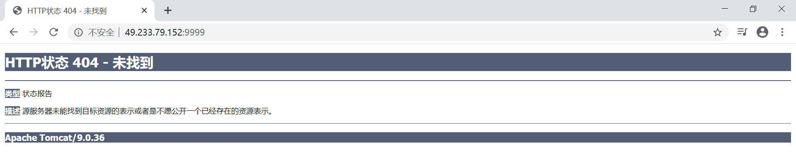

### 1. 搜索tomcat镜像
```shell
# 查看当前所有镜像
ubuntu@VM-0-4-ubuntu:~$ sudo docker images
REPOSITORY          TAG                 IMAGE ID            CREATED             SIZE
ubuntu              latest              74435f89ab78        7 days ago          73.9MB
ubuntu              18.04               8e4ce0a6ce69        7 days ago          64.2MB
nginx               latest              2622e6cca7eb        2 weeks ago         132MB
mysql               latest              be0dbf01a0f3        2 weeks ago         541MB
hello-world         latest              bf756fb1ae65        5 months ago        13.3kB

# 远程仓库搜索tomcat
ubuntu@VM-0-4-ubuntu:~$ sudo docker search tomcat
NAME                          DESCRIPTION                                     STARS               OFFICIAL            AUTOMATED
tomcat                        Apache Tomcat is an open source implementati…   2759                [OK]
tomee                         Apache TomEE is an all-Apache Java EE certif…   79                  [OK]

. . . . . .
```

### 2. 下载tomcat镜像
```shell
# 查看当前所有镜像
ubuntu@VM-0-4-ubuntu:~$ sudo docker images
REPOSITORY          TAG                 IMAGE ID            CREATED             SIZE
ubuntu              latest              74435f89ab78        7 days ago          73.9MB
ubuntu              18.04               8e4ce0a6ce69        7 days ago          64.2MB
nginx               latest              2622e6cca7eb        2 weeks ago         132MB
mysql               latest              be0dbf01a0f3        2 weeks ago         541MB
hello-world         latest              bf756fb1ae65        5 months ago        13.3kB

# 下载版本为9.0的tomcat
ubuntu@VM-0-4-ubuntu:~$ sudo docker pull tomcat:9.0
9.0: Pulling from library/tomcat
e9afc4f90ab0: Pull complete
989e6b19a265: Pull complete
af14b6c2f878: Pull complete
5573c4b30949: Pull complete
fb1a405f128d: Pull complete
612a9f566fdc: Pull complete
cf63ebed1142: Pull complete
fbb20561cd50: Pull complete
e99c920870d7: Pull complete
b7f793f2be47: Pull complete
Digest: sha256:81c2a95e5b1b5867229d75255abe54928d505deb81c8ff8949b61fde1a5d30a1
Status: Downloaded newer image for tomcat:9.0
docker.io/library/tomcat:9.0

# 再次查看当前所有镜像，验证 nginx 是否安装成功
ubuntu@VM-0-4-ubuntu:~$ sudo docker images
REPOSITORY          TAG                 IMAGE ID            CREATED             SIZE
ubuntu              latest              74435f89ab78        7 days ago          73.9MB
ubuntu              18.04               8e4ce0a6ce69        7 days ago          64.2MB
tomcat              9.0                 2eb5a120304e        2 weeks ago         647MB
nginx               latest              2622e6cca7eb        2 weeks ago         132MB
mysql               latest              be0dbf01a0f3        2 weeks ago         541MB
hello-world         latest              bf756fb1ae65        5 months ago        13.3kB
ubuntu@VM-0-4-ubuntu:~$
```

> DockerHub 官方的下载命令 : `docker run -it --rm tomcat:9`，其多用于测试，即表示当使用完 tomcat 容器后立即将其删除.


### 3.运行tomcat
```shell
# 查看当前正在运行的容器
ubuntu@VM-0-4-ubuntu:~$ sudo docker ps
CONTAINER ID        IMAGE               COMMAND             CREATED             STATUS              PORTS               NAMES

# 查看本地所有镜像
ubuntu@VM-0-4-ubuntu:~$ sudo docker images
REPOSITORY          TAG                 IMAGE ID            CREATED             SIZE
ubuntu              latest              74435f89ab78        7 days ago          73.9MB
ubuntu              18.04               8e4ce0a6ce69        7 days ago          64.2MB
tomcat              9.0                 2eb5a120304e        2 weeks ago         647MB
nginx               latest              2622e6cca7eb        2 weeks ago         132MB
mysql               latest              be0dbf01a0f3        2 weeks ago         541MB
hello-world         latest              bf756fb1ae65        5 months ago        13.3kB

# 以后台运行的方式启动tomcat : docker run -d <image name>
# -d : 后台运行， 
# --name : 为容器起别名
# -p 9999:8080 : 暴露端口，-p 宿主机端口:容器内部端口
ubuntu@VM-0-4-ubuntu:~$ sudo docker run -d -p 9999:8080 --name MyTomcat tomcat
4001aad00b7579fb9ecee4e36477bd4868015655b6b0c414da8e403a0f683162

# 再次查看当前正在运行的容器，验证 tomcat 是否已经启动
ubuntu@VM-0-4-ubuntu:~$ sudo docker ps
CONTAINER ID        IMAGE               COMMAND             CREATED             STATUS              PORTS                    NAMES
4001aad00b75        tomcat              "catalina.sh run"   34 seconds ago      Up 32 seconds       0.0.0.0:9999->8080/tcp   MyTomcat
```

*此时访问 http://ip:9999 页面如下图所示，这是因为 dockerhub 中的 tomcat 是被`阉割`( 例如缺少linux命令... )过的，所以相关配置文件并不完整.*

 

*为了访问 http://ip:9999 时能够看到 tomcat 首页，我们需要进入后台正在运行的 tomcat 容器中配置一下 webapps 中的内容*
```shell
# 查看当前正在运行的所有容器
ubuntu@VM-0-4-ubuntu:~$ sudo docker ps
CONTAINER ID        IMAGE               COMMAND             CREATED             STATUS              PORTS                    NAMES
4001aad00b75        tomcat              "catalina.sh run"   14 minutes ago      Up 14 minutes       0.0.0.0:9999->8080/tcp   MyTomcat

# 进入后台正在运行的 tomcat 容器，发现 webapps 目录下并没有文件
ubuntu@VM-0-4-ubuntu:~$ sudo docker exec -it MyTomcat /bin/bash
root@4001aad00b75:/usr/local/tomcat# ls
BUILDING.txt     LICENSE  README.md      RUNNING.txt  conf  logs            temp     webapps.dist
CONTRIBUTING.md  NOTICE   RELEASE-NOTES  bin          lib   native-jni-lib  webapps  work
root@4001aad00b75:/usr/local/tomcat# cd webapps
root@4001aad00b75:/usr/local/tomcat/webapps# ls -la
total 12
drwxr-xr-x 2 root root 4096 Jun 10 08:17 .
drwxr-xr-x 1 root root 4096 Jun 10 08:17 ..

# 方式一 : 将 webapps.dist 目录下的文件复制到 webapps 目录中，然后刷新浏览器会发现能够正确显示 tomcat 首页( 如下图所示 )
# 方式二 : 将 webapps.dist 改名为 webapps 也可以达到与方式一相同的效果
root@4001aad00b75:/usr/local/tomcat# ls
BUILDING.txt     LICENSE  README.md      RUNNING.txt  conf  logs            temp     webapps.dist
CONTRIBUTING.md  NOTICE   RELEASE-NOTES  bin          lib   native-jni-lib  webapps  work
root@4001aad00b75:/usr/local/tomcat# cp -r webapps.dist/* webapps
root@4001aad00b75:/usr/local/tomcat# cd webapps
root@4001aad00b75:/usr/local/tomcat/webapps# ls
ROOT  docs  examples  host-manager  manager

# 最后学习完毕后记得停止 tomcat 容器哟
ubuntu@VM-0-4-ubuntu:~$ sudo docker ps # 查看当前正在运行的容器
CONTAINER ID        IMAGE               COMMAND             CREATED             STATUS              PORTS                    NAMES
4001aad00b75        tomcat              "catalina.sh run"   35 minutes ago      Up 34 minutes       0.0.0.0:9999->8080/tcp   MyTomcat
ubuntu@VM-0-4-ubuntu:~$ sudo docker stop 4001aad00b75 # 根据id停止正在运行的容器
4001aad00b75
ubuntu@VM-0-4-ubuntu:~$ sudo docker ps # 再次查看当前正在运行的容器，验证 tomcat 容器是否已经停止运行
CONTAINER ID        IMAGE               COMMAND             CREATED             STATUS              PORTS                    NAMES
ubuntu@VM-0-4-ubuntu
```


### 思考
> 以后部署项目后，如果每次修改配置都要进入容器中感觉是不是非常麻烦 ?  所以我们要做的是 : 在容器外部提供一个映射路径( 例如 webapps )，进而使得在外部放置的项目能够自动同步到内部容器中.  那么该怎么实现这个想法呢 ? ( 嘿嘿... 目前我也不知道该如何实现这个想法，等我回来更新吧哈哈哈哈 )
