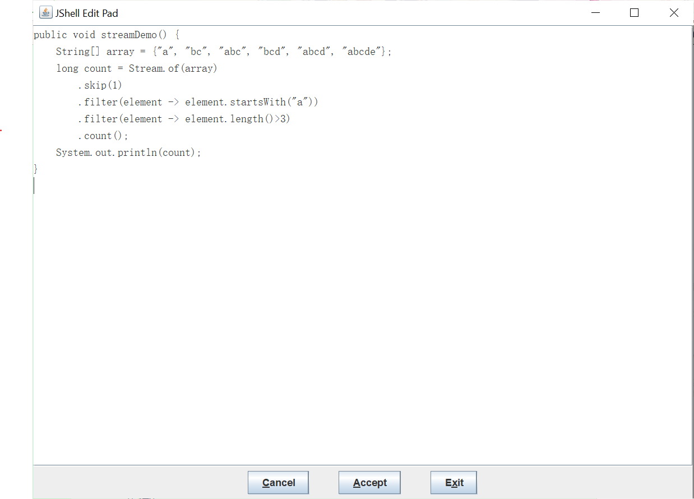

## 学习笔记 : JDK 9新特性之REPL( JShell )

### 产生背景
*像 Python 和 Scala之类的语言早就有交互式编程环境 REPL( read-evaluate-print-loop )了,以交互式的方式对语句和表达式进行求值,开发者只需要输入一些代码,就可以在编译前获得对程序的反馈. 而之前的 Java 版本想要执行代码,必须创建文件,声明类,提供测试方法才可以实现,而现在使用 JShell( 既写既的,快速运行 ) 就可以摆脱这种困扰咯~*

### 实现目标
* Java9 终于拥有了 REPL 工具 JShell : 既而可以让 Java 可以像脚本语言一样运行,从控制台启动 JShell,利用 JShell 在没有创建类的情况下直接声明变量,计算表达式,执行语句. 既开发时可以在命令行里直接运行Java的代码,而无需再创建 Java 文件,无需再使用 `public static void main(String[]args)`这句废话
* JShell 也可以从文件中加载语句或将语句保存到文件中
* JShell 也可以是 tab 键进行自动补全和自动添加分号

### 基本使用
*JShell 中的命令和代码片段是不一样的,命令都是以前导的反斜杠 `/` 开头,比如要显示所有已经定义的变量,可以使用 `/var`, 要显示所有已经定义的方法,可以使用 `/methods`,要显示所有已经定义的类型,可以使用 `/types`, 要显示所有输入的代码片段,可以使用 `/list` · · ·*


*进入JShell命令行环境 :*
```s
C:\Users\Administrator
λ jshell
|  Welcome to JShell -- Version 11.0.2
|  For an introduction type: /help intro

jshell>
```

*输入`/help`可以查看 JShell 相关的命令 :*
```s
jshell> /help                                                                                     
|  Type a Java language expression, statement, or declaration.                                    
|  Or type one of the following commands:                                                         
|  /list [<name or id>|-all|-start]                                                               
|       list the source you have typed                                                            
|  /edit <name or id>                                                                             
|       edit a source entry                                                                       
|  /drop <name or id>                                                                             
|       delete a source entry                                                                     
|  /save [-all|-history|-start] <file>                                                            
|       Save snippet source to a file                                                             
|  /open <file>                                                                                   
|       open a file as source input                                                               
|  /vars [<name or id>|-all|-start]                                                               
|       list the declared variables and their values                                              
|  /methods [<name or id>|-all|-start]                                                            
|       list the declared methods and their signatures                                            
|  /types [<name or id>|-all|-start]                                                              
|       list the type declarations                                                                
|  /imports                                                                                       
|       list the imported items                                                                   
|  /exit [<integer-expression-snippet>]                                                           
|       exit the jshell tool                                                                      
|  /env [-class-path <path>] [-module-path <path>] [-add-modules <modules>] ...                   
|       view or change the evaluation context                                                     
|  /reset [-class-path <path>] [-module-path <path>] [-add-modules <modules>]...                  
|       reset the jshell tool                                                                     
|  /reload [-restore] [-quiet] [-class-path <path>] [-module-path <path>]...                      
|       reset and replay relevant history -- current or previous (-restore)                       
|  /history [-all]                                                                                
|       history of what you have typed                                                            
|  /help [<command>|<subject>]                                                                    
|       get information about using the jshell tool                                               
|  /set editor|start|feedback|mode|prompt|truncation|format ...                                   
|       set configuration information                                                             
|  /? [<command>|<subject>]                                                                       
|       get information about using the jshell tool                                               
|  /!                                                                                             
|       rerun last snippet -- see /help rerun                                                     
|  /<id>                                                                                          
|       rerun snippets by ID or ID range -- see /help rerun                                       
|  /-<n>                                                                                          
|       rerun n-th previous snippet -- see /help rerun                                            
|                                                                                                 
|  For more information type '/help' followed by the name of a                                    
|  command or a subject.                                                                          
|  For example '/help /list' or '/help intro'.                                                    
|                                                                                                 
|  Subjects:                                                                                      
|                                                                                                 
|  intro                                                                                          
|       an introduction to the jshell tool                                                        
|  id                                                                                             
|       a description of snippet IDs and how use them                                             
|  shortcuts                                                                                      
|       a description of keystrokes for snippet and command completion,                           
|       information access, and automatic code generation                                         
|  context                                                                                        
|       a description of the evaluation context options for /env /reload and /reset               
|  rerun                                                                                          
|       a description of ways to re-evaluate previously entered snippets                          
                                                                                                  
jshell>                                                                                           
```

*JShell 命令的自动补全功能 :*
```s
jshell> /
/!          /?          /drop       /edit       /env        /exit       /help       /history    /imports
/list       /methods    /open       /reload     /reset      /save       /set        /types      /vars

<press tab again to see synopsis>

jshell> /
```

*`System.out.`后按下 Tab 键,就会列出当前类的所有的 public 方法的列表哟*
```s
jshell> System.out.
append(        checkError()   close()        equals(        flush()        format(        getClass()
hashCode()     notify()       notifyAll()    print(         printf(        println(       toString()
wait(          write(

jshell>
```

*实例 : 在 JShell 中使用 Stream 流过滤并遍历输出数组元素 :*
```s
jshell> public void streamDemo(){
   ...> String[]array = {"a","bc","bcd","abcd"};
   ...> Stream.of(array).filter(e->e.startsWith("a")).filter(e->e.length()>3).forEach(System.out::println);
   ...> }
|  created method streamDemo()

jshell> streamDemo();
abcd
```

*例如使用`/imports`命令用于查看已导入的包 :*
```s
jshell> /imports
|    import java.io.*
|    import java.math.*
|    import java.net.*
|    import java.nio.file.*
|    import java.util.*
|    import java.util.concurrent.*
|    import java.util.function.*
|    import java.util.prefs.*
|    import java.util.regex.*
|    import java.util.stream.*

jshell>
```

*列出到目前为止当前 `session` 里所有有效的代码片段 :*
```s
jshell> /list

   1 : System.out.println("demo");
   2 : public void streamDemo(){
       String[]array = {"a","bc","bcd","abcd"};
       Stream.of(array)
       .filter(e->e.startsWith("a"))
       .filter(e->e.length()>3)
       .forEach(System.out::println);
       }
   3 : streamDemo();

jshell>
```

*列出到目前为止当前 session 里所有方法 :*
```s
jshell> /method
|    void StreamDemo()
```

*在 JShell 中可以启用 JShell Edit Pad 编辑器来写更加便捷地书写 Java 代码,只需要输入命令`/edit`,代码编辑完成后,先点击"Accept"按钮,再点击"Exit"按钮,继而退出编辑器*


*调用已修改的程序,其运行结果如下所示 :*
```s
jshell> /edit
|  created method streamDemo()

jshell> /edit
|  modified method streamDemo()
|    update overwrote method streamDemo()

jshell> streamDemo();
2

jshell>
```

*JShell Edit Pad 编辑器功能非常有限,仅能提供一些最基础的功能,不过好消息是 JShell 可以配置外部的代码编辑器,只需要使用 `/edit` 设置外部编辑器的完整路径即可,例如使用 VS Code 来作为外部的代码编辑器*
```s
jshell> /set editor /Visual Studio Code/Microsoft VS Code/Code.exe
|  Editor set to: /Visual Studio Code/Microsoft VS Code/Code.exe
```

*从外部加载源代码 : 如果在外部已经有写好的 Java 文件,则可以使用 `/open` 命令导入到 JShell 环境中,例如现在有一个Test.java文件*
```s
jshell> /open /Java/Test.java

jshell> /methods
|    int add(int,int)
|    int sub(int,int)

jshell> add(1,2);
$5 ==> 3

jshell>
```

*JShell 命令缩写,例如 `/list` 的缩写为 `/l`,例如 `/list -all` 的缩写为 `/l -a`. 例如,我们可以使用 `/l -a` 来代替 `list -all` 输出所有的代码片段 :*
```s
jshell> /l -a                                                                     
                                                                                  
  s1 : import java.io.*;                                                          
  s2 : import java.math.*;                                                        
  s3 : import java.net.*;                                                         
  s4 : import java.nio.file.*;                                                    
  s5 : import java.util.*;                                                        
  s6 : import java.util.concurrent.*;                                             
  s7 : import java.util.function.*;                                               
  s8 : import java.util.prefs.*;                                                  
  s9 : import java.util.regex.*;                                                  
 s10 : import java.util.stream.*;                                                 
   1 : System.out.println("demo");                                                
   2 : public void StreamDemo(){                                                  
       String[]array = {"a","bc","bcd","abcd"};                                   
       Stream.of(array)                                                           
       .filter(e->e.startsWith("a"))                                              
       .filter(e->e.length()>3)                                                   
       .forEach(System.out::println);                                             
       }                                                                          
   3 : StreamDemo();                                                              
   4 : public void streamDemo() {                                                 
           String[] array = {"a", "bc", "abc", "bcd", "abcd"};                    
           long count = Stream.of(array)                                          
        .filter(element -> element.startsWith("a"))                               
        .filter(element -> element.length()>3)                                    
        .count();                                                                 
           System.out.println(count);                                             
       }                                                                          
   5 : public void streamDemo() {                                                 
           String[] array = {"a", "bc", "abc", "bcd", "abcd", "abcde"};           
           long count = Stream.of(array)                                          
        .skip(1)                                                                  
        .filter(element -> element.startsWith("a"))                               
        .filter(element -> element.length()>3)                                    
        .count();                                                                 
           System.out.println(count);                                             
       }                                                                          
   6 : streamDemo();                                                              
                                                                                  
jshell>                                                                           
```

*退出 JShell*
```s
jshell> /exit
|  Goodbye
```


*更多 JShell 的详细介绍请参考 : [官方介绍文档](https://docs.oracle.com/javase/9/jshell/introduction-jshell.htm)*