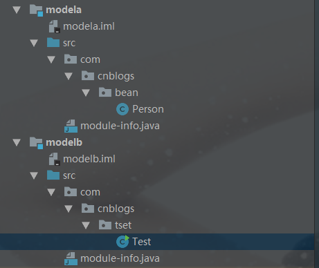

## 学习笔记 : JDK 9目录结构的变化及新特性之模块化

### 目录结构
*JDK 9( JDK 9以后的版本 )的具体目录结构如下所示 :*
* `bin` : 该目录包含所有的命令
* `conf` : 包含用户可以编辑的配置文件,例如以前位于jre\lib 目录中的 .properties 和 .policy 文件
* `include` : 包含一些编译本地代码时使用的C/C++头文件
* `jmods` : 包含JMOD 格式的平台模块,创建自定义运行映射时需要它
* `legal` : 包含法律声明
* `lib` : 包含非 Windows 平台上动态链接的本地库,其子目录和文件不应由开发人员直接编辑或使用

*注 : `JDK9 目录中不再有jre子目录`*


### 模块化系统
*Java 9最大的变化之一是引入了模块系统( Jigsaw 项目 ),主要原因是Java和相关生态在不断丰富的同时越来越暴露一些问题 :*

* Java 运行环境的膨胀和臃肿. 每次加载 JVM 启动时,至少会有 30 ~ 60MB 内存加载,主要原因是`JVM需要加载rt.jar`,不管其中的类是否被 classloader 加载,第一步整个 jar 都会被 JVM 加载到内存当中去( 而模块化可以根据模块的需要加载程序运行需要的class )
* 当代码库越来越大,创建复杂,盘根错节的"意大利面条式代码"的几率呈指数级的增长, 不同版本的类库交叉依赖导致让人头疼的问题,这些都是阻碍了 Java 开发和运行效率的提升
* 很难真正地对代码进行封装,而系统并没有对不同部分( 也就是JAR文件 ) 之间的依赖关系有个明确的概念,每一个公共类都可以被类路径之下任何其它的公共类访问到,这样就会导致无意中使用了并不想被公开访问的 API 

*`模块化的概念` : 模块( 代码和数据的封装体 )的概念其实就是package外再包裹一层,用模块来管理各个package,使得代码组织上更加安全,因为他可以指定哪些部分可以暴露,哪些部分可以隐藏*

*`模块化的特性` : Java9 模块的重要特征是在其工件 (artifact) 的根目录中包含了一个描述模块的 module-info.class 文件,这个文件由根目录中的源代码文件 module-info.java 编译而来,该模块声明文件可以描述模块的不同特征. JDK 9将 JDK 分成一组模块,可以在编译时,运行时或构建时进行组合. 模块化可以减少内存开销,只需必要的模块,并非全部模块,既而可以简化各种类库和大型应用的开发和维护*

#### 实例
1. *模块目录结构如下所示( 有两个名称分别为modela, modelb的模块 ) :*
   


1. *modela模块中的module-info.java :*
```java
module modela {
    exports com.cnblogs.bean;
}
```

3. *modelb模块中的module-info.java :*
```java
module modelb {
    requires modela;
}
```

4. *modelb模块中的Test.java :*
```java
package com.cnblogs.tset;
  
import com.cnblogs.bean.Person;
  
public class Test {
  
    public static void main(String[] args) {
        Person person = new Person("jdk9",2);
        System.out.println(person);
    } 
}
```

5. *程序运行结果 :*
```
Person{name='jdk9', age=2}
```

*如上示例,如果需要在modelb模块项目中使用modela模块项目的内容,必须在modela项目的module-info.java中定义`exports com.cnblogs.bean`将该目录下可以被其他模块使用,如果没有写,则包默认是封装在模块下,不被外界使用. 而在modela项目中需要使用`requires modela`导入需要使用的模块名,则可以在modelb中使用modela定义exports的类 (即而才可以在Test类中使用Person类)*

* `module-info.java` : 该文件必须位于项目的根目录中. 该文件用于定义模块需要什么依赖,以及那些包被外部使用
* `exports` : 控制着那些包可以被其他模块访问到,所有不被exports的包默认都被封装在模块里面不被外界所使用
* `requires` : 指明对其他模块的依赖


*参考博客 : [《JDK9 新特性》](https://www.cnblogs.com/peter1018/p/9209951.html)*

*更多新特性详细信息请参阅 : [What's New in JDK9](https://docs.oracle.com/javase/9/whatsnew/toc.htm)*