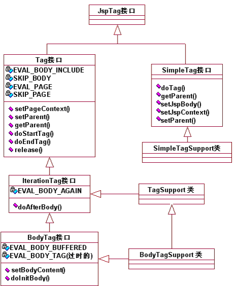

## JSP 自定义标签

### 入门
1. 什么是`JSP`自定义标签?
*自定义标签可以有效地将HTML代码与Java代码分类,从而使不懂Java编程的HTLML设计人员也可以编写出功能强大的JSP页面.JSP复规范中定义了多个用于开发自定义标签的接口和类,它们都位于`javax.servlet.jsp.tagext`包中,这些接口和类的继承关系如下所示.*



2. 标签分类
*在`JSP2.0`之前,所有的标签都需要实现`Tag`接口,这样的标签称为: `传统标签( javax.servlet.jsp.tagext.Tag )`. 后来为了简化标签的开发,JSP2.0规范又定义了一种新类型的标签,称为`简单标签( javax.servlet.jsp.tagext.SimpleTag )`*


### 自定义标签的开发步骤
1. 编写标签处理器
*`Tag`接口和`SimpleTag`接口定义了JSP页面与标签处理器类之间的通信规则.如果JSP引擎在编译JSP页面时遇到了自定义标签,`传统标签`将会调用标签处理器的`doStartTag()`方法,简单标签将会调用标签处理器类的`doTag()`方法.*

2. 编写标签库描述符文件
*要想让JSP引擎在遇到自定义标签时,能找到其所对应的标签处理器,还必须编写是一个标签描述符( `Tag Library Descriptor` )文件.简称: `TLD`文件.*
- *注意: 自定义标签的根标签(`<taglib>`)使用的是schema约束.其标签内容可以从 : `<Tomcat安装目录>\webapps\examples\WEB-INF\jsp2\jsp2-example-taglib.tld`中复制即可.* 

3. 在JSP页面导入和使用自定义标签
*TLD文件编写完成后,就可以在JSP文件中使用自定义标签.在使用自定义标签之前,首先需要使用`taglib`指令来引入TLD文件.*


### 传统标签
1. `Tag` 接口
   
*Tag接口定义了JSP页面与标签处理器之前的通信规则,当JSP容器将JSP页面翻译成Servlet源文件时,如果遇到JSP标签,会创建标签处理器类的实例对象.然后依次调用标签处理器的如下方法.*
```java
setPageContext() ——> setParent() ——> doStartTag() ——> doEndTag() ---> release()
```

2. `IterationTag` 接口
 
*在自定义标签的开发过程中,其可以对标签体的内容进行重复处理.*
- *`TagSupport`类实现了该接口,简化了程序的编写.*

3. `BodyTag` 接口

*在实现自定义标签时,其可以根据需要对标签体的内容进行处理后再向浏览器输出.*

#### 案例-实现一个`传统`自定义标签
*描述 : 开发一个显示IP地址的自定义标签*
1. 编写完成标签功能的标签处理器类
```java
package pers.huangyuhui.tag.handler;

import java.io.IOException;
import javax.servlet.jsp.JspException;
import javax.servlet.jsp.tagext.TagSupport;

/**
 * @ClassName: IpTag
 * @Description: 传统标签处理器
 * @author: HuangYuhui
 * @date: Apr 25, 2019 4:06:28 PM
 * 
 */
public class IpTag extends TagSupport {

	private static final long serialVersionUID = -8446674958888389920L;

	@Override
	public int doStartTag() throws JspException {

		String IP = pageContext.getRequest().getRemoteAddr();
		try {
			pageContext.getOut().write("访问用户的IP地址为 : " + IP);
		} catch (IOException e) {
			e.printStackTrace();
		}

		return super.doStartTag();
	}
}

```

2. 编写TLD文件
```xml
<?xml version="1.0" encoding="UTF-8"?>

<taglib xmlns="http://java.sun.com/xml/ns/j2ee"
	xmlns:xsi="http://www.w3.org/2001/XMLSchema-instance"
	xsi:schemaLocation="http://java.sun.com/xml/ns/j2ee http://java.sun.com/xml/ns/j2ee/web-jsptaglibrary_2_0.xsd"
	version="2.0">

	<!-- 标签库的版本号 -->
	<tlib-version>1.0</tlib-version>
	<!-- 标签库的名称 -->
	<short-name>TraditionalTag</short-name>
	<!-- 标签库的URI -->
	<uri>https://yubuntu0109.github.io</uri>

	<!-- 注册一个自定义的标签 -->
	<tag>
		<!-- 指定自定义标签的注册名称 -->
		<name>ipTag</name>
		<!-- 指定标签的标签处理器类 -->
		<tag-class>pers.huangyuhui.tag.handler.IpTag</tag-class>
		<!-- 指定标签的类型 -->
		<body-content>empty</body-content>
	</tag>
</taglib>
```

3. 编写JSP文件,并导入和使用自定义标签
```html
<%@ page language="java" contentType="text/html; charset=UTF-8"
    pageEncoding="UTF-8"%>
<%-- 导入自定义的标签库描述符文件 --%>
<%@taglib uri="https://yubuntu0109.github.io" prefix="yu" %>
<!DOCTYPE html>
<html>
	<head>
		<meta charset="UTF-8">
		<title>测试自定义标签</title>
	</head>
	<body>
		<yu:ipTag/>
	</body>
</html>
```

### 简单标签
1. `SimpleTag` 接口

*SimpleTag接口中的方法和传统标签中定义的签名有所区别,但是功能却基本一致,例如: 都实现了给`标签处理器`传递`pageContext`对象和父标签处理器对象的功能.而且`JSP容器`执行简单标签处理器的顺序也和执行传统标签处理器的顺序一致.简单标签处理器的执行流程如下所示:*
```java
JSP容器实例化标签处理器类 ——> setJspContext() ——> setParent() ——> 设置属性的setter方法 ——> setJspBody() ——> doTag()
```

2. `JspFragment` 类
   
*JSP容器在处理简单标签时,会把标签体内容用一个JspFragment对象表示,并调用标签处理器对象的setJspBody()方法将JspFragment对象传递给标签处理器对象,标签开发者可以根据需要调用JspFragment对象的方法来决定是否输出标签体,或者循环多次输出标签体等.其中JspFragment的`invoke(Write out)`方法是简单标签开发中最重要的一个方法,它用于控制如何执行标签体的内容.*

3. `SimpleTagSupport` 类
   
*该类实现了`SimpleTagSupport`接口,继而使得简单标签处理器的编写变得简化.*

#### 案例-实现一个自定义简单标签
*描述 : 自定义简单标签,实现重复执行标签体的功能.*

1. 编写标签处理器类
```java
package pers.huangyuhui.tag.handler;

import java.io.IOException;
import javax.servlet.jsp.JspException;
import javax.servlet.jsp.tagext.JspFragment;
import javax.servlet.jsp.tagext.SimpleTagSupport;

/**
 * @ClassName: SimpleIterate
 * @Description: 简单标签处理器
 * @author: HuangYuhui
 * @date: Apr 24, 2019 4:52:19 PM
 * 
 */
public class SimpleIterate extends SimpleTagSupport {

	private int num;

	public void setNum(int num) {
		this.num = num;
	}

	@Override
	// 对标签进行逻辑处理
	public void doTag() throws JspException, IOException {
		// 获取标签体
		JspFragment jspFragment = this.getJspBody();

		for (int i = 0; i < num; i++) {
			jspFragment.invoke(null);
		}
	}
}
```

2. *编写简单标签库描述符文件*
```xml
<?xml version="1.0" encoding="UTF-8"?>

<taglib xmlns="http://java.sun.com/xml/ns/j2ee"
	xmlns:xsi="http://www.w3.org/2001/XMLSchema-instance"
	xsi:schemaLocation="http://java.sun.com/xml/ns/j2ee http://java.sun.com/xml/ns/j2ee/web-jsptaglibrary_2_0.xsd"
	version="2.0">

	<!-- 标签库的版本号 -->
	<tlib-version>1.0</tlib-version>
	<!-- 标签库的名称 -->
	<short-name>SimpleTag</short-name>
	<!-- 标签库的URI -->
	<uri>/SimpleTag</uri>
    <!-- 注册一个自定义的标签 -->
	<tag>
		<name>simpleIterate</name>
		<tag-class>pers.huangyuhui.tag.handler.SimpleIterate</tag-class>
		<body-content>scriptless</body-content>
		<!-- 用于描述自定义标签的属性 -->
		<attribute>
			<!-- 指定属性的名称 -->
			<name>num</name>
			<!-- 指定在JSP页面调用自定义标签时是否必须设置这个属性 -->
			<required>true</required>
		</attribute>
	</tag>
</taglib>
```

3. 编写JSP文件,并导入和使用自定义标签
```html
<%@ page language="java" contentType="text/html; charset=UTF-8"
    pageEncoding="UTF-8"%>
<%@taglib uri="/SimpleTag"  prefix="yu"%>
<!DOCTYPE html>
<html>
		<head>
			<meta charset="UTF-8">
			<title>测试自定义标签</title>
		</head>
	<body>
			<yu:simpleIterate num="5">
				Hello SimpleTag !<br>
			</yu:simpleIterate>
	</body>
</html>
```

#### 案例-模拟`JSTL`的<c:choose>,<c:when>,<c:otherwise>标签
*描述 : 通过模仿`JSTL`核心标签库中的<c:choose>,<c:when test="">,<c:otherwise>标签,开发一套自己的标签 :  `<yu:choose>`,`<yu:when test="">`,`<yu:otherwise>`*

1. *编写标签`<yu:choose>`的标签处理器类 : ChooseTag.java*
```java
package pers.huangyuhui.tag.handler.choose;

import java.io.IOException;
import javax.servlet.jsp.JspException;
import javax.servlet.jsp.tagext.SimpleTagSupport;

/**
 * @ClassName: ChooseTag
 * @Description: 标签处理器
 * @author: HuangYuhui
 * @date: Apr 24, 2019 5:15:53 PM
 * 
 */
public class ChooseTag extends SimpleTagSupport {

	// 作为标识符用于控制<yu:when>和<yu:otherwise>的标签体是否执行
	private boolean flag;

	public boolean isFlag() {
		return flag;
	}

	public void setFlag(boolean flag) {
		this.flag = flag;
	}

	@Override
	public void doTag() throws JspException, IOException {
		this.getJspBody().invoke(null);
	}

}
```

2. *编写标签`<yu:when test="">`的标签处理器类 : WhenTag.java*
```java
package pers.huangyuhui.tag.handler.choose;

import java.io.IOException;
import javax.servlet.jsp.JspException;
import javax.servlet.jsp.JspTagException;
import javax.servlet.jsp.tagext.JspTag;
import javax.servlet.jsp.tagext.SimpleTagSupport;

/**
 * @ClassName: WhenTag
 * @Description: 标签处理器
 * @author: HuangYuhui
 * @date: Apr 24, 2019 5:19:01 PM
 * 
 */
public class WhenTag extends SimpleTagSupport {

	// 用于接收标签中`test`属性传入的值
	private boolean test;

	public void setTest(boolean test) {
		this.test = test;
	}

	@Override
	public void doTag() throws JspException, IOException {

		// 获得父类标签对象
		JspTag tag = this.getParent();

		// 判断父标签是否为: ChooseTag
		if (!(tag instanceof ChooseTag)) {
			throw new JspTagException("ERROR : OUT OF CHOOSE TAG");
		}

		// 将父类标签对象强转成`ChooseTag`类型
		ChooseTag chooseTag = (ChooseTag) tag;

		// 判断`WhenFlag`为true且父标签中的`flag`为false时执行该标签体
		if (test && !(chooseTag.isFlag())) {
			this.getJspBody().invoke(null);

			// 执行完标签体后,将父标签中的`flag`置为true,防止其它嵌套标签体继续执行
			chooseTag.setFlag(true);
		}
	}
}
```

3. *编写`<yu:otherwise>`的标签体处理器类 : OtherwiseTag.java*
```java
package pers.huangyuhui.tag.handler.choose;

import java.io.IOException;
import javax.servlet.jsp.JspException;
import javax.servlet.jsp.JspTagException;
import javax.servlet.jsp.tagext.JspTag;
import javax.servlet.jsp.tagext.SimpleTagSupport;

/**
 * @ClassName: OtherwishTag
 * @Description: 标签处理器
 * @author: HuangYuhui
 * @date: Apr 24, 2019 5:46:33 PM
 * 
 */
public class OtherwiseTag extends SimpleTagSupport {

	@Override
	public void doTag() throws JspException, IOException {

		// 获得父标签对象
		JspTag jspTag = this.getParent();

		// 判断父标签是否是: ChooseTag
		if (!(jspTag instanceof ChooseTag)) {
			throw new JspTagException("ERROR : OUT OF CHOOSE TAG");
		}

		// 将父类标签对象强转成`ChooseTag`类型
		ChooseTag chooseTag = (ChooseTag) jspTag;

		// 判断父标签中的`flag`为false时,执行该标签体
		if (!chooseTag.isFlag()) {
			this.getJspBody().invoke(null);

			// 执行完标签体后,将父标签中的`flag`置为true,防止其它嵌套标签体继续执行
			chooseTag.setFlag(true);
		}

	}

}
```

4. *编写`TLD`文件*
```xml
<?xml version="1.0" encoding="UTF-8"?>

<taglib xmlns="http://java.sun.com/xml/ns/j2ee"
	xmlns:xsi="http://www.w3.org/2001/XMLSchema-instance"
	xsi:schemaLocation="http://java.sun.com/xml/ns/j2ee http://java.sun.com/xml/ns/j2ee/web-jsptaglibrary_2_0.xsd"
	version="2.0">

	<description>模拟JSTL的choose,when,otherwish标签</description>
	<tlib-version>1.0</tlib-version>
	<short-name>SimpleTag</short-name>
	<uri>https://yubuntu0109.github.io</uri>

	<!-- choose tag -->
	<tag>
		<name>choose</name>
		<tag-class>pers.huangyuhui.tag.handler.choose.ChooseTag</tag-class>
		<body-content>scriptless</body-content>
	</tag>
	<!-- when tag -->
	<tag>
		<name>when</name>
		<tag-class>pers.huangyuhui.tag.handler.choose.WhenTag</tag-class>
		<body-content>scriptless</body-content>
		<attribute>
			<!-- 
			注意: 属性名一定要和该标签的处理器类中的属性名一致 !
			否则抛出异常:  Unable to find setter method for attribute: xxx ..
			-->
			<name>test</name>
			<required>true</required>
			<rtexprvalue>true</rtexprvalue>
		</attribute>
	</tag>
	<!-- otherwise tag -->
	<tag>
		<name>otherwise</name>
		<tag-class>pers.huangyuhui.tag.handler.choose.OtherwiseTag</tag-class>
		<body-content>scriptless</body-content>
	</tag>

</taglib>
```

5. *编写两个JSP文件,对三个自定义标签进行测试.*
```html
<%@ page language="java" contentType="text/html; charset=UTF-8"
    pageEncoding="UTF-8"%>
<!DOCTYPE html>
<html>
	<head>
		<meta charset="UTF-8">
		<title>测试自定义标签</title>
	</head>
	<body>
		<h3 align="center">请选择你热爱的运动哟 (づ￣3￣)づ╭❤～</h3>
		<hr>
		<div align="center">
			<form action="choose_when_otherwise.jsp">
				<input type="radio"  name = "hobby" value="badminton"/>羽毛球
				<input type="radio"  name = "hobby" value="footall"/>足球
				<input type="radio"  name = "hobby" value="basketball"/>篮球
				<input type="radio"  name = "hobby" value="others"/>其它<br>
				<input type="submit" value="提交"/>
			</form>
		</div>
	</body>
</html>
```

```html
<%@ page language="java" contentType="text/html; charset=UTF-8"
    pageEncoding="UTF-8"%>
<%-- 导入自定义的标签库描述符文件 --%>
<%@taglib uri="https://yubuntu0109.github.io"  prefix="yu"%>
<!DOCTYPE html>
<html>
	<head>
		<meta charset="UTF-8">
		<title>测试自定义标签</title>
	</head>
	<body>
		<div align="center">
			<yu:choose>
				<yu:when test="${param.hobby=='badminton' }">
					<p>你热爱的运动是: 羽毛球</p>
				</yu:when>
				<yu:when test="${param.hobby=='footall' }">
					<p>你热爱的运动是: 足球</p>
				</yu:when>
				<yu:when test="${param.hobby=='basketball' }">
					<p>你热爱的运动是: 篮球</p>
				</yu:when>
				<yu:otherwise>
					<p>哎哟 ~ 难道你只会coding ! ヾ(◍°∇°◍)ﾉﾞ</p>
				</yu:otherwise>
			</yu:choose>
		</div>
	</body>
</html>
```