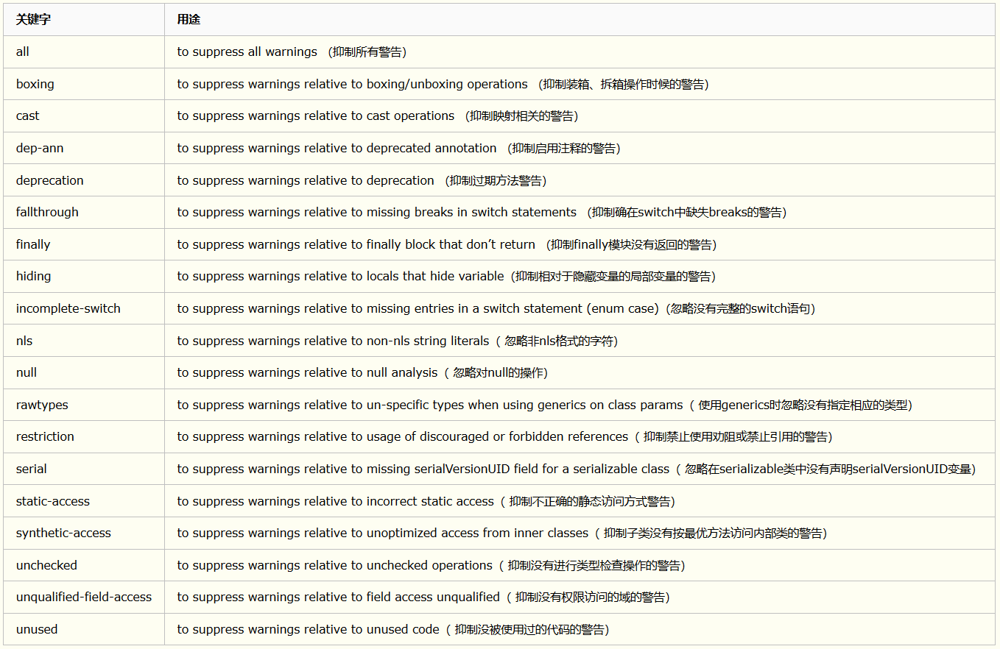

## Java注解 (元数据)

### 注解的概念及作用
- *从JDK1.5开始,Java支持在源文件中嵌入补充信息,这类信息被称为`注解(annotation)`.注解不会改变程序的动作,因此也就不会改变程序的语义,但是在开发和部署期间,各种工具可以使用这类信息,例如: 源代码生成器可以处理注解! 注: `如果没有注解信息处理流程(如:通过反射查询注解),则注解毫无意义 !`*

- *说明: 其实术语`元数据(metadata)`,但是`注解`这个名称更具有描述性并且更常用.*

### 声明注解
- *注解是一种代码级别的说明.它与`类`,`接口`,`枚举`在同一个层次,它可以声明在`包`,`类`,`字段`,`方法`,`局部变量`,`方法参数`等的前面,用来对这些元素进行说明,注释..*

### 注解的分类
1. 特殊的注解 : `标记注解`,`单成员注解`.
2. `内置注解`.
3. `类型注解`.
4. `重复注解`.

### 内置注解
#### 内置注解分类
1. *`java.lang.annotation`包下的注解分别是 : `@Retention`,`@Documnetd`,`@Target`,`@Inherited`*
- *以上四个注解被称为`元注解`,其作用是负责注解其它的注解,用来提供对其它`annotation`类型做说明.*
2. *`java.lang`包下注解分别是 : `@Override`,`@Deprecated`,`@FunctionalInterface`,`@SafeVarargs`,`@SuppressWarnings`*
- *注意: `JDK8`在`java.lang.annotation`中添加了`Repeatable`和`Native`注解.其中`Repeatable`支持重复注解,`Native`用于注解本机代码可以访问的域变量.*


#### 内置注解 : `非元注解`

- *`@SuppressWarnings`注解使用详解如下图所示*


1. *`@Override`,`@Deprecated`,`@SafeVarargs`,`SuppressWarnings`程序示例*
```java
package pers.huangyuhui.annotation.built_in_annotation;

import java.util.ArrayList;

/**
 * @ClassName: Built_in_annotations
 * @Description: 非元注解
 * @author: HuangYuhui
 * @date: Apr 14, 2019 9:36:20 AM
 * 
 */
public class Built_in_annotations<T> {

	@SuppressWarnings("unused")
	private T[] args;

	// Type safety: Potential heap pollution via varargs parameter args..
	// @SafeVarargs: 为标记注解,只能用于方法和构造方法,指示没有发生与可变长度参数相关的不安全动作.
	@SafeVarargs
	public Built_in_annotations(T... args) {
		this.args = args;
	}

	// @SafeVarargs: 该注解只能用于varargs方法或者声明为static或final的构造方法.
	@SafeVarargs
	public final void safeVarargsTest(T... args) {

		for (@SuppressWarnings("unused")
		T t : args) {
			System.out.println(args);
		}
	}

	// @Override: 用于确保超类方法被真正地重写,而不是简单地重载.
	@Override
	public String toString() {
		return super.toString();
	}

	// @Deprecated: 为标记注解,用于指示声明是过时的,并且已经被更新到的形式取代.
	@Deprecated
	public void deprecatedTest() {

	}

	// @SuppressWarnings: 用于抑制一个或多个编译器可能会报告的警告.使用以字符串形式表示的名称来指定要被抑制的警告.
	@SuppressWarnings("rawtypes")
	public void supressWarningsTest() {

		@SuppressWarnings("unused")
		ArrayList arrayList = new ArrayList<>();
	}

}

```
2. *`@FunctionalInterface`程序示例*
```java
/**
 * @ClassName: functionalInterface
 * @Description: `学习@functionalInterface注解`
 * @author: HuangYuhui
 * @date: Apr 14, 2019 10:39:46 AM
 * 
 */
//`Java8`为函数式接口引入了一个新注解`@FunctionalInterface`,其主要用于编译错误检查,
//加上该注释后当你写的接口不符合函数式定义时,编译器就会报错 !
//注意: 是否添加`@FunctionalInterface`对于接口是不是函数式接口没有影响,
//该注释只是提醒`编译器`去检查该接口是否仅仅包含一个抽象方法.
@FunctionalInterface
interface functionalInterface {

	// 注意: 函数式接口中只能有一个抽象方法 !
	void myLambda(String message);

	// 函数式接口里是可以包含默认方法,因为默认方法不是抽象方法,其有一个默认实现,
    //所以是符合函数式接口的定义的.
	default void defaultMethod() {
		// method body..
	}

	// 函数式接口里是可以包含静态方法,因为静态方法不能是抽象方法,是一个已经实现了的方法,
    //所以是符合函数式接口的定义的.
	static void staticMethod() {
		// method body..
	}

	// 函数式接口里是可以包含Object里的public方法,这些方法对于函数式接口来说,
	// 不被当成是抽象方法(虽然它们是抽象方法).因为任何一个函数式接口的实现,默认都继承了Object类,
    //其包含了来自java.lang.Object里对这些抽象方法的实现!
	@Override
	boolean equals(Object object);

}

//使用`@FunctionalInterface`注解的函数式接口继而可以使用`Lambda`表示式来表示该接口的一个实现.
//(Java8 之前一般是使用匿名类实现的).
//functionalInterface  f = message->System.out.println();
```

#### 内置注解 : `元注解`
- *使用`@Target`,`@Retention`自定义注解*
```java
import java.lang.annotation.ElementType;
import java.lang.annotation.Retention;
import java.lang.annotation.RetentionPolicy;
import java.lang.annotation.Target;

/**
 * @ClassName: MyTarget_annotation
 * @Description: 自定义注解
 * @author: HuangYuhui
 * @date: Apr 14, 2019 11:12:54 AM
 * 
 */

@Target({ ElementType.TYPE, ElementType.METHOD, ElementType.FIELD, ElementType.LOCAL_VARIABLE,
		ElementType.CONSTRUCTOR })//用于指定可以应用注解的声明类型,被设计为只能注解其它注解.
@Retention(RetentionPolicy.CLASS)//指定保留策略.
public @interface MyTarget_annotation {

	int id() default -1; //使用默认值

	String name();

	String[] address() default { "null" };

}

```
- *使用自定义注解*
```java
import pers.huangyuhui.annotation.myannotation.MyTarget_annotation;

/**
 * @ClassName: TargetTest
 * @Description: 使用自定义注解
 * @author: HuangYuhui
 * @date: Apr 14, 2019 11:38:23 AM
 * 
 */
@MyTarget_annotation(name = "")
public class TargetTest {

	// 由于声明的注解类型包含 : `CONSTRUCTOR`, 所以可以在构造方法前使用.
	@MyTarget_annotation(name = "")
	public TargetTest() {
		// TODO Auto-generated constructor stub
	}

	// 由于声明的注解类型包含 : `FIELD`, 所以可以在域变量前使用.
	@MyTarget_annotation(name = "")
	private String s;

	// 由于声明的注解类型包含 : `METHOD`, 所以可以在方法前使用.
	@MyTarget_annotation(id = 1, name = "YUbuntu0109", address = "my address") // 显式的定义注解值
	public void testMethod() {

		// 由于声明的注解类型包含 : `LOCAL_VARIABLE`, 所以可以在局部变量前使用.
		@SuppressWarnings("unused")
		@MyTarget_annotation(name = "")
		int i;
	}

}

```

### 使用反射获取注解
1. 通过`反射`获取方法关联的注解
- *首先自定义一个注解*
```java
package pers.huangyuhui.annotation.myannotation;
import java.lang.annotation.ElementType;
import java.lang.annotation.Retention;
import java.lang.annotation.RetentionPolicy;
import java.lang.annotation.Target;

/**
 * @ClassName: MyAnnotation
 * @Description: 自定义注解,用于通过反射获取注解信息的测试
 * @author: HuangYuhui
 * @date: Apr 14, 2019 5:52:05 PM
 * 
 */

@Retention(RetentionPolicy.RUNTIME)//指定保留策略
@Target({ ElementType.METHOD, ElementType.TYPE })
public @interface MyAnnotation {

	int id() default 1;

	String name() default "default value";
}

```

- *通过反射获取自定义注解信息*
```java
import java.lang.reflect.Method;

import pers.huangyuhui.annotation.myannotation.MyAnnotation;

/**
 * @ClassName: getAnnotationInfo
 * @Description: 通过反射获取方法关联的注解
 * @author: HuangYuhui
 * @date: Apr 14, 2019 5:45:32 PM
 * 
 */
public class getAnnotationInfo {

	@MyAnnotation(name = "Hello annotation !")
	public void fun(double d, String s) {
	}

	public static void main(String[] args) {
		getAnnotationInfo getInfo = new getAnnotationInfo();

		// 获取Class对象
		Class<?> class1 = getInfo.getClass();
		try {
			// 通过调用Class泛型类提供的`getMethod`方法获取与方法相关的信息
			Method method = class1.getMethod("fun", double.class, String.class);
			// 通过调用`getAnnotation`获取与对象相关联的特定注解
			MyAnnotation annotatioin = method.getAnnotation(MyAnnotation.class);

			System.out.println("id : " + annotatioin.id() + "\nname : " + annotatioin.name());

		} catch (NoSuchMethodException | SecurityException e) {
			e.printStackTrace();
		}

	}

}
```

- *程序运行结果如下*
```java
id : 1 
name : Hello annotation !
```

2. 通过`反射`获取所有注解
- *首先自定义一个注解*
```java
package pers.huangyuhui.annotation.myannotation;

import java.lang.annotation.Retention;
import java.lang.annotation.RetentionPolicy;

/**
 * @ClassName: MyAnnotation2
 * @Description: 自定义注解,用于反射获取注解信息的测试
 * @author: HuangYuhui
 * @date: Apr 14, 2019 6:09:15 PM
 * 
 */
@Retention(RetentionPolicy.RUNTIME)
public @interface MyAnnotation2 {

	String description();
}
```

- *通过反射获取自定义`注解`信息*
```java
package pers.huangyuhui.annotation.reflect;

import java.lang.annotation.Annotation;
import java.lang.reflect.Method;

import pers.huangyuhui.annotation.myannotation.MyAnnotation;
import pers.huangyuhui.annotation.myannotation.MyAnnotation2;

/**
 * @ClassName: getAllAnnotationInfo
 * @Description: 通过反射机制获取所有注解
 * @author: HuangYuhui
 * @date: Apr 14, 2019 6:10:29 PM
 * 
 */

@MyAnnotation()
@MyAnnotation2(description = "Test class")
public class getAllAnnotationInfo {

	@MyAnnotation(id = 1, name = "Hello annotation !")
	@MyAnnotation2(description = "Test method")
	public void fun() {

	}

	public static void main(String[] args) throws NoSuchMethodException, SecurityException {
		getAllAnnotationInfo allAnnotationInfo = new getAllAnnotationInfo();

		// 通过`getAnnoations`获取该类所有注解信息
		Annotation annotation[] = allAnnotationInfo.getClass().getAnnotations();

		System.out.println("`getAllAnnotationInfo`类的所有注解 : ");
		for (Annotation info : annotation) {
			System.out.println(info);
		}

		System.out.println();
		// 通过调用Class泛型类提供的`getMethod`方法获取与方法相关的信息
		Method method = allAnnotationInfo.getClass().getMethod("fun");
		// 通过调用`getAnnotation`获取与对象相关联的特定注解
		annotation = method.getAnnotations();

		System.out.println("方法`fun()`的所有注解 : ");
		for (Annotation info : annotation) {
			System.out.println(info);
		}

	}

}
```
- *程序运行结果如下*
```java
`getAllAnnotationInfo`类的所有注解 : 
@pers.huangyuhui.annotation.myannotation.MyAnnotation(name="default value", id=1)
@pers.huangyuhui.annotation.myannotation.MyAnnotation2(description="Test class")

方法`fun()`的所有注解 : 
@pers.huangyuhui.annotation.myannotation.MyAnnotation(name="Hello annotation !", id=1)
@pers.huangyuhui.annotation.myannotation.MyAnnotation2(description="Test method")

```

### 标记注解
- *编写示例程序来判断`标记注解`是否存在*
```java
import java.lang.annotation.Retention;
import java.lang.annotation.RetentionPolicy;
import java.lang.reflect.Method;

/**
 * @ClassName: TagTest
 * @Description: 标记注解
 * @author: HuangYuhui
 * @date: Apr 14, 2019 6:57:26 PM
 * 
 */

@Retention(RetentionPolicy.RUNTIME)
@interface MyMarker_annotation {

}

public class MarketTest {

	@MyMarker_annotation
	public static void fun() {
		MarketTest marketTest = new MarketTest();

		try {

			// 通过调用Class泛型类提供的`getMethod`方法获取与该方法相关的信息
			Method method = marketTest.getClass().getMethod("fun");
			// 通过使用`AnnotatedElement`接口的`isAnnotationPresent`方法来确定自定义注解中是否存在`标记注解`
			if (method.isAnnotationPresent(MyMarker_annotation.class)) {
				System.out.println("存在标记注解 !");
			}
		} catch (Exception e) {
			System.err.println("Method not found !");
		}
	}

	public static void main(String[] args) {
		fun();
	}
}

```
- *程序运行结果如下*
```
存在标记注解 !
```
- *`说明` : 因为`标记注解没有成员`,所以应用标记注解时,后面不需要有圆括号.如果提供空的圆括号,也不会报错,但不是必需的.类似地,对于所有成员都使用`默认值(default)`的注解也可以没有圆括号.*


### 重复注解
- *要创建`重复注解`,必须创建`容器注解`*
```java
package pers.huangyuhui.annotation.myannotation;

import java.lang.annotation.Retention;
import java.lang.annotation.RetentionPolicy;

/**
 * @ClassName: MyReapeatable_annotation
 * @Description: `重复注解`的容器注解
 * @author: HuangYuhui
 * @date: Apr 14, 2019 8:08:21 PM
 * 
 */
@Retention(RetentionPolicy.RUNTIME)
public @interface MyReapeatable_annotation {

	// `value`成员指定的是重复注解类型的数组
	MyAnnotation[] value();
}
```

- *创建`重复注解`*
```java
package pers.huangyuhui.annotation.myannotation;

import java.lang.annotation.Repeatable;
import java.lang.annotation.Retention;
import java.lang.annotation.RetentionPolicy;

/**
 * @ClassName: MyAnnotation
 * @Description: 重复注解
 * @author: HuangYuhui
 * @date: Apr 14, 2019 5:52:05 PM
 * 
 */

//指定`@Repeatable`注解的`value`成员值为容器注解 : `MyReapeatable_annotation`
@Repeatable(MyReapeatable_annotation.class)
@Retention(RetentionPolicy.RUNTIME)
public @interface MyAnnotation {

	int id() default 1;

	String name() default "default value";
}
```

- *通过反射获取`重复注解`信息*
```java
package pers.huangyuhui.annotation.myannotation_test;

import java.lang.annotation.Annotation;
import java.lang.reflect.Method;

import pers.huangyuhui.annotation.myannotation.MyAnnotation;

/**
 * @ClassName: RepeatTest
 * @Description: 通过反射获取`重复注解`的信息
 * @author: HuangYuhui
 * @date: Apr 14, 2019 7:58:54 PM
 * 
 */
public class RepeatTest {

	@MyAnnotation
	@MyAnnotation(id=2)
	@MyAnnotation(id=3,name="YUbuntu0109")
	public static void testMethod() {

		RepeatTest repeatTest = new RepeatTest();

		try {
			
			// 获取Class对象
			Class<?> class1 = repeatTest.getClass();
			
			// 通过调用Class泛型类提供的`getMethod`方法获取与该方法相关的信息
			Method method = class1.getMethod("testMethod");
			
			// `getAnnotation`用于获取与指定对象关联的特定注解
			// Annotation annotation = method.getAnnotation(MyReapeatable_annotation.class);
			// System.out.println(annotation);

			// 使用`getAnnotationsByType`来获取`MyAnnotation`重复注解
			Annotation[] annotations = method.getAnnotationsByType(MyAnnotation.class);
			for (Annotation info : annotations) {
				System.out.println(info);
			}

		} catch (NoSuchMethodException e) {
			System.err.println("Error : Method not found !");
		}
	}

	public static void main(String[] args) {
		testMethod();
	}
}

```
- *程序运行结果如下*
```java

//程序运行结果 :
@pers.huangyuhui.annotation.myannotation.MyReapeatable_annotation(value={

@pers.huangyuhui.annotation.myannotation.MyAnnotation(name="default value", id=1), 
@pers.huangyuhui.annotation.myannotation.MyAnnotation(name="default value", id=2), 
@pers.huangyuhui.annotation.myannotation.MyAnnotation(name="YUbuntu0109", id=3)

})

//程序运行结果(使用`getAnnotationsByType`来获取`MyAnnotation`重复注解) : 
@pers.huangyuhui.annotation.myannotation.MyAnnotation(name="default value", id=1)
@pers.huangyuhui.annotation.myannotation.MyAnnotation(name="default value", id=2)
@pers.huangyuhui.annotation.myannotation.MyAnnotation(name="YUbuntu0109", id=3)

```