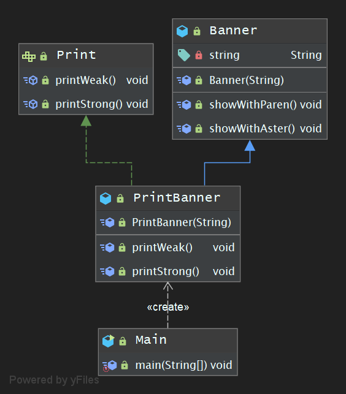
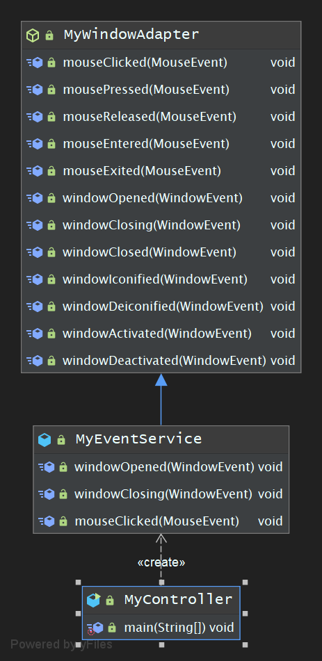

## 学习笔记 : Java设计模式之Adapter模式

### 概述
*适配器模式 : 将一个类的接口转换为客户希望的另一个接口. 适配器模式让那些接口不兼容的的类可以在一起工作. Adapter模式也称为Wrapper模式( Adapter Pattern : Convert the interface of a class into another interface clients expect. Adapter lets classes work together that couldn't otherwise because of incompatible interfaces )*

### 示例程序(使用继承的适配器)
*首先让我们来看一段使用继承的适配器的示例程序,该简单程序的作用是将一段输入的字符串显示为`(hello)`或`*hello*`.*

1. *Banner类 : 充当Adaptee角色*
```java
package pers.huangyuhui.adapter.adapter1;

/**
 * @project: design-patterns
 * @description: 充当Adaptee角色
 * @author: 黄宇辉
 * @date: 9/3/2019-4:12 PM
 * @version: 1.0
 * @website: https://yubuntu0109.github.io/
 */
public class Banner {
    private String string;

    public Banner(String string) {
        this.string = string;
    }

    public void showWithParen() {
        System.out.println("(" + string + ")");
    }

    public void showWithAster() {
        System.out.println("*" + string + "*");
    }

}
```

2. *Print接口 : 充当Target角色*
```java
package pers.huangyuhui.adapter.adapter1;

/**
 * @project: design-patterns
 * @description: 充当Target角色
 * @author: 黄宇辉
 * @date: 9/3/2019-4:15 PM
 * @version: 1.0
 * @website: https://yubuntu0109.github.io/
 */
public interface Print {
    void printWeak();

    void printStrong();
}
```

3. *PrintBanner类 : 充当Adapter角色*
```java
package pers.huangyuhui.adapter.adapter1;

/**
 * @project: design-patterns
 * @description: 充当Adapter角色
 * @author: 黄宇辉
 * @date: 9/3/2019-4:16 PM
 * @version: 1.0
 * @website: https://yubuntu0109.github.io/
 */
public class PrintBanner extends Banner implements Print {

    public PrintBanner(String string) {
        super(string);
    }

    @Override
    public void printWeak() {
        super.showWithParen();
    }

    @Override
    public void printStrong() {
        super.showWithAster();
    }
}
```

4. *Main类 : 充当Client角色*
```java
package pers.huangyuhui.adapter.adapter1;

/**
 * @project: design-patterns
 * @description: 充当Client角色
 * @author: 黄宇辉
 * @date: 9/3/2019-4:17 PM
 * @version: 1.0
 * @website: https://yubuntu0109.github.io/
 */
public class Main {
    public static void main(String[] args) {
        Print print = new PrintBanner("Hello");
        print.printWeak();
        print.printStrong();
    }
}
```

5. *程序运行结果如下所示 :*
```
(Hello)
*Hello*
```

#### 示例程序的类图


#### Adapter模式中登场的角色
* `Target( 目标抽象类 )` : 目标抽象类定义客户所需的接口,可以是一个抽象类或接口,也可以是具体类. 在类适配器中,由于Java语言不支持多重继承,所以它只能是接口.
* `Client( 请求者 ) ` : 该角色负责使用 Target 角色所定义的方法进行具体的处理
* `Adapter( 适配器类 )` : 它可以调用另一个接口,作为一个转换器,对 Adaptee 和 Target 进行适配. 适配器 Adapter 是适配器模式的核心,`在类适配器中,它通过实现 Target 接口并继承 Adaptee 来使两者产生联系,在对象适配器中,它通过继承Target并关联一个Adaptee对象来使两者产生联系`.
* `Adaptee( 适配者类 )` : 适配者既被适配的角色,它定义了一个已经存在的接口,这个接口需要适配,适配者类一般是一个具体类,其包含着客户希望使用的业务方法


### 示例程序(使用委托的适配器)
*在 Java 语言中,委托是指将某个方法中的实际处理交给其它实例的方法*

1. *Banner类 : 充当Adaptee角色(同上个示例程序)*
```java
package pers.huangyuhui.adapter.adapter2;

/**
 * @project: design-patterns
 * @description: 充当Adaptee角色
 * @author: 黄宇辉
 * @date: 9/3/2019-4:23 PM
 * @version: 1.0
 * @website: https://yubuntu0109.github.io/
 */
public class Banner {
    private String string;

    public Banner(String string) {
        this.string = string;
    }

    public void showWithParen() {
        System.out.println("(" + string + ")");
    }

    public void showWithAster() {
        System.out.println("*" + string + "*");
    }
}
```

2. *Print类 : 充当Target角色*
```java
package pers.huangyuhui.adapter.adapter2;

/**
 * @project: design-patterns
 * @description: 充当Target角色
 * @author: 黄宇辉
 * @date: 9/3/2019-4:21 PM
 * @version: 1.0
 * @website: https://yubuntu0109.github.io/
 */
public abstract class Print {
    public abstract void printWeak();

    public abstract void pintStrong();
}
```

3. *PrintBanner类 : 充当Adapter角色*
```java
package pers.huangyuhui.adapter.adapter2;

/**
 * @project: design-patterns
 * @description: 充当Adapter角色
 * @author: 黄宇辉
 * @date: 9/3/2019-4:22 PM
 * @version: 1.0
 * @website: https://yubuntu0109.github.io/
 */
public class PrintBanner extends Print {

    private Banner banner;

    public PrintBanner(String string) {
        this.banner = new Banner(string);
    }

    @Override
    public void printWeak() {
        banner.showWithParen();
    }

    @Override
    public void pintStrong() {
        banner.showWithAster();
    }
}
```

4. *Main类 : 充当Client角色(同上个示例程序)*
```java
package pers.huangyuhui.adapter.adapter2;

/**
 * @project: design-patterns
 * @description: 充当Client角色
 * @author: 黄宇辉
 * @date: 9/3/2019-4:26 PM
 * @version: 1.0
 * @website: https://yubuntu0109.github.io/
 */
public class Main {

    public static void main(String[] args) {
        Print print = new PrintBanner("Adapter Pattern");
        print.printWeak();
        print.pintStrong();

    }
}
```

#### 示例程序的类图


### 扩-缺省适配模式
*缺省设计模式是适配器模式的一种变体,其应用也比较广泛,其定义为 : `缺省设计模式( Default Adapter Pattern )` : 当不需要实现一个接口提供的所有方法时,可先设计一个抽象类来实现接口,并为接口中的每个方法提供一个默认实现( 空方法 ),那么该抽象类的子类就可以选择性地覆盖父类的某些实现方法来实现需求,它适用于不想使用一个接口的所有方法的情况,又称为单接口适配器模式*

#### 示例程序
*下面是一个缺省适配模式的示例程序,创建一个 JFrame 窗体,并通过继承 MyWindowAdapter 适配器类,选择性地自定义监听事件.*

1. *MyWindowAdapter接口 : 充当缺省适配器类. WindowListener, MouseListener接口 : 充当适配者接口*
```java
package pers.huangyuhui.adapter.adapter3;

import java.awt.event.MouseEvent;
import java.awt.event.MouseListener;
import java.awt.event.WindowEvent;
import java.awt.event.WindowListener;

/**
 * @project: design-patterns
 * @description: 充当缺省适配器类
 * @author: 黄宇辉
 * @date: 9/3/2019-4:35 PM
 * @version: 1.0
 * @website: https://yubuntu0109.github.io/
 */
public abstract class MyWindowAdapter implements WindowListener, MouseListener {


    @Override
    public void mouseClicked(MouseEvent e) {

    }

    @Override
    public void mousePressed(MouseEvent e) {

    }

    @Override
    public void mouseReleased(MouseEvent e) {

    }

    @Override
    public void mouseEntered(MouseEvent e) {

    }

    @Override
    public void mouseExited(MouseEvent e) {

    }

    @Override
    public void windowOpened(WindowEvent e) {

    }

    @Override
    public void windowClosing(WindowEvent e) {

    }

    @Override
    public void windowClosed(WindowEvent e) {

    }

    @Override
    public void windowIconified(WindowEvent e) {

    }

    @Override
    public void windowDeiconified(WindowEvent e) {

    }

    @Override
    public void windowActivated(WindowEvent e) {

    }

    @Override
    public void windowDeactivated(WindowEvent e) {

    }
}
```

2. *MyEventService类 : 充当具体业务类*
```java
package pers.huangyuhui.adapter.adapter3;

import java.awt.event.MouseEvent;
import java.awt.event.WindowEvent;

/**
 * @project: design-patterns
 * @description: 充当具体业务类
 * @author: 黄宇辉
 * @date: 9/3/2019-4:40 PM
 * @version: 1.0
 * @website: https://yubuntu0109.github.io/
 */
public class MyEventService extends MyWindowAdapter {

    @Override
    public void windowOpened(WindowEvent e) {
        System.out.println("windowOpened : Hello");
    }

    @Override
    public void windowClosing(WindowEvent e) {
        System.out.println("windowClosing : Bye");
    }

    @Override
    public void mouseClicked(MouseEvent e) {
        System.out.println("mouseClicked : Clicked");
    }

}
```

3. *MyContoller类 : 测试类,创建JFrame窗体并为其绑定监听事件*
```java
package pers.huangyuhui.adapter.adapter3;

import javax.swing.*;
import java.awt.event.MouseAdapter;
import java.awt.event.MouseEvent;
import java.awt.event.WindowAdapter;
import java.awt.event.WindowEvent;

/**
 * @project: design-patterns
 * @description: 创建JFrame窗体并为其绑定监听事件
 * @author: 黄宇辉
 * @date: 9/3/2019-4:47 PM
 * @version: 1.0
 * @website: https://yubuntu0109.github.io/
 */
public class MyController {
    public static void main(String[] args) {
        MyEventService myEventService = new MyEventService();
        JFrame j = new JFrame("title");
        j.setSize(500, 300);
        j.setVisible(true);
        j.setLocationRelativeTo(null);
        j.setDefaultCloseOperation(JFrame.EXIT_ON_CLOSE);

        //绑定事件
        j.addWindowListener(new WindowAdapter() {
            @Override
            public void windowOpened(WindowEvent e) {
                myEventService.windowOpened(e);
            }

            @Override
            public void windowClosing(WindowEvent e) {
                myEventService.windowClosing(e);
            }
        });
        j.addMouseListener(new MouseAdapter() {
            @Override
            public void mouseClicked(MouseEvent e) {
                myEventService.mouseClicked(e);
            }
        });

    }
}
```

#### 示例程序的类图


#### Adapter模式中登场的角色
* `ServiceInterface( 适配器接口 )` : 该接口中声明了大量的方法.
* `AbstractServiceClass( 缺省适配器类 )` : 为缺省适配器模式的核心类,通常将其定义为抽象类,使用空方法的形式实现了在 ServiceInterface 接口中声明的方法.
* `ConcreteServiceClass( 具体业务类 )` : 直接继承 AbstractServiceClass 适配器类,根据需要有选择性地覆盖在适配器中定的方法.