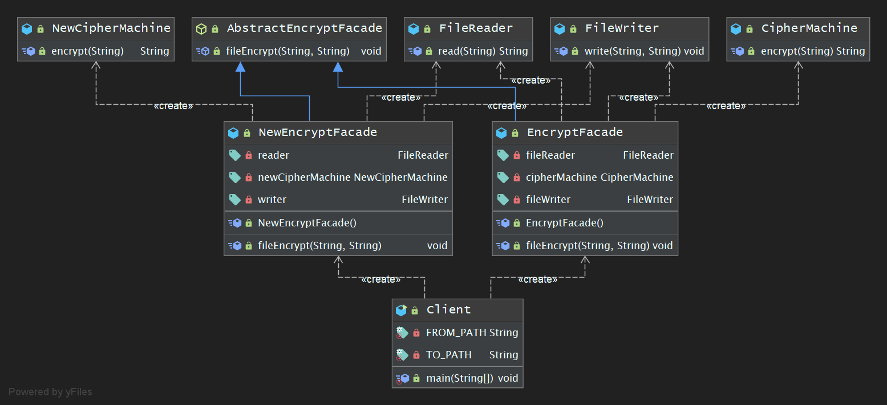

## 学习笔记 : Java设计模式之Facade Pattern

### 概述
*为子系统中的一组接口提供一个统一的入口. 外观模式定义了一个高层接口,这个接口使得这一子系统更加容易使用. ( Facade Pattern : Provide a unified interface to a set of interfaces in a subsystem. Facade defines a highter-level interface that makes the subsystem easier to use. )*

* 扩 : 外观模式又称门面模式,它是一种对象结构型模式. 外观模式是`迪米特法则`的一种具体实现,通过引入一个新的外观角色来降低原有系统的复杂度,同时降低客户类与子系统的耦合度.


### 外观设计模式中使用的角色
1. *`Facade( 外观角色 )` : 在客户端可以调用它的方法,在外观角色中知道相关的( 一个或多个 )子系统的功能和责任. 在正常情况下,它将所有从客户端发来的请求委派到相应的子系统,传递给相应的子系统对象处理.*
2. *`SubSystem( 子系统角色 )` : 在软件系统中有一个或者多个子系统角色,每一个子系统可以不是一个单独的类,而是一个类的集合,它实现了子系统的功能. 每一个子系统都可以被客户端直接调用,或者被外观角色调用,它处理由外观类传递过来的请求. 子系统并不知道外观类的存在,对于子系统而言,外观角色仅仅是另外一个客户端而已.*

* 扩 : 外观模式中所指的子系统是一个广义的概念,它可以是一个类,一个功能模块,系统的一个组成部分或者一个完整的系统. 通常所指一些业务类,实现了一些具体的,独立的业务功能.


### 示例程序
*下面是一个使用外观设计模式的简单示例程序 : 写一个用于文件加密的模块,该模块的功能为对指定文件中的数据进行加密并将加密之后的数据保存到新的文件中. 具体流程包括三个部分 : 读取源文件中的数据, 数据加密, 将加密后的数据写入到新文件*

1. *FileReader类 : 文件读取类, 充当子系统类*
```java
package pers.huangyuhui.facade_pattern.facade_pattern_1;

import java.io.FileInputStream;
import java.io.IOException;

/**
 * @project: design-patterns
 * @description: 文件读取类, 充当子系统类
 * @author: 黄宇辉
 * @date: 9/12/2019-9:36 PM
 * @version: 1.0
 * @website: https://yubuntu0109.github.io/
 */
public class FileReader {

    public String read(String path) {
        var stringBuffer = new StringBuilder();
        try (var fileInputStream = new FileInputStream(path)) {
            var data = 0;
            while ((data = fileInputStream.read()) != -1) {
                stringBuffer.append((char) data); //char
            }
        } catch (IOException e) {
            e.printStackTrace();
        }
        return stringBuffer.toString();
    }
}
```

2. *CipherMachine类 : 数据加密类(求模运算), 充当子系统类*
```java
package pers.huangyuhui.facade_pattern.facade_pattern_1;

/**
 * @project: design-patterns
 * @description: 数据加密类(求模运算), 充当子系统类
 * @author: 黄宇辉
 * @date: 9/12/2019-9:42 PM
 * @version: 1.0
 * @website: https://yubuntu0109.github.io/
 */
public class CipherMachine {

    public String encrypt(String text) {
        var result = new StringBuilder();
        for (int i = 0; i < text.length(); i++) {
            var s = String.valueOf(text.charAt(i) % 7);
            result.append(s);
        }
        return result.toString();
    }
}
```

3. *FileWriter类 : 文件保存类, 充当子类系统类*
```java
package pers.huangyuhui.facade_pattern.facade_pattern_1;

import java.io.FileOutputStream;
import java.io.IOException;

/**
 * @project: design-patterns
 * @description: 文件保存类, 充当子类系统类
 * @author: 黄宇辉
 * @date: 9/12/2019-9:56 PM
 * @version: 1.0
 * @website: https://yubuntu0109.github.io/
 */
public class FileWriter {

    public void write(String encryptStr, String path) {
        try (var fileOutputStream = new FileOutputStream(path)) {
            fileOutputStream.write(encryptStr.getBytes());
        } catch (IOException e) {
            e.printStackTrace();
        }
    }
}
```

4. *EncryptFacade类 : 加密外观类, 充当外观类*
```java
package pers.huangyuhui.facade_pattern.facade_pattern_1;

/**
 * @project: design-patterns
 * @description: 加密外观类, 充当外观类
 * @author: 黄宇辉
 * @date: 9/12/2019-9:59 PM
 * @version: 1.0
 * @website: https://yubuntu0109.github.io/
 */
public class EncryptFacade {

    //维持对子系统对象的引用
    private FileReader fileReader;
    private CipherMachine cipherMachine;
    private FileWriter fileWriter;

    public EncryptFacade() {
        fileReader = new FileReader();
        cipherMachine = new CipherMachine();
        fileWriter = new FileWriter();
    }

    //调用子系统对象的业务方法
    public void fileEncrypt(String fromPath, String toPath) {
        var text = fileReader.read(fromPath);
        System.out.println(">>>>>>>>>> : 读取文件[ " + fromPath + " ]中的明文数据 : " + text);
        var encryptStr = cipherMachine.encrypt(text);
        System.out.println(">>>>>>>>>> : 明文数据加密后的结果 : " + encryptStr);
        fileWriter.write(encryptStr, toPath);
    }
}
```

5. *Client类 : 客户端测试类*
```java
package pers.huangyuhui.facade_pattern.facade_pattern_1;

/**
 * @project: design-patterns
 * @description: 客户端测试类
 * @author: 黄宇辉
 * @date: 9/14/2019-6:05 PM
 * @version: 1.0
 * @website: https://yubuntu0109.github.io/
 */
public class Client {

    private static final String FROM_PATH = "src\\main\\java\\pers\\huangyuhui\\facade_pattern\\facade_pattern_1\\from.txt";
    private static final String TO_PATH = "src\\main\\java\\pers\\huangyuhui\\facade_pattern\\facade_pattern_1\\to.txt";

    public static void main(String[] args) {
        EncryptFacade encryptFacade = new EncryptFacade();
        encryptFacade.fileEncrypt(FROM_PATH, TO_PATH);
    }
}
```

6. *from.txt : 源文件,用于存储待加密的数据*
```
YUbuntu0109
```

7. *程序运行结果如下所示 :*
```
>>>>>>>>>> : 读取文件[ src\main\java\pers\huangyuhui\facade_pattern\facade_pattern_1\from.txt ]中的明文数据 : YUbuntu0109
>>>>>>>>>> : 明文数据加密后的结果 : 51055456061
```

8. *to.txt : 目标文件,用于存储加密后的数据( 程序运行后的该文件中的内容如下所示 )*
```
51055456061
```

#### 示例程序的类图


### 示例程序-抽象外观类
*在标准的外观模式结构中,如果需要增加,删除或更换与外观类交互的子类,必须修改外观类或客户端的代码,这将违背`开闭原则`,因此可以通过引入抽象外观类对系统进行改进,即客户端针对抽象外观类进行编程,在运行时再确定具体的外观类. ( 下述示例程序是在上述示例程序基础上进行改进的 )*

1. *FileReader类 : 文件读取类, 充当子系统类*
```java
package pers.huangyuhui.facade_pattern.facade_pattern_2;

import java.io.FileInputStream;
import java.io.IOException;

/**
 * @project: design-patterns
 * @description: 文件读取类, 充当子系统类
 * @author: 黄宇辉
 * @date: 9/12/2019-9:36 PM
 * @version: 1.0
 * @website: https://yubuntu0109.github.io/
 */
public class FileReader {

    public String read(String path) {
        var stringBuffer = new StringBuilder();
        try (var fileInputStream = new FileInputStream(path)) {
            var data = 0;
            while ((data = fileInputStream.read()) != -1) {
                stringBuffer.append((char) data); //char
            }
        } catch (IOException e) {
            e.printStackTrace();
        }
        return stringBuffer.toString();
    }
}
```

2. *FileWriter类 : 文件保存类, 充当子类系统类*
```java
package pers.huangyuhui.facade_pattern.facade_pattern_2;

import java.io.FileOutputStream;
import java.io.IOException;

/**
 * @project: design-patterns
 * @description: 文件保存类, 充当子类系统类
 * @author: 黄宇辉
 * @date: 9/12/2019-9:56 PM
 * @version: 1.0
 * @website: https://yubuntu0109.github.io/
 */
public class FileWriter {

    public void write(String encryptStr, String path) {
        try (var fileOutputStream = new FileOutputStream(path)) {
            fileOutputStream.write(encryptStr.getBytes());
        } catch (IOException e) {
            e.printStackTrace();
        }
    }
}
```

3. *CipherMachine类 : 数据加密类(求模运算), 充当子系统类*
```java
package pers.huangyuhui.facade_pattern.facade_pattern_2;

/**
 * @project: design-patterns
 * @description: 数据加密类(求模运算), 充当子系统类
 * @author: 黄宇辉
 * @date: 9/12/2019-9:42 PM
 * @version: 1.0
 * @website: https://yubuntu0109.github.io/
 */
public class CipherMachine {

    public String encrypt(String text) {
        var result = new StringBuilder();
        for (int i = 0; i < text.length(); i++) {
            var s = String.valueOf(text.charAt(i) % 7);
            result.append(s);
        }
        return result.toString();
    }
}
```

4. *NewCipherMachine类 : 数据加密类(移位运算), 充当子系统类*
```java
package pers.huangyuhui.facade_pattern.facade_pattern_2;

/**
 * @project: design-patterns
 * @description: 数据加密类(移位运算), 充当子系统类
 * @author: 黄宇辉
 * @date: 9/14/2019-6:59 PM
 * @version: 1.0
 * @website: https://yubuntu0109.github.io/
 */
public class NewCipherMachine {

    public String encrypt(String text) {
        var result = "";
        var key = 10; //设置密钥,移位数为10
        for (int i = 0; i < text.length(); i++) {
            var c = text.charAt(i);
            //小写字母移位
            if (c >= 'a' && c <= 'z') {
                c += key % 26;
                if (c > 'z') {
                    c -= 26;
                }
                if (c < 'a') {
                    c += 26;
                }
            }
            //大写字母移位
            if (c >= 'A' && c <= 'Z') {
                c += key % 26;
                if (c > 'Z') {
                    c -= 26;
                }
                if (c < 'A') {
                    c += 26;
                }
                result += c;
            }
        }
        return result;
    }
}
```

5. *AbstractEncryptFacade抽象类 : 明文加密抽象类, 充当抽象外观类*
```java
package pers.huangyuhui.facade_pattern.facade_pattern_2;

/**
 * @project: design-patterns
 * @description: 明文加密抽象类, 充当抽象外观类
 * @author: 黄宇辉
 * @date: 9/14/2019-6:54 PM
 * @version: 1.0
 * @website: https://yubuntu0109.github.io/
 */
public abstract class AbstractEncryptFacade {
    public abstract void fileEncrypt(String fromPath, String toPath);
}
```

6. *EncryptFacade类 : 加密外观类, 充当外观类*
```java
package pers.huangyuhui.facade_pattern.facade_pattern_2;

/**
 * @project: design-patterns
 * @description: 加密外观类, 充当外观类
 * @author: 黄宇辉
 * @date: 9/12/2019-9:59 PM
 * @version: 1.0
 * @website: https://yubuntu0109.github.io/
 */
public class EncryptFacade extends AbstractEncryptFacade {

    //维持对子系统对象的引用
    private FileReader fileReader;
    private CipherMachine cipherMachine;
    private FileWriter fileWriter;

    public EncryptFacade() {
        fileReader = new FileReader();
        cipherMachine = new CipherMachine();
        fileWriter = new FileWriter();
    }

    //调用子系统对象的业务方法
    public void fileEncrypt(String fromPath, String toPath) {
        var text = fileReader.read(fromPath);
        System.out.println(">>>>>>>>>> : 读取文件[ " + fromPath + " ]中的明文数据 : " + text);
        var encryptStr = cipherMachine.encrypt(text);
        System.out.println(">>>>>>>>>> : 明文数据加密后的结果 : " + encryptStr);
        fileWriter.write(encryptStr, toPath);
    }
}
```

7. *NewEncryptFacade类 : 加密外观类, 充当外观类*
```java
package pers.huangyuhui.facade_pattern.facade_pattern_2;

/**
 * @project: design-patterns
 * @description: 加密外观类, 充当外观类
 * @author: 黄宇辉
 * @date: 9/14/2019-6:57 PM
 * @version: 1.0
 * @website: https://yubuntu0109.github.io/
 */
public class NewEncryptFacade extends AbstractEncryptFacade {

    private FileReader reader;
    private NewCipherMachine newCipherMachine;
    private FileWriter writer;

    public NewEncryptFacade() {
        reader = new FileReader();
        newCipherMachine = new NewCipherMachine();
        writer = new FileWriter();
    }

    //调用子系统对象的业务方法
    @Override
    public void fileEncrypt(String fromPath, String toPath) {
        String text = reader.read(fromPath);
        System.out.println(">>>>>>>>>> : 读取文件[ " + fromPath + " ]中的明文数据 : " + text);
        String encryptStr = newCipherMachine.encrypt(text);
        System.out.println(">>>>>>>>>> : 明文数据加密后的结果 : " + encryptStr);
        writer.write(encryptStr, toPath);
    }
}
```

8. *Client类 : 客户端测试类*
```java
package pers.huangyuhui.facade_pattern.facade_pattern_2;

/**
 * @project: design-patterns
 * @description: 客户端测试类
 * @author: 黄宇辉
 * @date: 9/14/2019-6:05 PM
 * @version: 1.0
 * @website: https://yubuntu0109.github.io/
 */
public class Client {

    private static final String FROM_PATH = "src\\main\\java\\pers\\huangyuhui\\facade_pattern\\facade_pattern_2\\from.txt";
    private static final String TO_PATH = "src\\main\\java\\pers\\huangyuhui\\facade_pattern\\facade_pattern_2\\to.txt";

    public static void main(String[] args) {
        //取模运算加密
        AbstractEncryptFacade encryptFacade = new EncryptFacade();
        encryptFacade.fileEncrypt(FROM_PATH, TO_PATH);
        //移位运算加密
        AbstractEncryptFacade newEncryptFacade = new NewEncryptFacade();
        newEncryptFacade.fileEncrypt(FROM_PATH, TO_PATH);
    }
}
```

9. *from.txt : 源文件,用于存储待加密的数据*
```
YUbuntu0109
```

10. *to.txt : 目标文件,用于存储加密后的数据( 程序运行后的该文件中的内容如下所示 )*
```
IE
```

11. *程序运行结果如下所示 :*
```
>>>>>>>>>> : 读取文件[ src\main\java\pers\huangyuhui\facade_pattern\facade_pattern_2\from.txt ]中的明文数据 : YUbuntu0109
>>>>>>>>>> : 明文数据加密后的结果 : 51055456061
>>>>>>>>>> : 读取文件[ src\main\java\pers\huangyuhui\facade_pattern\facade_pattern_2\from.txt ]中的明文数据 : YUbuntu0109
>>>>>>>>>> : 明文数据加密后的结果 : IE
```

#### 示例程序的类图

