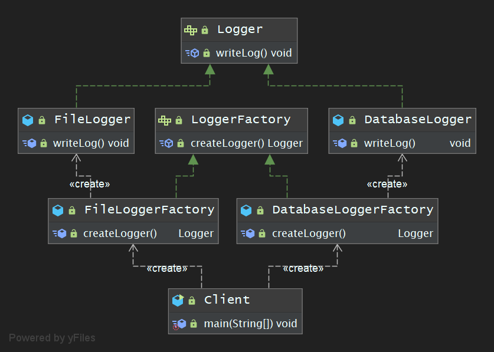
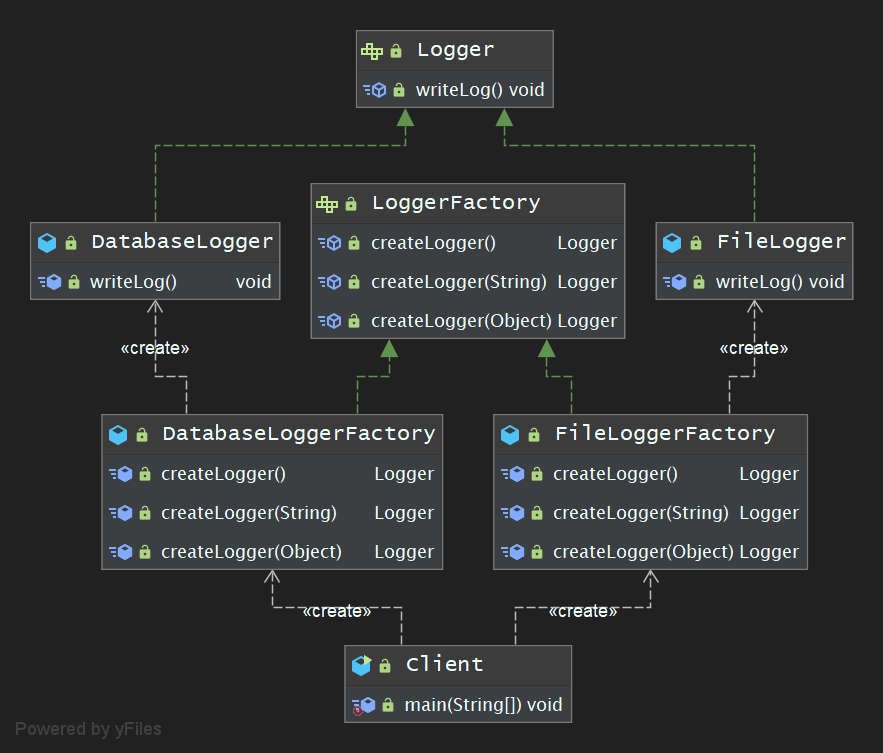
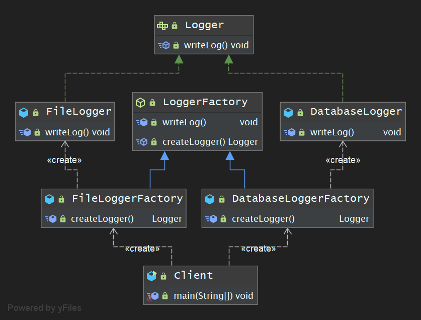

## 学习笔记 : Java设计模式之Factory Method模式

### 概述
*工厂方法模式 : 定义一个用于创建对象的接口,但是让子类决定将哪一个类实例化. 工厂方法模式让一个类的实例化延迟到其子类. ( Factory Method Pattern : Definde an interface for creating an object,but let subclasses decides which class to instantiate. Factory Method lets a class defer instantiation to sublclasses )*

* 工厂方法模式是简单工厂模式的延伸,它继承了简单工厂模式的优点,同时还弥补了简单工厂模式的缺陷,使其更好地符合开闭原则的要求. 工厂方法模式简称为工厂模式( Factory Pattern ),又可称为虚拟构造器模式( Virtual Constructor Pattern )或多态工厂模式( Polymorphic Factory Pattern ). 其为一种类创建型模式哟 ~

### Factory Method模式中的角色
1. *`Product (抽象产品)` : 它是定义产品的接口,是工厂方法模式所创建对象的超类型,也是产品对象的公共父类.*
2. *`ConcreteProduct (具体产品)` : 它实现了抽象产品接口,某种类型的具体产品由专门的具体工厂创建,具体工厂和具体产品间一一对象.*
3. *`Factory (抽象工厂)` : 在抽象工厂类中声明了工厂方法( Factory Method ),用于返回一个产品. 抽象工厂是工厂方法模式的核心,所有创建对象的工厂类都必须实现该接口.*
4. *`ConcreteFactory (具体工厂)` : 它是抽象工厂类的子类,实现了在抽象工厂中声明的工厂方法,并由客户端调用,返回一个具体产品类的实例.*


### 程序示例-简洁版
*下面是一个实现了Factory Method模式的简单示例程序,该示例程序的功能( 模拟 )是为了提高多种日志记录器之间切换的灵活性.*

1. *Logger接口 : 日志记录器接口, 充当抽象产品角色*
```java
package pers.huangyuhui.factory_method.factory_method1;

/**
 * @project: design-patterns
 * @description: 日志记录器接口, 充当抽象产品角色
 * @author: 黄宇辉
 * @date: 9/5/2019-9:26 AM
 * @version: 1.0
 * @website: https://yubuntu0109.github.io/
 */
public interface Logger {
    void writeLog();
}
```

2. *DatabaseLogger类 : 数据库日志记录器, 充当具体产品角色*
```java
package pers.huangyuhui.factory_method.factory_method1;

/**
 * @project: design-pattern
 * @description: 数据库日志记录器, 充当具体产品角色
 * @author: 黄宇辉
 * @date: 9/5/2019-9:27 AM
 * @version: 1.0
 * @website: https://yubuntu0109.github.io/
 */
public class DatabaseLogger implements Logger {

    @Override
    public void writeLog() {
        System.out.println("this is some logs about database");
    }
}
```

3. *FileLogger类 : 文件日志记录器, 充当具体产品角色*
```java
package pers.huangyuhui.factory_method.factory_method1;

/**
 * @project: design-patterns
 * @description: 文件日志记录器, 充当具体产品角色
 * @author: 黄宇辉
 * @date: 9/5/2019-9:30 AM
 * @version: 1.0
 * @website: https://yubuntu0109.github.io/
 */
public class FileLogger implements Logger {

    @Override
    public void writeLog() {
        System.out.println("this is some logs about file");
    }
}
```

4. *LoggerFactory类 : 日志记录器工厂接口, 充当抽象工厂角色*
```java
package pers.huangyuhui.factory_method.factory_method1;

/**
 * @project: design-patterns
 * @description: 日志记录器工厂接口, 充当抽象工厂角色
 * @author: 黄宇辉
 * @date: 9/5/2019-9:33 AM
 * @version: 1.0
 * @website: https://yubuntu0109.github.io/
 */
public interface LoggerFactory {
    Logger createLogger();
}
```

5. *DatabaseLoggerFactory类 : 数据库日志记录器工厂类, 充当具体工厂角色*
```java
package pers.huangyuhui.factory_method.factory_method1;


/**
 * @project: design-patterns
 * @description: 数据库日志记录器工厂类, 充当具体工厂角色
 * @author: 黄宇辉
 * @date: 9/5/2019-9:36 AM
 * @version: 1.0
 * @website: https://yubuntu0109.github.io/
 */
public class DatabaseLoggerFactory implements LoggerFactory {

    @Override
    public Logger createLogger() {
        return new DatabaseLogger();
    }
}
```

6. *FileLoggerFactory类 : 文件日志记录器工厂类, 充当具体工厂角色*
```java
package pers.huangyuhui.factory_method.factory_method1;

/**
 * @project: design-patterns
 * @description: 文件日志记录器工厂类, 充当具体工厂角色
 * @author: 黄宇辉
 * @date: 9/5/2019-9:38 AM
 * @version: 1.0
 * @website: https://yubuntu0109.github.io/
 */
public class FileLoggerFactory implements LoggerFactory {

    @Override
    public Logger createLogger() {
        return new FileLogger();
    }
}
```

7. *Client类 : 客户端测试类*
```java
package pers.huangyuhui.factory_method.factory_method1;

/**
 * @project: design-patterns
 * @description: 客户端测试类
 * @author: 黄宇辉
 * @date: 9/5/2019-9:39 AM
 * @version: 1.0
 * @website: https://yubuntu0109.github.io/
 */
public class Client {

    public static void main(String[] args) {
        LoggerFactory databaseLoggerFactory = new DatabaseLoggerFactory();
        Logger databaseLogger = databaseLoggerFactory.createLogger();
        databaseLogger.writeLog();

        LoggerFactory fileLoggerFactory = new FileLoggerFactory();
        Logger fileLogger = fileLoggerFactory.createLogger();
        fileLogger.writeLog();
    }
}
```

8. *程序运行结果如下所示 :*
```
this is some logs about database
this is some logs about file
```

#### 示例程序的类图



### 示例程序-工厂方法的重载
*下述示例代码文件同上述`示例程序-简洁版`,既只需修改部分代码即可哟~*

1. *LoggerFactory接口 : 日志记录器工厂接口, 充当抽象工厂角色(工厂方法的重载)*
```java
package pers.huangyuhui.factory_method.factory_method2;

/**
 * @project: design-patterns
 * @description: 日志记录器工厂接口, 充当抽象工厂角色(工厂方法的重载)
 * @author: 黄宇辉
 * @date: 9/5/2019-9:33 AM
 * @version: 1.0
 * @website: https://yubuntu0109.github.io/
 */
public interface LoggerFactory {
    Logger createLogger();

    Logger createLogger(String args);

    Logger createLogger(Object obj);
}
```

2. *DatabaseLoggerFactory类 : 数据库日志记录器工厂类, 充当具体工厂角色(工厂方法的重载)*
```java
package pers.huangyuhui.factory_method.factory_method2;

/**
 * @project: design-patterns
 * @description: 数据库日志记录器工厂类, 充当具体工厂角色(工厂方法的重载)
 * @author: 黄宇辉
 * @date: 9/5/2019-9:36 AM
 * @version: 1.0
 * @website: https://yubuntu0109.github.io/
 */
public class DatabaseLoggerFactory implements LoggerFactory {

    @Override
    public Logger createLogger() {
        return new DatabaseLogger();
    }

    @Override
    public pers.huangyuhui.factory_method.factory_method2.Logger createLogger(String args) {
        System.out.println("使用参数" + args + "作为连接字符串来连接数据库,代码省略 ···");
        Logger logger = new DatabaseLogger();
        //初始化数据库日志记录器,代码省略 ···
        return new DatabaseLogger();
    }

    @Override
    public pers.huangyuhui.factory_method.factory_method2.Logger createLogger(Object obj) {
        System.out.println("使用封装在" + obj.toString() + "中的连接字符串来连接数据库,代码省略 ···");
        Logger logger = new DatabaseLogger();
        //使用封装在参数obj中的数据来初始化数据库日志记录器，代码省略 ···
        return logger;
    }
}
```

3. *Client类 : 客户端测试类-(工厂方法的重载)*
```java
package pers.huangyuhui.factory_method.factory_method2;

/**
 * @project: design-patterns
 * @description: 客户端测试类-(工厂方法的重载)
 * @author: 黄宇辉
 * @date: 9/5/2019-9:39 AM
 * @version: 1.0
 * @website: https://yubuntu0109.github.io/
 */
public class Client {

    public static void main(String[] args) {
        LoggerFactory databaseLoggerFactory = new DatabaseLoggerFactory();
        Logger databaseLogger = databaseLoggerFactory.createLogger("database-connection-info");
        databaseLogger.writeLog();

        LoggerFactory fileLoggerFactory = new FileLoggerFactory();
        Logger fileLogger = fileLoggerFactory.createLogger();
        fileLogger.writeLog();
    }
}
```

4. *程序运行结果如下所示 :*
```
使用参数database-connection-info作为连接字符串来连接数据库,代码省略 ···
this is some logs about database
this is some logs about file
```

#### 示例程序的类图



### 示例程序-工厂方法的隐藏
*下述示例代码文件同上述`示例程序-简洁版`,既只需修改部分代码即可哟~*

1. *LoggerFactory类 : 日志记录器工厂接口, 充当抽象工厂角色(工厂方法的隐藏)*
```java
package pers.huangyuhui.factory_method.factory_method3;

/**
 * @project: design-patterns
 * @description: 日志记录器工厂接口, 充当抽象工厂角色(工厂方法的隐藏)
 * @author: 黄宇辉
 * @date: 9/5/2019-9:33 AM
 * @version: 1.0
 * @website: https://yubuntu0109.github.io/
 */
public abstract class LoggerFactory {

    //工厂方法的隐藏
    public void writeLog() {
        Logger logger = this.createLogger();
        logger.writeLog();
    }

    public abstract Logger createLogger();
}
```

2. *DatabaseLoggerFactory类 : 数据库日志记录器工厂类, 充当具体工厂角色*
```java
public class DatabaseLoggerFactory extends LoggerFactory { · · · · · ·
```

3. *FileLoggerFactory类 : 文件日志记录器工厂类, 充当具体工厂角色*
```java
public class FileLoggerFactory extends LoggerFactory { · · · · · ·
```

4. *Client类 : 客户端测试类(工厂方法的隐藏)*
```java
package pers.huangyuhui.factory_method.factory_method3;

/**
 * @project: design-patterns
 * @description: 客户端测试类(工厂方法的隐藏)
 * @author: 黄宇辉
 * @date: 9/5/2019-9:39 AM
 * @version: 1.0
 * @website: https://yubuntu0109.github.io/
 */
public class Client {

    public static void main(String[] args) {
        new DatabaseLoggerFactory().writeLog();
        //LoggerFactory databaseLoggerFactory = new DatabaseLoggerFactory();
        //Logger databaseLogger = databaseLoggerFactory.createLogger();
        //databaseLogger.writeLog();

        new FileLoggerFactory().writeLog();
        //LoggerFactory fileLoggerFactory = new FileLoggerFactory();
        //Logger fileLogger = fileLoggerFactory.createLogger();
        //fileLogger.writeLog();
    }
}
```

5. *程序运行结果如下所示 :*
```
this is some logs about database
this is some logs about file
```

#### 示例程序的类图
