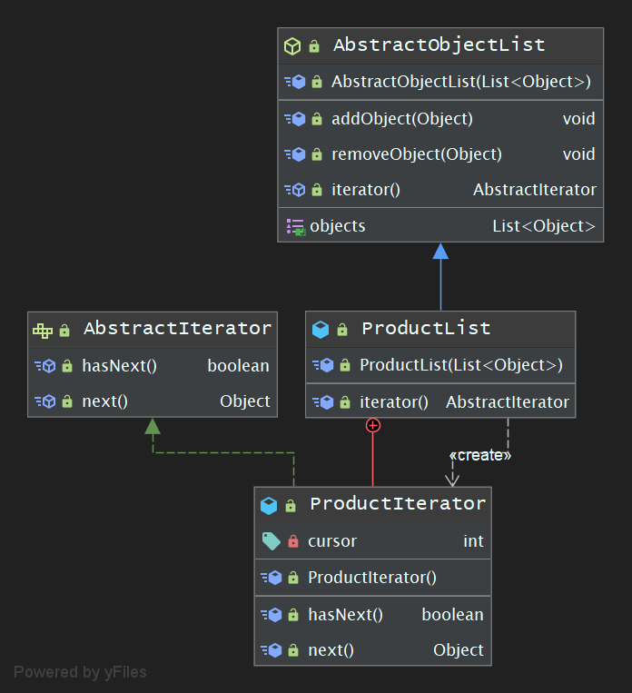

## 学习笔记 : Java设计模式之Iterator模式

### 概述
*迭代器模式 : 提供一种方法顺序访问一个聚合对象中的各个元素,而又不暴露该对象的内部表示. 迭代器模式又称( Cursor )模式,它是一种对象行为型模式( Iterator Pattern : Provide a way to access the elements of an aggregate object sequentially without exposing its underlying representation )*

### 示例程序-详细版
*下面是一个实现了`Iterator模式`的示例程序,其作用是将书籍信息( Book )放到存储书籍信息的书架( BookSelf )上,并将书的名字按顺序显示出来*

1. *Book : 图书信息类*
```java
package pers.huangyuhui.iterator;

/**
 * @project: design-patterns
 * @description: Book信息
 * @author: 黄宇辉
 * @date: 9/2/2019-4:59 PM
 * @version: 1.0
 * @website: https://yubuntu0109.github.io/
 */
public class Book {

    private String name;

    public Book(String name) {
        this.name = name;
    }

    public String getName() {
        return name;
    }

}
```

2. *Aggregate接口 : 充当集合角色*
```java
package pers.huangyuhui.iterator;


/**
 * @project: design-patterns
 * @description: 集合
 * @author: 黄宇辉
 * @date: 9/2/2019-5:00 PM
 * @version: 1.0
 * @website: https://yubuntu0109.github.io/
 */
public interface Aggregate {

    Iterator iterator();
}
```

3. *BookSelf类 : 充当具体的集合角色*
```java
package pers.huangyuhui.iterator;

/**
 * @project: design-patterns
 * @description: 具体的集合
 * @author: 黄宇辉
 * @date: 9/2/2019-5:03 PM
 * @version: 1.0
 * @website: https://yubuntu0109.github.io/
 */
public class BookSelf implements Aggregate {
    private Book[] books;
    private int last = 0;

    public BookSelf(int maxsize) {
        this.books = new Book[maxsize];
    }

    public Book getBookByIndex(int index) {
        return books[index];
    }

    public void appendBook(Book book) {
        this.books[last++] = book;
    }

    public int getLength() {
        return last;
    }

    @Override
    public Iterator iterator() {
        return new BookShelfIterator(this);
    }
}
```

4. *Iterator接口 : 充当迭代器角色*
```java
package pers.huangyuhui.iterator;

/**
 * @project: design-patterns
 * @description: 迭代器
 * @author: 黄宇辉
 * @date: 9/2/2019-5:01 PM
 * @version: 1.0
 * @website: https://yubuntu0109.github.io/
 */
public interface Iterator {
    boolean hasNext();

    Object next();
}
```

5. *BookShelfIterator类 : 充当具体的迭代器角色*
```java
package pers.huangyuhui.iterator;

/**
 * @project: design-patterns
 * @description: 集体的迭代器
 * @author: 黄宇辉
 * @date: 9/2/2019-5:07 PM
 * @version: 1.0
 * @website: https://yubuntu0109.github.io/
 */
public class BookShelfIterator implements Iterator {

    private BookSelf bookSelf;
    private int index;

    public BookShelfIterator(BookSelf bookSelf) {
        this.bookSelf = bookSelf;
        this.index = 0;
    }

    @Override
    public boolean hasNext() {
        return index < bookSelf.getLength();
    }

    @Override
    public Object next() {
        return bookSelf.getBookByIndex(index++);
    }
}
```

6. *Test测试类*
```java
package pers.huangyuhui.iterator;

/**
 * @project: design-patterns
 * @description: 测试类
 * @author: 黄宇辉
 * @date: 9/2/2019-5:09 PM
 * @version: 1.0
 * @website: https://yubuntu0109.github.io/
 */
public class Test {

    //demo
    public static void main(String[] args) {
        BookSelf bookSelf = new BookSelf(5);
        bookSelf.appendBook(new Book("A-BOOK"));
        bookSelf.appendBook(new Book("B-BOOK"));
        bookSelf.appendBook(new Book("C-BOOK"));
        bookSelf.appendBook(new Book("D-BOOK"));
        bookSelf.appendBook(new Book("E-BOOK"));
        Iterator iterator = bookSelf.iterator();
        while (iterator.hasNext()) {
            Book book = (Book) iterator.next();
            System.out.println(book.getName());
        }
    }
}
```

7. *程序运行结果如下所示 :*
```
A-BOOK
B-BOOK
C-BOOK
D-BOOK
E-BOOK
```

#### 示例程序的类图


#### Iterator模式中的角色分析
* `Iterator( 迭代器 )` : 该角色负责定义按顺序逐个遍历元素的接口( API ),在上述程序中,由`Iterator接口`扮演此角色.
* `ConcreteIterator( 具体的迭代器 )` : 该角色负责实现`Iterator角色`所定义的接口( API ). 在上述程序中,由`BookShelfIterator类`扮演此角色.
* `Aggregate( 集合 / 抽象聚合类 )` : 该角色负责定义创建`Iterator角色`的接口( API ),在上述程序中,由`Aggregate接口`扮演此角色.
* `ConcreteAggregate( 具体的集合 / 具体聚合类 )` : 该角色负责实现`Aggregate角色`所定义的接口( API ),它会创建出具体的`Iterator角色`. 在上述程序中,由`BookSelf类`扮演了此角色.


### 示例程序-简洁版
*下面同样是一个实现了`Iterator模式`的示例程序( 同上 ),其作用是将商品数据存储到商品集合( ProductList )中,并将商品的名字按顺序显示出来*

1. *AbstractObjectList : 抽象聚合类*
```java
package pers.huangyuhui.iterator2;

import java.util.List;

/**
 * @project: design-patterns
 * @description: 抽象聚合类
 * @author: 黄宇辉
 * @date: 9/2/2019-5:51 PM
 * @version: 1.0
 * @website: https://yubuntu0109.github.io/
 */
public abstract class AbstractObjectList {

    protected List<Object> objects;

    public AbstractObjectList(List<Object> objects) {
        this.objects = objects;
    }

    public void addObject(Object object) {
        this.objects.add(object);
    }

    public void removeObject(Object object) {
        this.objects.remove(object);
    }

    public List<Object> getObjects() {
        return objects;
    }

    //创建迭代器的抽象工厂方法
    public abstract AbstractIterator iterator();

}
```

2. *ProductList : 商品数据类,充当具体聚合类. ProductIterator(内部类) : 商品迭代器,充当具体迭代器*
```java
package pers.huangyuhui.iterator2;

import java.util.List;

/**
 * @project: design-patterns
 * @description: 商品书籍类, 充当具体聚合类
 * @author: 黄宇辉
 * @date: 9/2/2019-5:56 PM
 * @version: 1.0
 * @website: https://yubuntu0109.github.io/
 */
public class ProductList extends AbstractObjectList {

    public ProductList(List<Object> objects) {
        super(objects);
    }

    @Override
    public AbstractIterator iterator() {
        return new ProductIterator();
    }

    /*
    ProductIterator:商品迭代器,充当具体迭代器(使用内部类实现迭代器,与jdk中的迭代器实现原理相同)
    */
    public class ProductIterator implements AbstractIterator {

        private int cursor;

        public ProductIterator() {
            cursor = 0;
        }

        @Override
        public boolean hasNext() {
            return cursor < objects.size();
        }

        @Override
        public Object next() {
            return objects.get(cursor++);
        }
    }

}
```

3. *AbstractIterator : 抽象迭代器*
```java
package pers.huangyuhui.iterator2;

/**
 * @project: design-patterns
 * @description: 抽象迭代器
 * @author: 黄宇辉
 * @date: 9/2/2019-5:55 PM
 * @version: 1.0
 * @website: https://yubuntu0109.github.io/
 */
public interface AbstractIterator {

    boolean hasNext();

    Object next();
}
```

4. *Test : 测试类*
```java
package pers.huangyuhui.iterator2;

import java.util.ArrayList;
import java.util.List;

/**
 * @project: design-patterns
 * @description: 测试类
 * @author: 黄宇辉
 * @date: 9/2/2019-6:13 PM
 * @version: 1.0
 * @website: https://yubuntu0109.github.io/
 */
public class Test {

    //demo
    public static void main(String[] args) {
        List<Object> arrayList = new ArrayList<>();
        arrayList.add("A-BOOK");
        arrayList.add("B-BOOK");
        arrayList.add("C-BOOK");

        ProductList productList = new ProductList(arrayList);
        productList.addObject("D-BOOK");
        productList.addObject("E-BOOK");
        productList.removeObject("A-BOOK");

        AbstractIterator iterator = productList.iterator();
        while (iterator.hasNext()) {
            System.out.println(iterator.next());
        }
        System.out.println("all datas : " + productList.getObjects().toString());

    }
}
```

5. *程序运行结果如下所示 :*
```
B-BOOK
C-BOOK
D-BOOK
E-BOOK
all datas : [B-BOOK, C-BOOK, D-BOOK, E-BOOK]
```

#### 示例程序的类图



*📚参与书籍 : 《图解设计模式 - [日]结诚浩 · 著》, 《Java设计模式 - 刘伟编 · 著》*