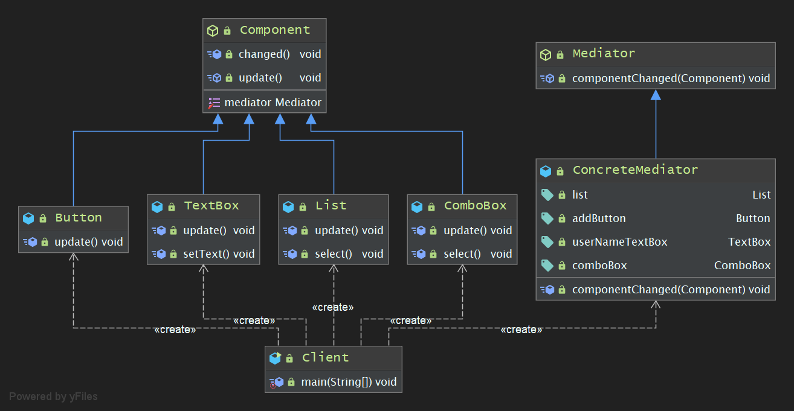

## 学习笔记 : Java设计模式之Mediator Pattern

### 定义
*中介者设计模式 : 定义一个对象来封装一系列对象的交互. 中介者模式使各个用户对象之间不需要显示地相互引用,从而使其耦合松散,而且用户可以独立地改变它们之间的交互. (  Mediator Pattern : Define an object that encapsulates how a set of objects interact. Mediator promotes loose coupling by keeping objects from referring to each other explicitly,and it lets you vary their interaction independently. )*

> 中介者模式又称为调停者模式,它是一种对象行为模式. 在中介者设计模式中,通过引入中介者来简化对象之间的复杂交互,中介者模式是迪米特法则的一个典型应用


### 角色分析
1. *`Mediator( 抽象中介者 )` : 它定义一个接口,该接口用于与各同事对象之间进行通信.*
2. *`ConcreteMediator( 具体中介者 )` : 它是抽象中介者的子类,通过协调各个同事对象来实现协作行为,它维持了对各个同事对象的引用.*
3. *`Colleague( 抽象同事类 )` : 它定义各个同事类公有的方法,并声明了一些抽象方法供子类实现,同时它维持了一个对抽象中介者类的引用,其子类可以通过该引用与中介者通信.*
4. *`ConcreteColleague( 具体同时类 )` : 它是抽象同事类的子类,每一个同事对象在需要和其他同事对象通信时先与中介者通信,通过中介者间接完成与其他同事类的通信; 在具体同事类中实现了在抽象同事类中声明的抽象方法.*


### 程序示例
*下面是一个使用中介者模式的简单示例程序 : 设计一个 CRM 桌面系统,其中包含一个客户信息管理模块,其界面组件之间存在复杂的交互关系,如果删除一个客户,则从客户列表中( List )中删掉对应的项,客户选择组合框( ComboBox )中的客户名称也将减少一个; 如果增加一个客户信息,则客户列表中将增加一个客户,并且组合框中也将增加一项. 为了更好地处理界面组件之间的交互,现使用中介者模式设计该系系统~*

1. *Mediator.java : 抽象中介者类*
```java
package pers.huangyuhui.mediator_pattern.mediator_pattern_1;

/**
 * @project: design-patterns
 * @description: 抽象中介者类
 * @author: 黄宇辉
 * @date: 10/10/2019-12:49 PM
 * @version: 1.0
 * @website: https://yubuntu0109.github.io/
 */
public abstract class Mediator {
    public abstract void componentChanged(Component component);
}
```

2. *ConcreteMediator.java : 具体中介者类*
```java
package pers.huangyuhui.mediator_pattern.mediator_pattern_1;

/**
 * @project: design-patterns
 * @description: 具体中介者类
 * @author: 黄宇辉
 * @date: 10/10/2019-12:50 PM
 * @version: 1.0
 * @website: https://yubuntu0109.github.io/
 */
public class ConcreteMediator extends Mediator {

    //维持对各个同事对象的引用
    public List list;
    public Button addButton;
    public TextBox userNameTextBox;
    public ComboBox comboBox;

    //封装同事对象之间的交互
    @Override
    public void componentChanged(Component component) {
        //单击按钮
        if (component == addButton) {
            System.out.println("--- 点击增加信息按钮 ---");
            list.update();
            comboBox.update();
            userNameTextBox.update();
        }
        //从列表框选择客户
        else if (component == list) {
            System.out.println("\n--- 从列表框选择客户 ---");
            list.select();
            userNameTextBox.setText();
        }
        //从组合框选择客户
        else if (component == comboBox) {
            System.out.println("\n--- 从组合框选择客户 ---");
            comboBox.select();
            userNameTextBox.setText();
        }
    }
}
```

3. *Component.java : 抽象组件类, 充当抽象同事类*
```java
package pers.huangyuhui.mediator_pattern.mediator_pattern_1;

/**
 * @project: design-patterns
 * @description: 抽象组件类, 充当抽象同事类
 * @author: 黄宇辉
 * @date: 10/10/2019-12:51 PM
 * @version: 1.0
 * @website: https://yubuntu0109.github.io/
 */
public abstract class Component {

    protected Mediator mediator;

    public void setMediator(Mediator mediator) {
        this.mediator = mediator;
    }

    //转发调用
    public void changed() {
        mediator.componentChanged(this);
    }

    public abstract void update();
}
```

4. *Button.java : 按钮类, 充当具体同事类*
```java
package pers.huangyuhui.mediator_pattern.mediator_pattern_1;

/**
 * @project: design-patterns
 * @description: 按钮类, 充当具体同事类
 * @author: 黄宇辉
 * @date: 10/10/2019-12:51 PM
 * @version: 1.0
 * @website: https://yubuntu0109.github.io/
 */
public class Button extends Component {
    public void update() {
        //System.out.println("点击添加信息按钮");
    }
}
```

5. *List.java : 列表框类, 充当具体同事类*
```java
package pers.huangyuhui.mediator_pattern.mediator_pattern_1;

/**
 * @project: design-patterns
 * @description: 列表框类, 充当具体同事类
 * @author: 黄宇辉
 * @date: 10/10/2019-12:52 PM
 * @version: 1.0
 * @website: https://yubuntu0109.github.io/
 */
public class List extends Component {

    public void update() {
        System.out.println("列表框增加一项: 黄宇辉");
    }

    public void select() {
        System.out.println("列表框选中项: 黄浩然");
    }
}
```

6. *ComboBox.java : 组合框类, 充当具体同事类*
```java
package pers.huangyuhui.mediator_pattern.mediator_pattern_1;

/**
 * @project: design-patterns
 * @description: 组合框类, 充当具体同事类
 * @author: 黄宇辉
 * @date: 10/10/2019-12:55 PM
 * @version: 1.0
 * @website: https://yubuntu0109.github.io/
 */
public class ComboBox extends Component {

    public void update() {
        System.out.println("组合框增加一项: 黄宇辉");
    }

    public void select() {
        System.out.println("组合框选中项: 黄浩然");
    }
}
```

7. *TextBox.java : 文本框, 充当具体同事类*
```java
package pers.huangyuhui.mediator_pattern.mediator_pattern_1;

/**
 * @project: design-patterns
 * @description: 文本框, 充当具体同事类
 * @author: 黄宇辉
 * @date: 10/10/2019-12:56 PM
 * @version: 1.0
 * @website: https://yubuntu0109.github.io/
 */
public class TextBox extends Component {

    public void update() {
        System.out.println("客户信息增加成功后文本框被清空");
    }

    public void setText() {
        System.out.println("文本框显示: 黄浩然");
    }
}
```

8. *Client.java : 客户端测试类*
```java
package pers.huangyuhui.mediator_pattern.mediator_pattern_1;

/**
 * @project: design-patterns
 * @description: 客户端测试类
 * @author: 黄宇辉
 * @date: 10/10/2019-12:58 PM
 * @version: 1.0
 * @website: https://yubuntu0109.github.io/
 */
public class Client {

    public static void main(String[] args) {
        //定义中介者对象
        ConcreteMediator mediator = new ConcreteMediator();

        //定义同事对象
        List list = new List();
        Button addButton = new Button();
        ComboBox comboBox = new ComboBox();
        TextBox userNameTextBox = new TextBox();

        //关联中介者
        list.setMediator(mediator);
        comboBox.setMediator(mediator);
        addButton.setMediator(mediator);
        userNameTextBox.setMediator(mediator);

        //初始化具体同事类
        mediator.list = list;
        mediator.comboBox = comboBox;
        mediator.addButton = addButton;
        mediator.userNameTextBox = userNameTextBox;

        //通过中介者进行通信
        addButton.changed(); //点击添加客户信息按钮
        list.changed(); //从列表框中选择客户
        comboBox.changed(); //从组合框中选择客户
    }
}
```

9. *程序运行结果如下所示 :*
```
--- 点击增加信息按钮 ---
列表框增加一项: 黄宇辉
组合框增加一项: 黄宇辉
客户信息增加成功后文本框被清空

--- 从列表框选择客户 ---
列表框选中项: 黄浩然
文本框显示: 黄浩然

--- 从组合框选择客户 ---
组合框选中项: 黄浩然
文本框显示: 黄浩然
```

#### 类图



### 程序示例-扩展
*对上述示例程序进行改进,使客户信息管理窗口下端能够及时显示当前系统中客户信息的总数. 由于上述案例使用了中介者设计模式,所以在原有系统中增加新的组件( 既新的同事类 )将变得很容易,解决方案 : 首先增加一个 Label 类,其次增加一个 ConcreteMediator 的子类 SubConcreteMediator 来实现对 Label 对象的引用,然后在新增的中介者类 SubConcreteMediator 中通过覆盖 componentChanged() 方法实现所有组件( 包括新增Lable组件 )之间的交互. 既原有组件类无需做任何修改,客户端代码仅需做少量修改,其更加符合开闭原则~*

1. *Label.java : 文本标签类, 具体同事类*
```java
package pers.huangyuhui.mediator_pattern.mediator_pattern_2;

/**
 * @project: design-patterns
 * @description: 文本标签类, 具体同事类
 * @author: 黄宇辉
 * @date: 10/10/2019-1:30 PM
 * @version: 1.0
 * @website: https://yubuntu0109.github.io/
 */
public class Label extends Component {
    
    public void update() {
        System.out.println("[ 文本标签内容改变,客户信息总数: +1 ]");
    }
}
```

2. *SubConcreteMediator.java : 在新增的该中介者类, 通过覆写componentChanged()方法来实现所有组件(包括新增Label组件)之间的交互*
```java
package pers.huangyuhui.mediator_pattern.mediator_pattern_2;

/**
 * @project: design-patterns
 * @description: 在新增的该中介者类, 通过覆写componentChanged()方法来实现所有组件(包括新增Label组件)之间的交互
 * @author: 黄宇辉
 * @date: 10/10/2019-1:30 PM
 * @version: 1.0
 * @website: https://yubuntu0109.github.io/
 */
public class SubConcreteMediator extends ConcreteMediator {

    //增加对Label对象的引用
    public Label label;

    @Override
    public void componentChanged(Component component) {
        //super.componentChanged(component);
        //单击按钮
        if (component == addButton) {
            System.out.println("--- 点击增加信息按钮 ---");
            list.update();
            comboBox.update();
            userNameTextBox.update();
            label.update(); //更新文本标签
        }
        //从列表框选择客户
        else if (component == list) {
            System.out.println("\n--- 从列表框选择客户 ---");
            list.select();
            userNameTextBox.setText();
        }
        //从组合框选择客户
        else if (component == comboBox) {
            System.out.println("\n--- 从组合框选择客户 ---");
            comboBox.select();
            userNameTextBox.setText();
        }

    }
}
```

3. *Client.java : 客户端测试类*
```java
package pers.huangyuhui.mediator_pattern.mediator_pattern_2;

/**
 * @project: design-patterns
 * @description: 客户端测试类
 * @author: 黄宇辉
 * @date: 10/10/2019-12:58 PM
 * @version: 1.0
 * @website: https://yubuntu0109.github.io/
 */
public class Client {

    public static void main(String[] args) {
        //定义中介者对象
        SubConcreteMediator mediator = new SubConcreteMediator();

        //定义同事对象
        List list = new List();
        Label label = new Label();
        Button addButton = new Button();
        ComboBox comboBox = new ComboBox();
        TextBox userNameTextBox = new TextBox();

        //关联中介者
        list.setMediator(mediator);
        label.setMediator(mediator);
        comboBox.setMediator(mediator);
        addButton.setMediator(mediator);
        userNameTextBox.setMediator(mediator);

        //初始化具体同事类
        mediator.list = list;
        mediator.label = label;
        mediator.comboBox = comboBox;
        mediator.addButton = addButton;
        mediator.userNameTextBox = userNameTextBox;

        //通过中介者进行通信
        addButton.changed(); //点击添加客户按钮
        list.changed(); //从列表框中选择客户
        comboBox.changed(); //从组合框中选择客户
    }
}
```

4. *程序运行结果如下所示 :*
```
--- 点击增加信息按钮 ---
列表框增加一项: 黄宇辉
组合框增加一项: 黄宇辉
客户信息增加成功后文本被清空
[ 文本标签内容改变,客户信息总数: +1 ]

--- 从列表框选择客户 ---
列表框选中项: 赵艳春
文本框显示: 赵艳春

--- 从组合框选择客户 ---
组合框选中项: 赵艳春
文本框显示: 赵艳春
```

#### 类图

