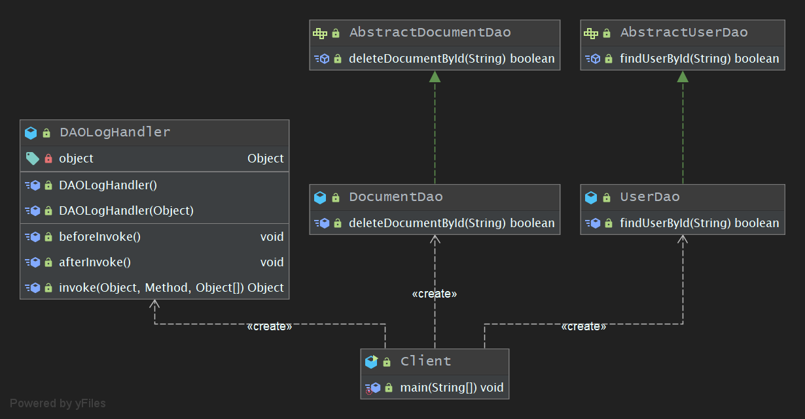

## 学习笔记 : Java设计模式之Proxy Pattern

### 定义
*代理模式 : 给某一个对象提供一个代理或占位符,并由代理对象来控制对原对象的访问. (Proxy Pattern : Provide a surrogate or placehodler for another object to access to it)*

### 概述
代理模式是常用的结构型设计模式之一,当无法直接访问某个对象或访问某个对象存在困难时可以通过一个代理对象来间接访问,为了保证客户端使用的透明性,所访问的真实对象与代理对象需要实现相同的接口. 根据代理模式的使用目的不同,代理模式又可以分为多种类型,例如保护代理,远程代理,虚拟代理,缓冲代理等,它们应用于不同的场合,满足用户的不同需求.

### 角色分析
1. *`Subject( 抽象主题角色 )` : 它声明了真实主题与代理主题的共同接口,既任何使用真实主题的地方都可以使用代理主题,客户端通常需要针对抽象主题角色进行编程.*
2. *`Proxy( 代理主题角色 )` : 它包含了对真实主题的引用,既可以在任何时候操作真实主题对象. 在代理主题角色中提供了一个与真实主题角色相同的接口,以便在任何时候都可以替代真实主题. 代理主题角色还可以控制对真实主题的使用,负责在需要的时候创建和删除真实主题对象,并对真实主题对象的使用加以约束.*
3. *`RealSubject( 真实主题角色 )` : 它定义了代理角色所代表的真实对象,在真实主题角色中实现了真实的业务操作,客户端可以通过代理主题角色间接调用真实主题角色中定义的操作.*


### 示例程序-静态代理
*下面是一个使用代理模式( 静态代理 )的简单示例程序 : 模拟实现某商务信息查询系统的部分功能 : ( 一 )在进行商务信息查询前用户需要通过身份验证,只有合法的用户才能够使用该查询系统. ( 二 )在进行商务信息查询时系统需要记录其查询日志,以便根据查询次数收取查询费用*

1. *AccessValidator类 : 身份验证类(业务类), 它提供validate()方法来实现用户身份的验证*
```java
package pers.huangyuhui.froxy_pattern.froxy_pattern_1;

/**
 * @project: design-patterns
 * @description: 身份验证类(业务类), 它提供validate()方法来实现用户身份的验证
 * @author: 黄宇辉
 * @date: 9/25/2019-12:53 PM
 * @version: 1.0
 * @website: https://yubuntu0109.github.io/
 */
public class AccessValidator {

    //模拟实现登录验证
    public boolean validate(String userId) {
        if (userId.equalsIgnoreCase("yubuntu0109")) {
            System.out.println("ID为:[ " + userId + " ]的用户登录成功");
            return true;
        } else {
            System.out.println("ID为:[ " + userId + " ]的用户登录失败");
            return false;
        }
    }
}
```

2. *Logger类 : 日志记录类(业务类), 提供一个log()方法来保存日志信息*
```java
package pers.huangyuhui.froxy_pattern.froxy_pattern_1;

/**
 * @project: design-patterns
 * @description: 日志记录类(业务类), 提供一个log()方法来保存日志信息
 * @author: 黄宇辉
 * @date: 9/25/2019-12:57 PM
 * @version: 1.0
 * @website: https://yubuntu0109.github.io/
 */
public class Logger {

    //模拟实现日志记录
    public void log(String userId) {
        System.out.println("成功更新数据库信息,ID为:[ " + userId + "+ ]的用户查询次数+1");
    }
}
```

3. *Searcher接口 : 抽象查询类, 充当抽象主题角色*
```java
package pers.huangyuhui.froxy_pattern.froxy_pattern_1;

/**
 * @project: design-patterns
 * @description: 抽象查询类, 充当抽象主题角色
 * @author: 黄宇辉
 * @date: 9/25/2019-1:00 PM
 * @version: 1.0
 * @website: https://yubuntu0109.github.io/
 */
public interface Searcher {
    String doSearch(String userId, String keyWord);
}
```

4. *RealSearcher类 : 具体查询类, 充当真实主题角色, 它实现了查询功能*
```java
package pers.huangyuhui.froxy_pattern.froxy_pattern_1;

/**
 * @project: design-patterns
 * @description: 具体查询类, 充当真实主题角色, 它实现了查询功能
 * @author: 黄宇辉
 * @date: 9/25/2019-1:01 PM
 * @version: 1.0
 * @website: https://yubuntu0109.github.io/
 */
public class RealSearcher implements Searcher {

    //模拟查询商务信息
    @Override
    public String doSearch(String userId, String keyWord) {
        System.out.println("ID为:[ " + userId + " ]的用户使用关键字:[ " + keyWord + " ]查询了商务信息");
        return "[ 这是用户所查询的商务信息结果 ]";
    }
}
```

5. *ProxySearcher类 : 代理查询类, 充当代码主题角色, 它是查询代理, 维持了对RealSearcher, AccessValidator, 及Logger对象的引用*
```java
package pers.huangyuhui.froxy_pattern.froxy_pattern_1;

/**
 * @project: design-patterns
 * @description: 代理查询类, 充当代码主题角色, 它是查询代理, 维持了对RealSearcher, AccessValidator, 及Logger对象的引用
 * @author: 黄宇辉
 * @date: 9/25/2019-1:05 PM
 * @version: 1.0
 * @website: https://yubuntu0109.github.io/
 */
public class ProxySearcher implements Searcher {

    private RealSearcher realSearcher = new RealSearcher(); //维持一个对真实主题的引用
    private AccessValidator accessValidator;
    private Logger logger;

    @Override
    public String doSearch(String userId, String keyWord) {
        //如果身份验证成功,则执行查询操作
        if (this.validate(userId)) {
            String result = realSearcher.doSearch(userId, keyWord); //调用真实主题的查询方法
            this.log(userId); //记录查询日志
            return result;
        } else {
            return null;
        }
    }

    //创建访问验证对象并调用其validate()方法来实现身份验证
    public boolean validate(String userId) {
        accessValidator = new AccessValidator();
        return accessValidator.validate(userId);
    }

    //创建日志记录对象并调用其log()方法来实现日志记录
    public void log(String userId) {
        logger = new Logger();
        logger.log(userId);
    }
}
```

6. *Client类 : 客户端测试类*
```java
package pers.huangyuhui.froxy_pattern.froxy_pattern_1;

/**
 * @project: design-patterns
 * @description: 客户端测试类
 * @author: 黄宇辉
 * @date: 9/25/2019-1:13 PM
 * @version: 1.0
 * @website: https://yubuntu0109.github.io/
 */
public class Client {

    public static void main(String[] args) {
        Searcher searcher = new ProxySearcher();
        System.out.println(searcher.doSearch("yubuntu0109", "design-patterns-in-java"));
    }
}
```

7. *示例程序的运行结果如下所示 :*
```
ID为:[ yubuntu0109 ]的用户登录成功
ID为:[ yubuntu0109 ]的用户使用关键字:[ design-patterns-in-java ]查询了商务信息
成功更新数据库信息,ID为:[ yubuntu0109+ ]的用户查询次数+1
[ 这是用户所查询的商务信息结果 ]
```

#### 示例程序的类图


### 示例程序-动态代理
*下面是一个使用代理模式( 动态代理 )的示例程序 : 模拟为某 OA 系统数据访问层( DAO )增加方法调用日志,既记录每一个方法被调用的开始及结束时间*

1. *AbstractUserDao接口 : 抽象用户DAO类, 充当抽象主题角色*
```java
package pers.huangyuhui.froxy_pattern.froxy_pattern_2;

/**
 * @project: design-patterns
 * @description: 抽象用户DAO类, 充当抽象主题角色
 * @author: 黄宇辉
 * @date: 9/25/2019-1:16 PM
 * @version: 1.0
 * @website: https://yubuntu0109.github.io/
 */
public interface AbstractUserDao {
    boolean findUserById(String userId);
}
```

2. *AbstractDocumentDao接口 : 抽象文档DAO类, 充当抽象主题角色*
```java
package pers.huangyuhui.froxy_pattern.froxy_pattern_2;

/**
 * @project: design-patterns
 * @description: 抽象文档DAO类, 充当抽象主题角色
 * @author: 黄宇辉
 * @date: 9/25/2019-1:17 PM
 * @version: 1.0
 * @website: https://yubuntu0109.github.io/
 */
public interface AbstractDocumentDao {
    boolean deleteDocumentById(String documentId);
}
```

3. *DocumentDao类 : 文档DAO类, 充当具体主题角色*
```java
package pers.huangyuhui.froxy_pattern.froxy_pattern_2;

/**
 * @project: design-patterns
 * @description: 文档DAO类, 充当具体主题角色
 * @author: 黄宇辉
 * @date: 9/25/2019-1:21 PM
 * @version: 1.0
 * @website: https://yubuntu0109.github.io/
 */
public class DocumentDao implements AbstractDocumentDao {

    @Override
    public boolean deleteDocumentById(String documentId) {
        if (documentId.equalsIgnoreCase("Y001")) {
            System.out.println("成功删除ID为:[ " + documentId + " ]的文档信息");
            return true;
        } else {
            System.out.println("并未找到ID为:[ " + documentId + " ]的文档信息");
            return false;
        }
    }
}
```

4. *UserDao类 : 用户DAO类, 充当具体主题角色*
```java
package pers.huangyuhui.froxy_pattern.froxy_pattern_2;

/**
 * @project: design-patterns
 * @description: 用户DAO类, 充当具体主题角色
 * @author: 黄宇辉
 * @date: 9/25/2019-1:18 PM
 * @version: 1.0
 * @website: https://yubuntu0109.github.io/
 */
public class UserDao implements AbstractUserDao {

    @Override
    public boolean findUserById(String userId) {
        if (userId.equalsIgnoreCase("yubuntu0109")) {
            System.out.println("成功查询ID为:[ " + userId + " ]的用户信息");
            return true;
        } else {
            System.out.println("并未查询ID为:[" + userId + " ]的用户信息");
            return false;
        }
    }
}
```

5. *DAOLogHandler类 : 自定义请求处理程序类*
```java
package pers.huangyuhui.froxy_pattern.froxy_pattern_2;

import java.lang.reflect.InvocationHandler;
import java.lang.reflect.Method;
import java.util.Date;
import java.util.Timer;

/**
 * @project: design-patterns
 * @description: 自定义请求处理程序类
 * @author: 黄宇辉
 * @date: 9/25/2019-1:24 PM
 * @version: 1.0
 * @website: https://yubuntu0109.github.io/
 */
public class DAOLogHandler implements InvocationHandler {

    private Object object;

    public DAOLogHandler() {
    }

    //注入一个需要提供代理的真实主题对象
    public DAOLogHandler(Object object) {
        this.object = object;
    }

    public void beforeInvoke() {
        System.out.println("------> invoke before: " + new Date().toString());
    }

    public void afterInvoke() {
        System.out.println("------> invoke after: " + new Date().toString());
    }

    //实现invoke()方法,调用在真实主题类中定义的方法
    @Override
    public Object invoke(Object proxy, Method method, Object[] args) throws Throwable {
        beforeInvoke();
        Object result = method.invoke(object, args); //转发调用
        afterInvoke();
        return result;
    }
}
```

6. *Client类 : 客户端测试类*
```java
package pers.huangyuhui.froxy_pattern.froxy_pattern_2;

import java.lang.reflect.InvocationHandler;
import java.lang.reflect.Proxy;

/**
 * @project: design-patterns
 * @description: 客户端测试类
 * @author: 黄宇辉
 * @date: 9/25/2019-1:29 PM
 * @version: 1.0
 * @website: https://yubuntu0109.github.io/
 */
public class Client {

    public static void main(String[] args) {
        InvocationHandler handler = new DAOLogHandler(new UserDao());
        AbstractUserDao proxy = (AbstractUserDao) Proxy.newProxyInstance(AbstractUserDao.class.getClassLoader(), new Class[]{AbstractUserDao.class}, handler);
        proxy.findUserById("yubuntu0109");

        System.out.println("------------------------------");

        InvocationHandler handler2 = new DAOLogHandler(new DocumentDao());
        AbstractDocumentDao proxy2 = (AbstractDocumentDao) Proxy.newProxyInstance(AbstractDocumentDao.class.getClassLoader(), new Class[]{AbstractDocumentDao.class}, handler2);
        proxy2.deleteDocumentById("Y001");
    }
}
```

7. *示例程序运行的结果如下所示 :*
```
------> invoke before: Fri Sep 27 14:05:06 CST 2019
成功查询ID为:[ yubuntu0109 ]的用户信息
------> invoke after: Fri Sep 27 14:05:06 CST 2019

------------------------------

------> invoke before: Fri Sep 27 14:05:06 CST 2019
成功删除ID为:[ Y001 ]的文档信息
------> invoke after: Fri Sep 27 14:05:06 CST 2019
```

#### 示例程序的类图


