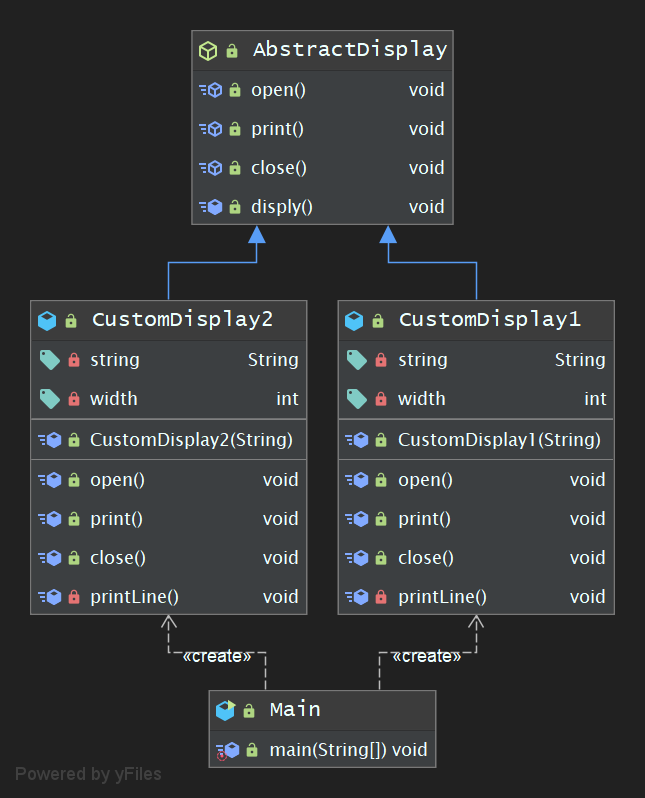

## 学习笔记 : Java设计模式之Template Method模式

### 概述
*模板设计模式 : 定义一个操作中算法的框架,而将这一些步骤延迟到子类中. 模板方法模式使得子类可以不改变一个算法的结构即可重定义该算法的某些特定步骤,简单点说既在父类中定义处理流程的框架,在子类中实现具体的处理. ( Template Method Pattern : Define the skeleton of an algorithm in an operation,deferring some steps to subclasses. Template Method lets subclasses redefine certain steps of an algorithm without changing the algorithm's structure )*

* 其是一种基于继承的代码复用技术,它是一种行为型模式,当然也是最简单的行为设计模式 ~


### 模板方法模式的实现分类
*模板方法模式的实现可划分为 : 模板方法( 基本方法的集合 )和基本方法( 实现具体的逻辑步骤 )*

#### 模板方法
*模板方法是指定义在抽象类中,把基本操作方法组合在一起形成一个总算法或一个总行为的方法. 模板方法是一个具体方法,其逻辑的组成步骤在抽象类中可以是具体方法,也可以是抽象方法( 可将模板方法定义为 final 方法哟 )*

#### 基本方法
*基本方法是实现算法各个步骤的方法,是模板方法的组成部分. 其可划分为 :*
* 抽象方法 : 一个抽象方法由抽象类声明,由其具体子类实现.
* 具体方法 : 一个具体方法由是一个抽象类或具体类声明并实现,其子类可以进行覆盖也可以进行直接继承
* 钩子方法 : 一个钩子方法由一个抽象类或者具体类声明并实现,而其子类可能会加以扩展.


### 示例程序-简洁版
*下面是一个使用模板方法模式的简单示例程序 : 通过自定义模板样式来打印不同包裹字符的效果~*

1. *AbstractDisplay抽象类 : 充当抽象类角色*
```java
package pers.huangyuhui.template_method.template_method1;

/**
 * @project: design-patterns
 * @description: 充当抽象类角色
 * @author: 黄宇辉
 * @date: 9/4/2019-10:46 AM
 * @version: 1.0
 * @website: https://yubuntu0109.github.io/
 */
public abstract class AbstractDisplay {

    //基本方法-抽象方法
    public abstract void open();

    //基本方法-抽象方法
    public abstract void print();

    //基本方法-抽象方法
    public abstract void close();

    //模板方法:为具体方法,其逻辑的组成步骤可以是具体方法或抽象方法..
    public /*final*/ void disply() {
        open();
        for (int i = 0; i < 5; i++) {
            print();
        }
        close();
    }

    //基本方法-具体方法
    //略······

    //基本方法-钩子方法
    //略······
}
```

2. *CustomDisplay1类 : 充当具体类角色*
```java
package pers.huangyuhui.template_method.template_method1;

/**
 * @project: design-patterns
 * @description: 充当具体类角色
 * @author: 黄宇辉
 * @date: 9/4/2019-10:44 AM
 * @version: 1.0
 * @website: https://yubuntu0109.github.io/
 */
public class CustomDisplay1 extends AbstractDisplay {

    private String string;
    private int width;

    public CustomDisplay1(String string) {
        this.string = string;
        width = string.getBytes().length;
    }

    @Override
    public void open() {
        printLine();
    }

    @Override
    public void print() {
        System.out.println("█" + string + "█");
    }

    @Override
    public void close() {
        printLine();
    }

    private void printLine() {
        System.out.print("●");
        for (int i = 0; i < width; i++) {
            System.out.print("■");
        }
        System.out.println("●");
    }

}
```

3. *CustomDisplay2类 : 充当具体类角色*
```java
package pers.huangyuhui.template_method.template_method1;

/**
 * @project: design-patterns
 * @description: 充当具体类角色
 * @author: 黄宇辉
 * @date: 9/4/2019-11:03 AM
 * @version: 1.0
 * @website: https://yubuntu0109.github.io/
 */
public class CustomDisplay2 extends AbstractDisplay {

    private String string;
    private int width;

    public CustomDisplay2(String string) {
        this.string = string;
        this.width = string.getBytes().length;
    }

    @Override
    public void open() {
        printLine();
    }

    @Override
    public void print() {
        System.out.println("|" + string + "|");
    }

    @Override
    public void close() {
        printLine();
    }

    private void printLine() {
        System.out.print("+");
        for (int i = 0; i < width; i++) {
            System.out.print("-");
        }
        System.out.println("+");
    }
}
```

4. *Main类 : 程序测试*
```java
package pers.huangyuhui.template_method.template_method1;

/**
 * @project: design-patterns
 * @description: 测试类
 * @author: 黄宇辉
 * @date: 9/4/2019-10:54 AM
 * @version: 1.0
 * @website: https://yubuntu0109.github.io/
 */
public class Main {

    public static void main(String[] args) {
        AbstractDisplay abstractDisplay = new CustomDisplay1("Template Method Pattern");
        AbstractDisplay abstractDisplay2 = new CustomDisplay2("Template Method Pattern");
        abstractDisplay.disply();
        abstractDisplay2.disply();
    }

}
```

5. *程序运行结果如下所示 :*
```
●■■■■■■■■■■■■■■■■■■■■■■■●
█Template Method Pattern█
█Template Method Pattern█
█Template Method Pattern█
█Template Method Pattern█
█Template Method Pattern█
●■■■■■■■■■■■■■■■■■■■■■■■●
+-----------------------+
|Template Method Pattern|
|Template Method Pattern|
|Template Method Pattern|
|Template Method Pattern|
|Template Method Pattern|s
+-----------------------+
```

#### Template Method模式中登场的角色
* `AbstractClass( 抽象类 )` : AbstractClass角色不仅负责实现模板方法,还负责声明在模板方法中所使用到的抽象方法,这些抽象方法由子类ConcreteClass角色负责实现.
* `ConcreteClass( 具体类 )` : 该类负责实现AbstrctClass中定义的抽象方法,`这些实现的方法将会在AbstractClass角色的模板方法中别调用.`

#### 示例程序的类图



### 示例程序-详细版
*下面是一个使用方法模板模式的简单示例程序 : 该程序的功能( 模拟 )为支持多种数据源及图表的显示方式,但所有的图表实现操作都需基于XML格式的数据,因此可能需要对数据进行转换,如果从数据源中获取的数据已经是XML数据则无需进行转换,所以这里需要用到`钩子方法`哟*

1. *DataViewer抽象类 : 充当抽象类角色*
```java
package pers.huangyuhui.template_method.template_method2;

/**
 * @project: design-patterns
 * @description: 充当抽象类角色
 * @author: 黄宇辉
 * @date: 9/4/2019-12:59 PM
 * @version: 1.0
 * @website: https://yubuntu0109.github.io/
 */
public abstract class DataViewer {

    //抽象方法:获取数据
    public abstract void getData();

    //具体方法:转换数据
    private void convertData() {
        System.out.println("将数据转换为XML格式");
    }

    //抽象方法:显示数据
    public abstract void displayData();

    //钩子方法:判断是否为XML格式的数据
    public boolean isNotXMLData() {
        return true;
    }

    //模板方法
    public final void process() {
        getData();
        //如果不是xml格式的数据,则需将其转换为xml格式的数据
        if (isNotXMLData()) {
            convertData();
        }
        displayData();
    }
}
```

2. *CustomDataViewer1类 : 充当具体类角色*
```java
package pers.huangyuhui.template_method.template_method2;

/**
 * @project: design-patterns
 * @description: 充当具体类角色
 * @author: 黄宇辉
 * @date: 9/4/2019-1:05 PM
 * @version: 1.0
 * @website: https://yubuntu0109.github.io/
 */
public class CustomDataViewer1 extends DataViewer {

    @Override
    public void getData() {
        System.out.println("从XML文件中获取数据");
    }

    @Override
    public void displayData() {
        System.out.println("以柱状图的方式显示数据");
    }

    //覆盖父类的钩子方法
    @Override
    public boolean isNotXMLData() {
        //return super.isNotXMLData();
        return false;
    }
}
```

3. *CustomDataViewer2类 : 充当具体类角色*
```java
package pers.huangyuhui.template_method.template_method2;

/**
 * @project: design-patterns
 * @description: 充当具体类角色
 * @author: 黄宇辉
 * @date: 9/4/2019-1:08 PM
 * @version: 1.0
 * @website: https://yubuntu0109.github.io/
 */
public class CustomDataViewer2 extends DataViewer {

    @Override
    public void getData() {
        System.out.println("从XML文件中获取数据");
    }

    @Override
    public void displayData() {
        System.out.println("以圆饼图的方式显示数据");
    }

}
```

4. *Main类 : 程序测试*
```java
package pers.huangyuhui.template_method.template_method2;

/**
 * @project: design-patterns
 * @description: 测试类
 * @author: 黄宇辉
 * @date: 9/4/2019-1:10 PM
 * @version: 1.0
 * @website: https://yubuntu0109.github.io/
 */
public class Main {
    public static void main(String[] args) {
        DataViewer dataViewer = new CustomDataViewer1();
        DataViewer dataViewer2 = new CustomDataViewer2();
        dataViewer.process();
        System.out.println("--------------------");
        dataViewer2.process();
    }
}
```

5. *程序运行结果如下所示 :*
```
从XML文件中获取数据
以柱状图的方式显示数据
--------------------
从XML文件中获取数据
将数据转换为XML格式
以圆饼图的方式显示数据
```

#### 示例程序的类图
