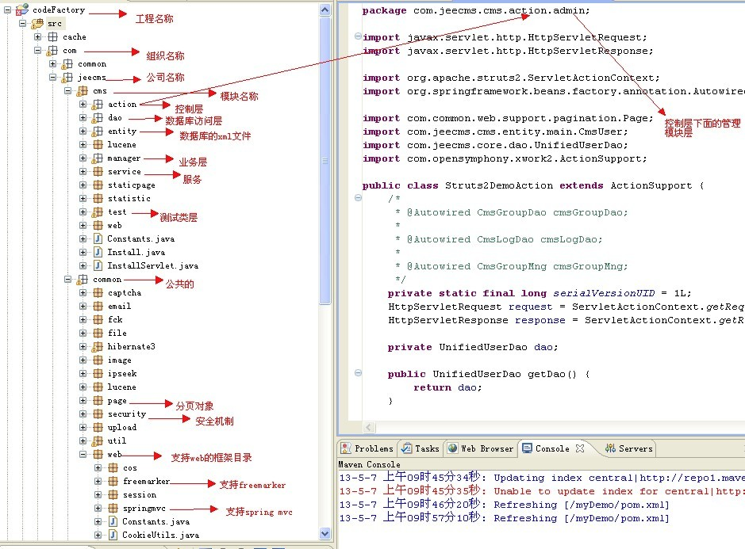

## 学习笔记 : Java项目开发中PO,BO,VO,DTO,POJO,DAO的概念及其作用
*最近参与了GitHub上的一个开源项目 : [一个简洁优美的Springboot集成Shiro的权限管理系统](https://github.com/YUbuntu0109/springboot-shiro), 项目中无论是模块的划分,还是结构的分层,都让我眼前一亮! 既而代码的功能被理所当然地划分的非常有层次感,可见作者的编程设计水平实属厉害啊~ 下面来一起学习下Java项目开发中 `PO`, `BO`, `VO`, `DTO`, `POJO`, `DAO` 的概念及其作用吧~*

### PO(bean、entity等命名)
*`Persistant Object`持久对象 : 数据库表中的记录在Java对象中的显示状态. 最形象的理解就是一个`PO`就是数据库中的一条记录,好处是可以把一条记录作为一个对象处理,可以方便的转为其它对象*

### BO(service、manager、business等命名)
*`Business Object`业务对象 : 主要作用是把业务逻辑封装为一个对象. 这个对象可以包括一个或多个其它的对象,形象描述为一个对象的形为和动作,当然也有涉及到基它对象的一些形为和动作. 比如处理一个人的业务逻辑,有睡觉,吃饭,工作,上班等等形为,这样处理业务逻辑时,我们就可以针对BO去处理*

### VO(from也有此写法)
*`Value Object`值对象 : 主要体现在视图的对象,对于一个`WEB`页面将整个页面的属性封装成一个对象,然后用一个VO对象在控制层与视图层进行传输交换*

### DTO(经过处理后的PO,可能增加或者减少PO的属性)
*`Data Transfer Object`数据传输对象 : 主要用于远程调用等需要大量传输对象的地方. 比如我们一张表有100个字段,那么对应的PO就有100个属性,但是我们界面上只要显示10个字段,客户端用`WEB service`来获取数据,没有必要把整个PO对象传递到客户端,这时我们就可以用只有这10个属性的DTO来传递结果到客户端,这样也不会暴露服务端表结构. 到达客户端以后,如果用这个对象来对应界面显示,那此时它的身份就转为VO*

### POJO(POJO是一种概念或者接口,身份及作用随环境变化而变化)
*`Plain Ordinary Java Object`简单Java对象 : 即POJO是一个简单的普通的Java对象,它不包含业务逻辑或持久逻辑等,但不是JavaBean、EntityBean等,不具有任何特殊角色和不继承或不实现任何其它Java框架的类或接口. POJO有一些Private的参数作为对象的属性. 然后针对每个参数定义了get和set方法作为访问的接口,POJO对象有时也被称为Data对象，大量应用于表现现实中的对象. `一个POJO持久化以后就是PO. 直接用它传递、传递过程中就是DTO. 直接用来对应表示层就是VO`*

### DAO(Data Access Object数据访问对象)
*这个大家最熟悉,和上面几个O区别最大,基本没有互相转化的可能性和必要. 主要用来封装对数据库的访问,通过它可以把POJO持久化为PO,用PO组装出来VO、DTO*

### Controller(控制层)
*控制层主要由`Action / Servlet`等构成( 目前Spring MVC则是通过@Controller标签使用 ),此层业务层与视图层打交道的中间层,负责传输VO对象和调用BO层的业务方法,负责视图层请求的数据处理后响应给视图层*

### View(视图层)
*主要是指由JSP、HTML等文件形成的显示层,总结一下要用具体的X0需要看具体环境及项目架构,在不同的层、不同的应用场合,对象的身份也不一样,而且对象身份的转化也是很自然的. 就像你对老婆来说就是老公,对父母来说就是子女. 设计这些概念的初衷不是为了唬人而是为了更好的理解和处理各种逻辑,让大家能更好的去用面向对象的方式处理问题*

### 上述名词在实际项目的应用举例
*`控制层`( controller-action ),`业务层/服务层`( bo-manager ),`实体层`( po-entity ),`数据访问`( dao ),`视图对象`( Vo-本项目省略 ),`视图层`( view-jsp/html )*

*`在平时开发项目中大家记得要精细设计各层,既而避免后续项目开发中产生不必要的大量重复工作. 如果不是大型系统可简化一些层,毕竟技术是为应用服务哒~`*

*🙏摘自(获益匪浅,非常感谢) : https://www.cnblogs.com/EasonJim/p/7967949.html*