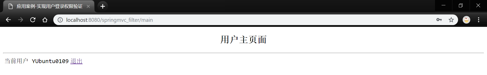

## 学习笔记 : Spring MVC之拦截器
*简介 : Spring MVC中的拦截器(`Interceptor`)类似于Servlet中的过滤器(`Filter`),主要用于拦截用户请求并做相应的处理,例如通过拦截器可以进行权限验证,记录请求信息的日志,判断用户是否登录等..要使用Spring MVC中的拦截器,就需要对拦截器类进行定义和配置,通常拦截器类可以通过两种方式来定义,如下所示 :*
1. 实现`HandlerInterceptor`接口,或继承HandlerInterceptor接口的实现类,如`HandlerInterceptorAdapter`.
2. 实现`WebRequestInterceptor`接口,或继承WebRequestInterceptor接口的实现类.


### 拦截器的执行流程

#### 单个拦截器的执行流程
1. *web.xml*
```xml
<?xml version="1.0" encoding="UTF-8"?>
<web-app xmlns:xsi="http://www.w3.org/2001/XMLSchema-instance"
	xmlns="http://xmlns.jcp.org/xml/ns/javaee"
	xsi:schemaLocation="http://xmlns.jcp.org/xml/ns/javaee http://xmlns.jcp.org/xml/ns/javaee/web-app_4_0.xsd"
	id="WebApp_ID" version="4.0">
	<display-name>springmvc_filter</display-name>
	<welcome-file-list>
		<welcome-file>index.jsp</welcome-file>
	</welcome-file-list>

	<servlet>
		<!-- 设置前端过滤器 -->
		<servlet-name>spring_mvc</servlet-name>
		<servlet-class>org.springframework.web.servlet.DispatcherServlet</servlet-class>
		<!-- 初始化时加载配置文件 -->
		<init-param>
			<param-name>contextConfigLocation</param-name>
			<param-value>classpath:springmvc-config.xml</param-value>
		</init-param>
		<!-- 容器启动时立即加载Servlet -->
		<load-on-startup>1</load-on-startup>
	</servlet>

	<servlet-mapping>
		<servlet-name>spring_mvc</servlet-name>
		<url-pattern>/</url-pattern>
	</servlet-mapping>

</web-app>
```

2. *CustomInterceptor.java : 自定义拦截器*
```java
package pers.huangyuhui.springmvc.filter.interceptor;

import javax.servlet.http.HttpServletRequest;
import javax.servlet.http.HttpServletResponse;

import org.springframework.web.servlet.HandlerInterceptor;
import org.springframework.web.servlet.ModelAndView;

/**
 * @ClassName: CustomInterceptor
 * @Description: 拦截器
 * @author: HuangYuhui
 * @date: May 23, 2019 9:23:19 PM
 *
 */
public class CustomInterceptor implements HandlerInterceptor {

	@Override
	public boolean preHandle(HttpServletRequest request, HttpServletResponse response, Object handler)
			throws Exception {
		System.out.println("------ this is preHandle1 ------");
		return true;
	}

	@Override
	public void postHandle(HttpServletRequest request, HttpServletResponse response, Object handler,
			ModelAndView modelAndView) throws Exception {
		System.out.println("------ this is postHandle1 ------");

	}

	@Override
	public void afterCompletion(HttpServletRequest request, HttpServletResponse response, Object handler, Exception ex)
			throws Exception {
		System.out.println("------ this is afterCompletion1 ------");
	}
}
```

3. *springmvc-config.xml : Spring MVC配置文件*
```xml
<?xml version="1.0" encoding="UTF-8"?>
<beans xmlns="http://www.springframework.org/schema/beans"
	xmlns:xsi="http://www.w3.org/2001/XMLSchema-instance"
	xmlns:context="http://www.springframework.org/schema/context"
	xmlns:mvc="http://www.springframework.org/schema/mvc"
	xsi:schemaLocation="http://www.springframework.org/schema/mvc http://www.springframework.org/schema/mvc/spring-mvc-4.3.xsd
		http://www.springframework.org/schema/beans http://www.springframework.org/schema/beans/spring-beans.xsd
		http://www.springframework.org/schema/context http://www.springframework.org/schema/context/spring-context-4.3.xsd">

    <!-- 指定需要扫描的包 -->
	<context:component-scan base-package="pers.huangyuhui.springmvc.filter.controller" />

	<!-- 定义视图解析器 -->
	<bean id="viewResolver" class="org.springframework.web.servlet.view.InternalResourceViewResolver">
		<!-- 设置前缀 -->
		<property name="prefix" value="/WEB-INF/view/" />
		<!-- 设置后缀 -->
		<property name="suffix" value=".jsp" />
	</bean>
	
	<!-- 配置拦截器 -->
	<mvc:interceptors>
		<!-- 拦截所有请求 -->
		<bean class="pers.huangyuhui.springmvc.filter.interceptor.CustomInterceptor" />
	</mvc:interceptors>

</beans>
```

4. *MyController.java : 控制器*
```java
package pers.huangyuhui.springmvc.filter.controller;

import org.springframework.stereotype.Controller;
import org.springframework.web.bind.annotation.RequestMapping;

/**
 * @ClassName: MyController
 * @Description: 控制器
 * @author: HuangYuhui
 * @date: May 23, 2019 9:20:31 PM
 *
 */
@Controller
@RequestMapping("/myFilter")
public class MyController {

	/**
	 * @Title: singleFilter
	 * @Description: 测试单个拦截器的执行流程
	 * @return: String
	 */
	@RequestMapping("/singleFilter")
	public String singleFilter() {

		System.out.println("test my filter ~");
		return "index";
	}

}
```

5. *新建`WebContent/WEB-INF/view/index.jsp`(仅测试)*

6. *将项目发布到Tomcat服务器并启动,在浏览器中访问地址: `http://localhost:8080/springmvc_filter/myFilter/singleFilter` 即可得到程序运行结果,如下所示 :*
```
------ this is preHandle1 ------
test my filter ~
------ this is postHandle1 ------
------ this is afterCompletion1 ------
```


#### 多个拦截器的执行流程
1. *web.xml(同上..)*

2. *CustomInterceptor.java : 第一个自定义拦截器*
```java
package pers.huangyuhui.springmvc.filter.interceptor;

import javax.servlet.http.HttpServletRequest;
import javax.servlet.http.HttpServletResponse;

import org.springframework.web.servlet.HandlerInterceptor;
import org.springframework.web.servlet.ModelAndView;

/**
 * @ClassName: CustomInterceptor
 * @Description: 自定义拦截器
 * @author: HuangYuhui
 * @date: May 23, 2019 9:23:19 PM
 *
 */
public class CustomInterceptor implements HandlerInterceptor {

	@Override
	public boolean preHandle(HttpServletRequest request, HttpServletResponse response, Object handler)
			throws Exception {
		System.out.println("------ this is preHandle1 ------");
		return true;
	}

	@Override
	public void postHandle(HttpServletRequest request, HttpServletResponse response, Object handler,
			ModelAndView modelAndView) throws Exception {
		System.out.println("------ this is postHandle1 ------");

	}

	@Override
	public void afterCompletion(HttpServletRequest request, HttpServletResponse response, Object handler, Exception ex)
			throws Exception {
		System.out.println("------ this is afterCompletion1 ------");
	}
}
```

3. *CustomInterceptor2.java : 第二个自定义拦截器*
```java
package pers.huangyuhui.springmvc.filter.interceptor;

import javax.servlet.http.HttpServletRequest;
import javax.servlet.http.HttpServletResponse;

import org.springframework.web.servlet.HandlerInterceptor;
import org.springframework.web.servlet.ModelAndView;

/**
 * @ClassName: CustomInterceptor2
 * @Description: 自定义拦截器
 * @author: HuangYuhui
 * @date: May 29, 2019 3:46:30 PM
 *
 */
public class CustomInterceptor2 implements HandlerInterceptor {

	@Override
	public boolean preHandle(HttpServletRequest request, HttpServletResponse response, Object handler)
			throws Exception {
		System.out.println("------ this is preHandle2 ------");
		return true;
	}

	@Override
	public void postHandle(HttpServletRequest request, HttpServletResponse response, Object handler,
			ModelAndView modelAndView) throws Exception {
		System.out.println("------ this is postHandle2 ------");

	}

	@Override
	public void afterCompletion(HttpServletRequest request, HttpServletResponse response, Object handler, Exception ex)
			throws Exception {
		System.out.println("------ this is afterCompletion2------");
	}
}
```

4. *springmvc-config.xml : Spring MVC配置文件*
```xml
<?xml version="1.0" encoding="UTF-8"?>
<beans xmlns="http://www.springframework.org/schema/beans"
	xmlns:xsi="http://www.w3.org/2001/XMLSchema-instance"
	xmlns:context="http://www.springframework.org/schema/context"
	xmlns:mvc="http://www.springframework.org/schema/mvc"
	xsi:schemaLocation="http://www.springframework.org/schema/mvc http://www.springframework.org/schema/mvc/spring-mvc-4.3.xsd
		http://www.springframework.org/schema/beans http://www.springframework.org/schema/beans/spring-beans.xsd
		http://www.springframework.org/schema/context http://www.springframework.org/schema/context/spring-context-4.3.xsd">

    <!-- 指定需要扫描的包 -->
	<context:component-scan base-package="pers.huangyuhui.springmvc.filter.controller" />

	<!-- 定义视图解析器 -->
	<bean id="viewResolver" class="org.springframework.web.servlet.view.InternalResourceViewResolver">
		<!-- 设置前缀 -->
		<property name="prefix" value="/WEB-INF/view/" />
		<!-- 设置后缀 -->
		<property name="suffix" value=".jsp" />
	</bean>

	<!-- 配置拦截器1 -->
	<mvc:interceptors>
		<mvc:interceptor>
			<!--拦截所有路径下的请求  -->
			<mvc:mapping path="/**"/>
			<!-- 拦截指定路径的请求 -->
			<bean class="pers.huangyuhui.springmvc.filter.interceptor.CustomInterceptor" />
		</mvc:interceptor>
	</mvc:interceptors>
	
	<!-- 配置拦截器2 -->
	<mvc:interceptors>
		<mvc:interceptor>
			<mvc:mapping path="/**"/>
			<bean class="pers.huangyuhui.springmvc.filter.interceptor.CustomInterceptor2" />
		</mvc:interceptor>
	</mvc:interceptors>

</beans>
```

5. *MyController.java : 控制器*
```java
package pers.huangyuhui.springmvc.filter.controller;

import org.springframework.stereotype.Controller;
import org.springframework.web.bind.annotation.RequestMapping;

/**
 * @ClassName: MyController
 * @Description: 控制器
 * @author: HuangYuhui
 * @date: May 23, 2019 9:20:31 PM
 *
 */
@Controller
@RequestMapping("/myFilter")
public class MyController {

	/**
	 * @Title: doubleFilter
	 * @Description: 测试多个拦截器的执行流程
	 * @return: String
	 */
	@RequestMapping("/doubleFilter")
	public String doubleFilter() {
		System.out.println("test my filter ~");
		return "index";
	}

}
```
6. *新建`WebContent/WEB-INF/view/index.jsp`(仅测试)*

7. *将项目发布到Tomcat服务器并启动,在浏览器中访问地址: `http://localhost:8080/springmvc_filter/myFilter/doubleFilter` 即可得到程序运行结果,如下所示 :*
```
------ this is preHandle1 ------
------ this is preHandle2 ------
test my filter ~
------ this is postHandle2 ------
------ this is postHandle1 ------
------ this is afterCompletion2------
------ this is afterCompletion1 ------
```


### 应用案例
*简介 : 通过拦截器来完成一个用户登录权限验证案例.在本案例中,要求如下 :*

- *只有登录后的用户才能访问系统主页面,如果没有登录系统而直接访问主页面,则其请求会被拦截器所拦截,并转发到登录页面,同时在登录页面提出提示信息.*
- *如果用户名或密码错误,会在登录页面给出相应的提示信息.* 
- *当已登录的用户在系统主页中单击"退出"按钮时,系统将会退回到登录页面.*

1. *web.xml : 略..*

2. *User.java : 用户信息*
```java
package pers.huangyuhui.springmvc.filter.bean;

/**
 * @ClassName: User
 * @Description: 用户信息
 * @author: HuangYuhui
 * @date: May 24, 2019 8:43:49 AM
 *
 */
public class User {

	private Integer id;
	private String name;
	private String password;

	public Integer getId() {
		return id;
	}

	public void setId(Integer id) {
		this.id = id;
	}

	public String getName() {
		return name;
	}

	public void setName(String name) {
		this.name = name;
	}

	public String getPassword() {
		return password;
	}

	public void setPassword(String password) {
		this.password = password;
	}

}
```

2. *login.jsp : 用户登录页面*
```html
<%@ page language="java" contentType="text/html; charset=UTF-8" pageEncoding="UTF-8"%>
<!DOCTYPE html>
<html>
<head>
<meta charset="UTF-8">
<title>应用案例-实现用户登录权限验证</title>
</head>
<body>
	<h2 align="center">用户登录页面  (${msg })</h2><hr>
	<div align="center">
		<form action="${pageContext.request.contextPath }/login" method="post">
			<table>
				<tr>
					<td>用户名</td>
					<td><input type="text" name="name"/></td>
				</tr>
				<tr height="50px">
					<td>密码</td>
					<td><input type="password" name="password"/></td>
				</tr>
			</table>
			<div align="center">
				<input style="margin-left:33px" type="submit"  value="登录"/>
				<input type="reset"  value="重置"/>
			</div>
		</form>
	</div>
</body>
</html>
```

3. *main.jsp : 系统主页面*
```html
<%@ page language="java" contentType="text/html; charset=UTF-8" pageEncoding="UTF-8"%>
<!DOCTYPE html>
<html>
<head>
<meta charset="UTF-8">
<title>应用案例-实现用户登录权限验证</title>
</head>
<body>
	<h2 align="center">用户主页面</h2><hr/>
	<table>
		<tr>
			<td>当前用户 ${USER_SESSION.name }</td>
			<td><a href="${pageContext.request.contextPath }/logout">退出</a></td>
		</tr>
	</table>
</body>
</html>
```

4. *UserController.java : 控制器*
```java
package pers.huangyuhui.springmvc.filter.controller;

import javax.servlet.http.HttpSession;

import org.springframework.stereotype.Controller;
import org.springframework.ui.Model;
import org.springframework.web.bind.annotation.GetMapping;
import org.springframework.web.bind.annotation.PostMapping;
import org.springframework.web.bind.annotation.RequestMapping;

import pers.huangyuhui.springmvc.filter.bean.User;

/**
 * @ClassName: UserController
 * @Description: 控制器
 * @author: HuangYuhui
 * @date: May 24, 2019 8:45:24 AM
 *
 */
@Controller
public class UserController {

	/**
	 * @Title: toLogin
	 * @Description: 跳转到用户登录页面
	 * @param: null
	 * @return: String
	 */
	// @RequestMapping(value = "/login", method = RequestMethod.GET)
	@GetMapping(value = "/login") // 组合注解
	public String toLogin() {
		return "login";
	}

	/**
	 * @Title: login
	 * @Description: 用户登录
	 * @param: user
	 * @param: model
	 * @param: session
	 * @return: String
	 */
	// @RequestMapping(value = "/login", method = RequestMethod.POST)
	@PostMapping(value = "/login")
	public String login(User user, Model model, HttpSession session) {

		// 获取用户名及密码
		String username = user.getName();
		String password = user.getPassword();

		// 此处模拟从数据库中获取用户名和密码后进行判断
		if ((username != null && username.equals("YUbuntu0109")) && (password != null && password.equals("demo"))) {
			// 将用户对象添加到Sessoin
			session.setAttribute("USER_SESSION", user);
			// 重定向到主页面
			return "redirect:main";

		}
		model.addAttribute("msg", "用户名或密码错误,请重新登录哟 !");

		return "login";
	}

	/**
	 * @Title: toMain
	 * @Description: 跳转到用户主页
	 * @param: null
	 * @return: String
	 */
	@RequestMapping(value = "/main")
	public String toMain() {
		return "main";
	}

	/**
	 * @Title: logout
	 * @Description: 退出登录
	 * @param: session
	 * @return: String
	 */
	@RequestMapping(value = "/logout")
	public String logout(HttpSession session) {
		// 清除Session
		session.invalidate();
		// 重定向到登录页面
		return "redirect:login";

	}

}
```

5. *LoginInterceptor.java : 自定义拦截器*
```java
package pers.huangyuhui.springmvc.filter.interceptor;

import javax.servlet.http.HttpServletRequest;
import javax.servlet.http.HttpServletResponse;
import javax.servlet.http.HttpSession;

import org.springframework.web.servlet.HandlerInterceptor;
import org.springframework.web.servlet.ModelAndView;

import pers.huangyuhui.springmvc.filter.bean.User;

/**
 * @ClassName: MyInterceptor
 * @Description: 用户登录拦截器
 * @author: HuangYuhui
 * @date: May 24, 2019 8:59:20 AM
 *
 */
public class LoginInterceptor implements HandlerInterceptor {

	@Override
	public boolean preHandle(HttpServletRequest request, HttpServletResponse response, Object handler)
			throws Exception {

		// 获取请求的URL
		String url = request.getRequestURI();
		// 除了login.jsp可以公开访问外,其它URL都进行拦截控制
		if (url.indexOf("/login") >= 0) {
			return true;
		}

		// 获取Session
		HttpSession session = request.getSession();
		User user = (User) session.getAttribute("USER_SESSION");
		// 判断Session中是否有用户数据
		if (user != null) {
			return true;
		}

		// 对不符合条件的给出提示信息并转发到登录页面
		request.setAttribute("msg", "你尚未登录,请先登录哟 !");
		request.getRequestDispatcher("/WEB-INF/view/login.jsp").forward(request, response);

		return false;
	}

	@Override
	public void postHandle(HttpServletRequest request, HttpServletResponse response, Object handler,
			ModelAndView modelAndView) throws Exception {
		System.out.println("this is postHandle");

	}

	@Override
	public void afterCompletion(HttpServletRequest request, HttpServletResponse response, Object handler, Exception ex)
			throws Exception {
		System.out.println("this is afterCompletion");
	}
}
```

6. *将项目发布到Tomcat服务器并启动,在浏览器中访问地址: `http://localhost:8080/springmvc_filter/main` 其页面如下:*
   


*登录成功后,其页面如下 :*


