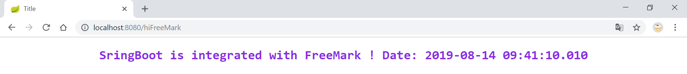

## 学习笔记 : Spring Boot整合FreeMarker

### FreeMarker官方简介
*Apache FreeMarker™ is a template engine: a Java library to generate text output (HTML web pages, e-mails, configuration files, source code, etc.) based on templates and changing data. Templates are written in the FreeMarker Template Language (FTL), which is a simple, specialized language (not a full-blown programming language like PHP). Usually, a general-purpose programming language (like Java) is used to prepare the data (issue database queries, do business calculations). Then, Apache FreeMarker displays that prepared data using templates. `In the template you are focusing on how to present the data, and outside the template you are focusing on what data to present.`*


*This approach is often referred to as the MVC (Model View Controller) pattern, and is particularly popular for dynamic web pages. `It helps in separating web page designers (HTML authors) from developers (Java programmers usually). Designers won't face complicated logic in templates`, and can change the appearance of a page without programmers having to change or recompile code.*


### 引入Maven依赖
```xml
<!-- Web -->
<dependency>
    <groupId>org.springframework.boot</groupId>
    <artifactId>spring-boot-starter-web</artifactId>
</dependency>
<!-- FreeMark -->
<dependency>
    <groupId>org.springframework.boot</groupId>
    <artifactId>spring-boot-starter-freemarker</artifactId>
</dependency>
```


### 编写Controller
```java
package pers.huangyuhui.freemark.controller;

import org.springframework.stereotype.Controller;
import org.springframework.ui.Model;
import org.springframework.web.bind.annotation.RequestMapping;

/**
 * @project: springboot-freemarker
 * @description: SpringBoot整合FreeMarker
 * @author: 黄宇辉
 * @date: 8/14/2019-9:16 AM
 * @version: 1.0
 * @website: https://yubuntu0109.github.io/
 */
@Controller
public class ViewController {

    @RequestMapping("/hiFreeMark")
    public String hiFreeMark(Model model) {
        model.addAttribute("resource", "SringBoot is integrated with FreeMarker !");
        return "index";
    }
}
```


### 编写FreeMarker页面
```html
<!DOCTYPE html>
<html lang="en">
<head>
    <meta charset="UTF-8">
    <title>Title</title>
</head>
<body>
<h2 align="center" style="color: blueviolet">${resource} Date: ${.now?string("yyyy-MM-dd HH:mm:ss.sss")}</h2>
</body>
</html>
```

*程序运行效果如下所示 :*
