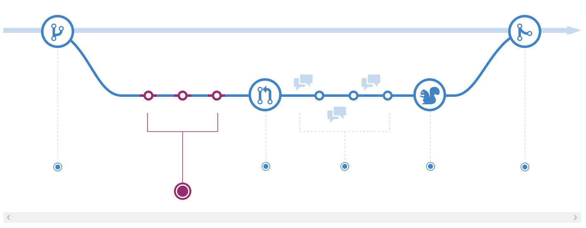
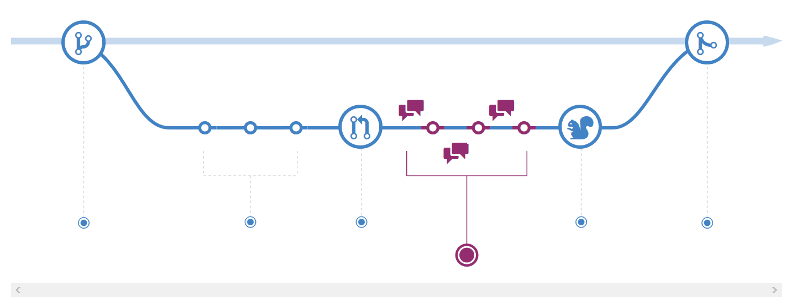
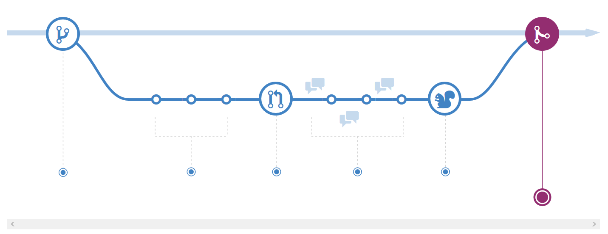

## 学习笔记 : GitHub工作流程
*GitHub流程(Git flow的简化版)是一种轻量级,基于分支的工作流程,支持定期进行部署的团队和项目. 本篇文章诠释了GitHub流程的工作原理及流程 .*

*GitHub工作流程可以简单地分为以下步骤 :*
1. *第一步 : 根据需求,从`master`拉出新分支(不区分功能分支或补丁分支) .*
2. *第二步 : 新分支开发完成后需要合并,谈论时,就需要向`master`发起一个`pull request` (PR) .*
3. *第三步 : `Pull Request`既是一个通知 : 让别人注意到你的请求,又是一种对话机制 : 让大家一起审核及讨论你的更改信息, 对话过程中可以不断修改提交信息并提交哟 .*
4. *第四步 : 当`Pull Request`通过审核后,继而可以与`master`合并啦 ! 成功重新部署后,原来你创建的那个分支就可以删除咯(先部署再合并也可以哟) .*

*A Successful Git Branching Model*

### Create a branch

*当你在一个项目上工作时,你会在任何特定时间都有一堆不同的功能或想法,既而分支可以帮助你管理其工作流程. 在项目中创建分支等同于创建一个可以尝试新想法的环境. 你在新建分支上所做的更改并不会影响`master`分支(主分支),因此你可以自由地进行实验和提交更改信息,并且在你准备好与你正在协作的人进行审核此分支前,其并不会与`master`分支合并,既而也不会污染到主分支哟 ~*

*Tip : 分支是`Git`中的核心概念,整个GitHub流程都是基于它的. 注意点 : `master`分支中的任何内容始终都是可部署的. 因此,在处理或修复功能时,创建新分支是必要的操作,注意哟,分行名称应该是具有描述性的(如 : refactor-authentication,user-content-cache-key,make-retina-avatars),以便其他人理解正在进行的工作内容 .*

### Add commits

*创建分支后,就可以对其进行更改咯. 无论何时添加,编辑或删除文件,你最终都需要进行提交并将它们添加到你的分支,添加提交的过程会为你创建一份透明的工作历史记录,以便其他人可以了解你已完成的工作. 每个提交都有一个关联的提交信息描述,该信息是解释为何进行特定更改的描述. 此外,每个提交都被视为一个单独的变更单位,既而如果发现程序错误或想决定改变开发方向,你都可以回滚其更改的信息哟 .*

*Tip : 提交时的描述消息很重要,因为Git会跟踪你的更改,然后在将它们推送到服务器后将其显示提交的描述信息. 通过编写清晰的提交描述信息,可以更轻松地让其他人跟进并提供反馈信息 .*

### Open a Pull Request

*`Pull Requests`会启动有关你的提交的讨论. 任何人都可以确切地看到他们所接受的你的请求及将会合并哪些更改等信息. 你可以在开发过程中的任何时候使用拉取请求 : 如当你想要分享一些屏幕截图或一些想法,或遇到困难并需要帮助或建议时... 当你准备好想让某人审查你的工作时,可以通过在Pull Request消息中使用GitHub的`@mention`哟 ~*

*Tip : `Pull Requests`对于贡献开源项目和管理对共享存储库的更改非常有帮助. 如果你使用的是`Fork＆Pull`模式 : 则`Pull Requests`提供了一种可以通知项目维护者你希望他们考虑的更改的方法. 如果你使用的是共享存储库模式 : 则`Pull Requests`会在合并到主分支之前帮助启动代码审查和有关建议更改的对话 .*

### Discuss and review your code

*一旦`Pull Request`开始,审核你的更改信息的人员或团队可能会有问题或意见,其原因可能是因为编码风格与项目编码风格规定不符等等等 .. `Pull Requests`后的这个审核与探讨的过程是非常有意义的,如果有人评论你忘了做某事或代码中有错误,你可以在分支中修复它并继续推送其更改信息. GitHub将在统一的Pull Request视图中显示你的新提交及你可能收到的任何其他反馈信息 .*

*Tip : `Pull Request`的评论是用`Markdown`编写的,因此你可以嵌入图片和表情符号,或使用预先格式化的文本块哟 ~*

### Deploy

*(实际开发中所需步骤) 一旦你的`pull request`请求被检查并且分支通过测试,你就可以通过重新部署继而在生产中验证它们. 若你发现你的分支出现了错误,则可以通过将现有的主服务器部署到生产环境中来回滚它 .*

### Merge

*现在你的更改已在生产中得到验证,是时候将代码合并到主分支中了啦. 合并后,`Pull Requests`会保留代码更改的记录,且它们是可被搜索到的,所以任何人都可以随时回头来查看,理解当初做出决定的解释信息 .*

*Tip : 通过将某些关键字合并到`Pull Request`的文本中,可以将`issues`与代码相关联. 合并`Pull Request`请求后,相关问题也将关闭. 例如 : 输入关键字`Closes #32`后将关闭存储库中的第32个`issue`. 更多信息请查看帮助文章 : https://help.github.com/en/articles/closing-issues-using-keywords*

*🙂 refer to : https://guides.github.com/introduction/flow/*