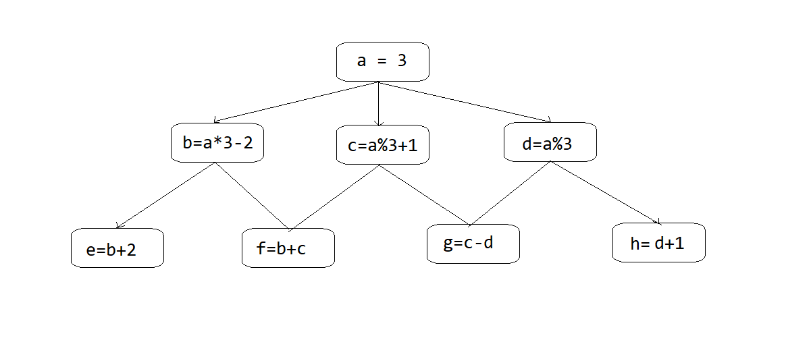
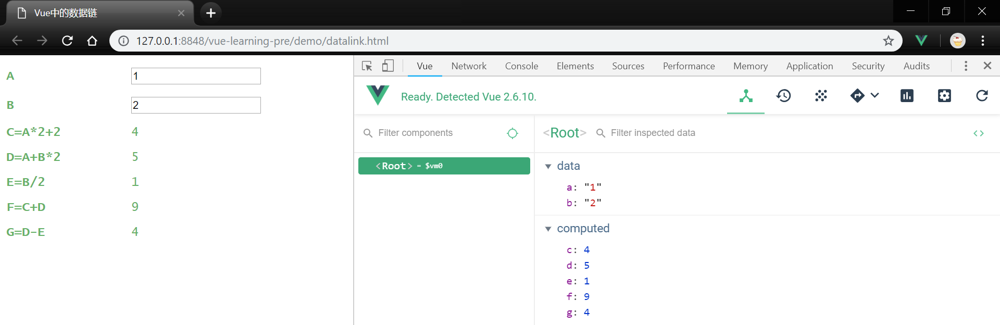
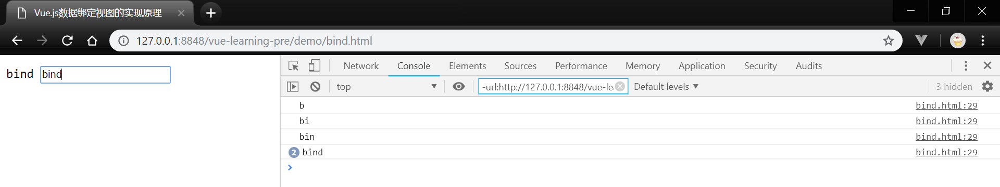

## 学习笔记 : Vue.js对的数据响应式原理
*简介 : `Vue`中最重要的概念就是响应式数据,一方面是指衍生和元数据之间的响应,通过数据链来实现. 另一方面是指视图与数据之间的绑定 .*


### 初始数据链
*数据链在学术上被定义为连通数据的链路,在这条链路上有一到多个数据起点(元数据),并通过改点不断衍生扩展新的节点(衍生数据),形成 一个庞大的网状结构. 当你修改数据起点时, 所有存在网上的节点值都将会同步更新,如下图所示 :*
 



### Vue中的数据链
*Vue实例提供了`computed`计算属性选项,以供开发者生成衍生数据对象. 虽然计算属性以函数形式声明,却并不接受参数,也只能以属性的方式调用. 由于计算属性的`this`指向`Vue`实例,所以它可以获取实例上所有已挂载的可见属性,如下示例此程序 :*
```html
<!DOCTYPE html>
<html>
	<head>
		<meta charset="utf-8">
		<script src="../resources/vue.js"></script>
		<title>Vue中的数据链</title>
		<style>
			#app{
				font-family: "lucida console",sans-serif;
				color: #67B168;
			}
			.data-label{
				display: inline-block;
				width: 160px;
			}
		</style>
	</head>
	<body>
		<div id="app">
			<p><strong class="data-label">A</strong><input type="text" v-model="a" /></p>
			<p><strong class="data-label">B</strong><input type="text" v-model="b" /></p>
			<p><strong class="data-label">C=A*2+2</strong>{{c}}</p>
			<p><strong class="data-label">D=A+B*2</strong>{{d}}</p>
			<p><strong class="data-label">E=B/2</strong>{{e}}</p>
			<p><strong class="data-label">F=C+D</strong>{{f}}</p>
			<p><strong class="data-label">G=D-E</strong>{{g}}</p>
		</div>
		<script>
			let vm = new Vue({
				el: '#app',
				data() {
					return {
						a: 3,
						b: 4
					}
				},
				//计算属性将被混入到Vue实例中.
				//所有getter和setter的this上下文自动地绑定为Vue实例.
				computed: {
					c() {
						return this.a * 2 + 2
					},
					d() {
						return Number(this.a) + this.b * 2
					},
					e() {
						return this.b / 2
					},
					f() {
						return Number(this.c) + Number(this.d)
					},
					g() {
						return this.d - this.e
					}
				}
			});
		</script>
	</body>
</html>
```

*程序运行效果如下图所示 :*



### 数据绑定视图
*下面通过一个示例程序,事实现数据与视图之间的`双向绑定` : 在对象函数的setter函数中修改文本节点的值,所以当obj.profile被重新赋值时,节点视图也会同步更新; 然后对输入框添加事件监听(addEventListener),当用户事件触发时,输入值将被赋予obj.profile. 以此方式,我们实现了数据与视图之间的双向绑定,这也就是Vue数据与视图绑定的实现原理 .*
```html
<!DOCTYPE html>
<html>
	<head>
		<meta charset="utf-8">
		<title>Vue.js数据绑定视图的实现原理</title>
	</head>
	<body>
		<span id="harry" style="line-height: 32px;">&nbsp;</span>
		<input id="trigger" type="text" />
		<script>
			let harry = document.getElementById("harry")
			let trigger = document.getElementById("trigger")
			let key = 'profile' //对象属性键名
			let store = {} //辅助get取值
			let obj = { //对象
				profile: ''
			}
			Object.defineProperty(obj, key, {
				set(value) {
					harry.innerText = value //重点:修改DOM节点视图
					store[key] = value
				},
				get() {
					return store[key]
				}
			})
			trigger.addEventListener('keyup', function() {
				obj[key] = this.value
				console.log(obj[key])
			})
		</script>
	</body>
</html>
```

*程序运行效果如下图所示 :*


*在Vue中,当我们把普通的JavaScript对象传给Vue实例的data选项时,Vue将遍历对象属性,并使用`Object.defineProperty`将其全部转换为`getter/setter`,并在组件渲染时将属性记录为依赖. 之后当依赖项的setter函数被调用时,会通知`watcher`重新计算并更新其关联的所有组件. 由于Object.definedProperty是`ES5`中一个无法shim(自定义扩展)的特性,所以Vue应用无法运行在不支持Objcet.defineProperty的IE8及其以下版本的浏览器上 .*