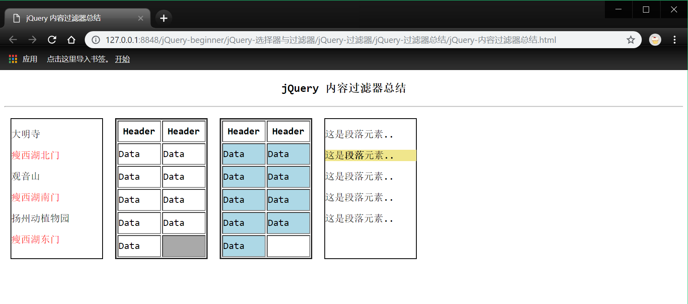

## jQuery 初学过滤器总结

### jQuery 过滤器分类
- *基础过滤器*
- *内容过滤器*
- *子元素过滤器*
- *可见性过滤器*

### jQuery 基础过滤器
1. *`:header` : 过滤器用于筛选所有标题元素.从'h1'到'h6'均在此选择范围内.*
2. *`:eq()` : 过滤器用于选择指定序号为'n'的元素,序号从0开始.*
3. *`gt()` : 过滤器用于选择大于序号为'n'的元素,序号从0开始.*
4. *`lt()` : 过滤器用于选择所有小于序号为'n'的元素,序号从0开始.*
5. *`:first` : 过滤器用于筛选第一个符合条件的元素.*
6. *`:last` : 过滤器用于筛选最后一个符合条件的元素.*
7. *`even` : 过滤器用于筛选符合条件的偶数个元素.*
8. *`odd` : 过滤器用于筛选符合条件的奇数个元素.*
9. *`not()` : 过滤器用于筛选所有不符合条件的元素.*

- *jQuery 基础过滤器示例*
```html
<!DOCTYPE html>
<html>
	<head>
		<meta charset="utf-8">
		<title>jQuery 基础过滤器总结</title>
		<script src="../../../jQuerySource/jquery-1.12.4.js"></script>
		<script type="text/javascript">
			<!--':header' : 过滤器用于筛选所有标题元素.从<h1>到<h6>均在此选择范围内 -->
			$(document).ready(function() {
				$(":header").css("background-color", "palegreen");
			});

			<!--':eq()' : 过滤器用于选择指定序号为'n'的元素,序号从0开始 -->
			<!--'gt()' : 过滤器用于选择大于序号为'n'的元素,序号从0开始 -->
			<!--'lt()' : 过滤器用于选择所有小于序号为'n'的元素,序号从0开始 -->
			$(document).ready(function() {
				//'equal' : 影响的是第三行的列表选项元素<li>.
				$("li:eq(2)").css("border", "1px solid #00FFFF");
				//'less than' : 影响的是第三行之后的所有列表选项.
				$("li:gt(2)").css("border", "1px solid blue");
				//'greater than' : 影响的是第三行之前的所有列表选项.
				$("li:lt(2)").css("border", "1px solid red");
			});

			<!--':first' : 过滤器用于筛选第一个符合条件的元素 -->
			<!--':last' : 过滤器用于筛选最后一个符合条件的元素 -->
			$(document).ready(function() {
				//':first()' : 过滤器用于筛选第一个符合条件的元素.
				$("p:first").css("border", "1px solid lawngreen");
				//':last()'  : 过滤器用于筛选最后一个符合条件的元素.
				$("p:last").css("background-color", "bisque");
			});

			<!--'even' : 过滤器用于筛选符合条件的偶数个元素 -->
			<!--'odd' : 过滤器用于筛选符合条件的奇数个元素 -->
			$(document).ready(function() {
				//':even' : 过滤器用于筛选符合条件的偶数个元素.
				$("div#even_old tr:even").css("background-color", "lightblue");
				//':odd' : 过滤器用于筛选符合条件的奇数个元素.
				$("div#even_old tr:odd").css("background-color", "silver");
			});

			<!--'not()' : 过滤器用于筛选所有不符合条件的元素 -->
			$(document).ready(function() {
				//注意:为避免冲突不能同时使用两行该过滤器,如果要同时除去两个段落元素可以使用如下语法规则.
				$(":not(div#eq_gt_lt ul li,div#first_last p)").css("border", "0.5px solid magenta");
			});
		</script>
		<style type="text/css">
			div {
				width: 160px;
				height: 180px;
				border: 1px solid;
				float: left;
				margin: 10px;
			}

			ul {
				width: 80px;
				height: auto;
			}
		</style>
	</head>
	<body>
		<center>
			<h3>jQuery 基础过滤器总结</h3>
		</center>
		<hr>
		<div id="eq_gt_lt">
			<ul>
				<li>第一章</li>
				<li>第二章</li>
				<li>第三章</li>
				<li>第四章</li>
				<li>第五章</li>
			</ul>
		</div>
		<div id="first_last">
			<p>第一个段落元素</p>
			<p>第二个段落元素</p>
			<p>第三个段落元素</p>
		</div>
		<div id="even_old">
			<table id="test" border="1" width="160" height="180">
				<!-- <caption>table</caption> -->
				<tr>
					<th>Header</th>
					<th>Header</th>
				</tr>
				<tr>
					<td>Data</td>
					<td>Data</td>
				</tr>
				<tr>
					<td>Data</td>
					<td>Data</td>
				</tr>

				<tr>
					<td>Data</td>
					<td>Data</td>
				</tr>
				<tr>
					<td>Data</td>
					<td>Data</td>
				</tr>
				<tr>
					<td>Data</td>
					<td>Data</td>
				</tr>
				<tr>
					<td>Data</td>
					<td>Data</td>
				</tr>
			</table>
		</div>
	</body>
</html>

```
- *jQuery 基础过滤器示例图*


### jQuery 内容过滤器
1. *`:parent()` : 用于选择包含子节点(子元素和文本)的元素,和`:empty()`恰相反哟.*
2. *`:empty()` : 用于选择未包含子节点(子元素和文本的元素).*
3. *`:contains()` : 用于筛选出所有包含指定文本内容的元素.*
4. *`:has()` : 用于选择包含指定选择器的元素.*

- *jQuery 内容过滤器示例*
```html
<!DOCTYPE html>
<html>
	<head>
		<meta charset="utf-8">
		<title>jQuery 内容过滤器总结</title>
		<script src="../../../jQuerySource/jquery-1.12.4.js"></script>
		<script type="text/javascript">
			<!--':contains()' : 用于筛选出所有包含指定文本内容的元素 -->
			$(document).ready(function() {
				$("p:contains('瘦西湖')").css("color", "red");
			});

			<!--':empty()' : 用于选择未包含子节点(子元素和文本的元素) -->
			$(document).ready(function() {
				$("div#empty td:empty").css("background", "darkgray");
			});

			<!--':parent()' : 用于选择包含子节点(子元素和文本)的元素,和':empty()'恰相反哟 -->
			$(document).ready(function() {
				$("div#parent td:parent").css("background-color", "lightblue");
			});

			<!--':has()' : 用于选择包含指定选择器的元素 -->
			$(document).ready(function() {
				//选择包含<strong>标签的<p>元素.
				$("p:has(strong)").css("background", "khaki");
			});
		</script>
		<style type="text/css">
			div {
				width: 150px;
				height: 230px;
				border: 1px solid;
				float: left;
				margin: 10px;
			}
		</style>
	</head>
	<body>
		<center>
			<h3>jQuery 内容过滤器总结</h3>
		</center>
		<hr>
		<div id="contains">
			<p>大明寺</p>
			<p>瘦西湖北门</p>
			<p>观音山</p>
			<p>瘦西湖南门</p>
			<p>扬州动植物园</p>
			<p>瘦西湖东门<p>
		</div>
		<div id="empty">
			<table border="1" width="150" height="230">
				<tr>
					<th>Header</th>
					<th>Header</th>
				</tr>
				<tr>
					<td>Data</td>
					<td>Data</td>
				</tr>
				<tr>
					<td>Data</td>
					<td>Data</td>
				</tr>
				<tr>
					<td>Data</td>
					<td>Data</td>
				</tr>
				<tr>
					<td>Data</td>
					<td>Data</td>
				</tr>
				<tr>
					<td>Data</td>
					<td></td>
				</tr>
			</table>
		</div>
		<div id="parent">
			<table border="1" width="150" height="230">
				<tr>
					<th>Header</th>
					<th>Header</th>
				</tr>
				<tr>
					<td>Data</td>
					<td>Data</td>
				</tr>
				<tr>
					<td>Data</td>
					<td>Data</td>
				</tr>
				<tr>
					<td>Data</td>
					<td>Data</td>
				</tr>
				<tr>
					<td>Data</td>
					<td>Data</td>
				</tr>
				<tr>
					<td>Data</td>
					<td></td>
				</tr>
			</table>
		</div>
		<div id="has">
			<p>这是段落元素..</p>
			<p>这是<strong>段落</strong>元素..</p>
			<p>这是<span>段落</span>元素..</p>
			<p>这是段落元素..</p>
			<p>这是段落元素..</p>
		</div>
	</body>
</html>

```

- *jQuery 内容过滤器示例图*



### jQuery 子过滤器
1. *`:nth-child` : 用于筛选页面上每个父元素中的第'n'个子元素.序号从1开始计数*
2. *`:first-child` : 过滤器用于筛选页面上每个父元素中的第一个子元素.*
3. *`:last-child` : 过滤器用于筛选页面上每个父元素中的最后一个子元素.*
4. *`:only` : 用于筛选所有在父元素中有且只有一个的子元素.*

- *jQuery 子过滤器示例*
```html
<!DOCTYPE html>
<html>
	<head>
		<meta charset="utf-8">
		<title>jQuery 子过滤器总结</title>
		<script src="../../../jQuerySource/jquery-1.12.4.js"></script>
		<script type="text/javascript">
			<!--':first-child' : 过滤器用于筛选页面上每个父元素中的第一个子元素 -->
			$(document).ready(function() {
				$("div#firstChild ul li:first-child").css({
					fontWeight: "bold",
					color: "red"
				});
			});
			
			<!--':last-child' : 过滤器用于筛选页面上每个父元素中的最后一个子元素 -->
			$(document).ready(function() {
				$("div#lastChild p:last-child").css({
					fontWeight: "bold",
					color: "#0000FF"
				});
			});
			
			<!--':only' : 用于筛选所有在父元素中有且只有一个的子元素 -->
			$(document).ready(function() {
				$("div#onlyChild ul li:only-child").css({
					fontWeight: "bold",
					color: "chartreuse"
				});
			});
			<!--':nth-child' : 用于筛选页面上每个父元素中的第'n'个子元素.序号从1开始计数 -->
// 			$(document).ready(function() {
// 				//筛选奇数项子元素.
// 				$("ul#item01 li:nth-child(odd)").css("color", "red");
// 				//选择第一个子元素.
// 				$("ul#item02 li:nth-child(2)").css("color", "red");
// 				//选择第3n+2个子元素.
// 				$("ul#item03 li:nth-child(3n+2)").css("color", "red);
// 			});
		</script>
		<style type="text/css">
			div {
				width: 150px;
				height: 180px;
				border: 1px solid;
				float: left;
				margin: 10px;
			}

			ul {
				float: left;
			}
		</style>
	</head>
	<body>
		<center>
			<h3>jQuery 子过滤器总结</h3>
		</center>
		<hr>
		<div id="firstChild">
			<ul>
				<li>Apple</li>
				<li>Pear</li>
				<li>Grape</li>
			</ul>
			<ul>
				<li>Milk</li>
				<li>Bread</li>
				<li>Coffee</li>
			</ul>
		</div>
		<div id="lastChild">
			<p>段落元素01..</p>
			<p>段落元素02..</p>
			<p>段落元素03..</p>
			<p>段落元素05..</p>
		</div>
		<div id="onlyChild">
			<ul>
				<li>第一个子元素</li>
				<li>第二个子元素</li>
			</ul>
			<ul>
				<li>唯一的子元素</li>
			</ul>
			<ul>
				无标签的文本内容..
			</ul>
		</div>
		<div id="nthChild">
			<ul id="item01">
				<!-- li:nth-child(odd): 筛选奇数项元素 -->
				<li>1</li>
				<li>2</li>
				<li>3</li>
				<li>4</li>
				<li>5</li>
			</ul>
			<ul id="item02">
				<!-- li:nth-child(2): 筛选第2个元素 -->
				<li>a</li>
				<li>b</li>
				<li>c</li>
				<li>d</li>
				<li>e</li>
			</ul>
			<ul id="item03">
				<!-- li:nth-child(3n+2): 筛选第3n+2个元素 -->
				<li>1</li>
				<li>2</li>
				<li>3</li>
				<li>4</li>
				<li>5</li>
			</ul>
		</div>
	</body>
</html>

```

- *jQuery 子过滤器示例图*


### jQuery 可见性过滤器
1. *`:hidden` : 过滤器用于筛选出所有处于隐藏状态的元素.*
2. *`:visible` : 过滤器用于筛选出所有处于可见状态的元素.*

- *jQuery 可见性过滤器示例*
```html
<!DOCTYPE html>
<html>
	<head>
		<meta charset="utf-8">
		<title>jQuery 可见性选择器</title>
		<script src="../../../jQuerySource/jquery-1.12.4.js"></script>
		<script type="text/javascript">
			<!--':hidden' : 过滤器用于筛选出所有处于隐藏状态的元素 -->
			<!--':visible' : 过滤器用于筛选出所有处于可见状态的元素 -->
			$(document).ready(function() {

				//选择处于隐藏状态的div元素.
				//find(selector): 用于查找处于可见状态的元素.该方法可以返回符合条件的元素的对象数组.
				var hideDiv = $("body").find("div:hidden");

				//选择处于隐藏状态的input元素.
				//$(div#test01): 表示在id="test01"的div元素中查找.
				var hideInput = $("div#test01").find("input:hidden");

				//选择处于可见状态的input元素.
				var visbleInput = $("div.test02").find("input:visible");

				//选择处于可见状态的div元素.
				var visbleDiv = $("body").find("div:visible");

				window.alert("处于隐藏状态的div元素有:" + hideDiv.length +
					"个!\n处于隐藏状态的input元素有:" + hideInput.length + "个 !" +
					"\n处于显示状态的div元素有 : " + visbleDiv.length + "个!" +
					"\n处于显示状态的input元素有 : " + visbleInput.length + "个!");
			});
		</script>
	</head>
	<body>
		<h3></h3>
		<hr>
		<!-- 隐藏状态的div元素 -->
		<div style="display: none">display:none</div>
		<!-- 显示状态的div元素 -->
		<div id="test01">
			<!-- 隐藏状态的input元素 -->
			<input type="hidden" />
		</div>
		<!-- 显示状态的div元素 -->
		<div class="test02">
			<!-- 显示状态的input元素 -->
			name : <input type="text" name="username" /><br /><br>
			password: <input type="password" name="userpassword" />
		</div>
	</body>
</html>

```

- *jQuery 可见性过滤器示例图*


- *Ok,学习笔记很简约,毕竟初学`jQuery`嘛.后期会不断更新我学习`jQuery`的学习笔记的(っ•̀ω•́)っ✎⁾⁾ ~ 最近养成了晨跑和夜跑的好习惯,也改掉了熬夜及大量饮咖啡的坏习惯,只想证明: 我会努力让自己更喜欢自己 !让你们喜欢我(✪ω✪) ~* 