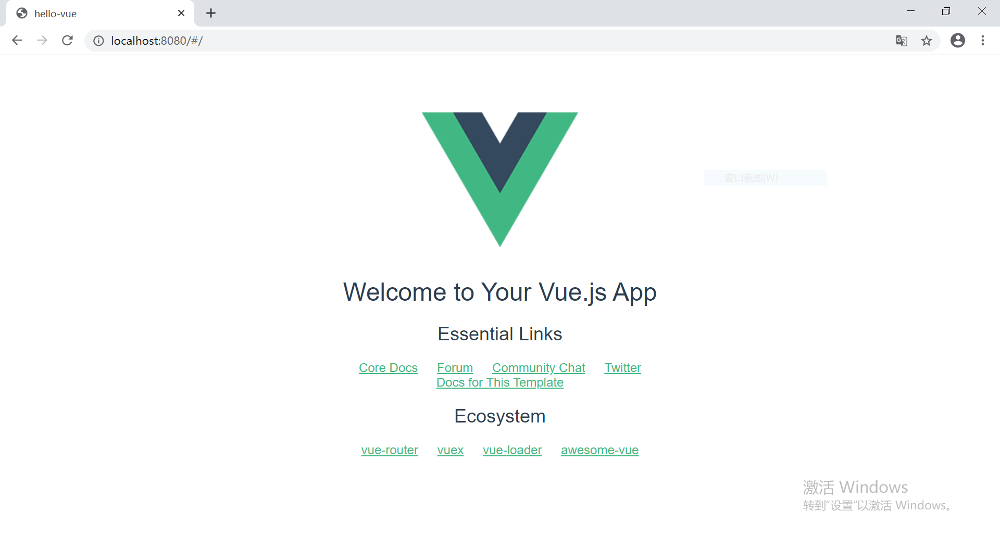

## 简介
*构建一个 vue 项目最简单的方式就是使用脚手架工具 `vue-cli`. 其作用就是用配置好的模板迅速搭建起一个项目工程，进而省去自己配置 webpack 配置文件的基本内容，大大降低了初学者构建项目的难度. 以下是使用 vue-cli 构建 vue 项目的流程.*

### 环境准备
首先安装 Node.js，因为 vue 的安装及使用需要 node 和 npm 环境，最后可通过 `node -v` 以及 `npm -v` 来检查是否安装成功.
>  https://nodejs.org/en/

### 安装淘宝npm
为了加速下载 vue 项目依赖，安装一下淘宝的npm
```shell
$ npm install -g cnpm --registry=https://registry.npm.taobao.org
```

### 安装vue-cli
1. 首先安装vue-cli
```shell
$ cnpm install --g vue-cli
```

2. 检查是否安装成功
```shell
$ vue --version
@vue/cli 4.4.4
```

### 构建vue项目
1. 初始化的过程中，会有一个交互式的选项让你选择项目的一些配置，根据项目需求选择即可.
```shell
# 项目名称必须全部小写,否则会报错
$ vue init webpack hello-vue
```


```shell
? Project name hello-vue # 项目名称
? Project description a demo project for vue.js # 项目描述
? Author (HuangYuhui <Gentleman_0109@outlook.com>) # 作者信息
? Vue build standalone # 运行+编译时
? Install vue-router? Yes # 安装 vue-router
? Use ESLint to lint your code? Yes # 使用 ESLint 作为代码规范
? Pick an ESLint preset Standard # 选择 Standard 的代码规范
? Set up unit tests Yes # 安装单元测试
? Pick a test runner jest # 测试模块
? Setup e2e tests with Nightwatch? Yes # 安装 e2e 测试

# 共有三个选项,这里我们最好选择第三个,因为通过npm install安装vue项目依赖库非常的慢,所以我们可以在项目创建后,自己通过"cnpm install"安装
# Should we run “npm install” for you after the project has been created?
# <recommended><use arrow keys>Yes, use NPM  Yes, use Yarn  No, I will handle that myself
? Should we run `npm install` for you after the project has been created? (recommended) npm # 使用包管理器 npm
```

2. 项目构建完成之后会提示如下构建成功信息:
```shell
# Project initialization finished!
# ========================

To get started:

  cd hello-vue
  npm run dev

Documentation can be found at https://vuejs-templates.github.io/webpack
```

3. 启动项目
```shell
$ cd hello-vue
$ npm run dev
```

*项目默认会在 8080 端口启动，如果端口有占用，会自动调整端口. 打开浏览器输入 : `http://localhost:8080` 就会看到构建的 vue 项目主页，如下图所示*


### 安装vue的辅助工具
如果项目可以正常启动，即可继续安装你所需的vue辅助工具 :
```shell
# 路由管理模块
npm install vue-router --save
# 状态管理模块
npm install vuex --save
# 网路请求模块
npm install vue-resource --save
# 安装element-ui
cnpm install element-ui --save
# 安装axios
cnpm install axios --save
# ...
```


### 参考
> [Vue项目创建详解](https://www.cnblogs.com/aizai846/archive/2020/04/05/12634878.html)

> [vue-cli构建vue项目的步骤详解](http://www.uxys.com/html/Vue/20200127/26722.html)
