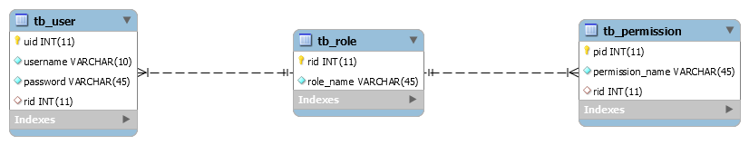
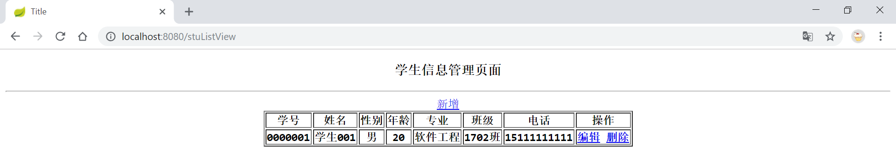
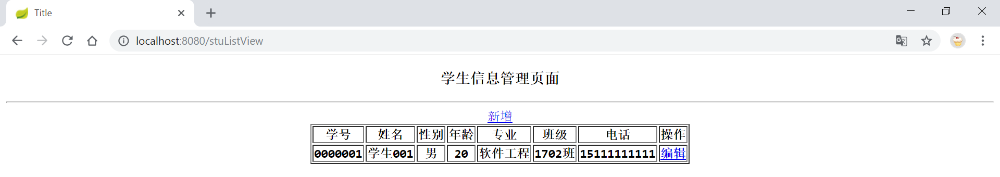
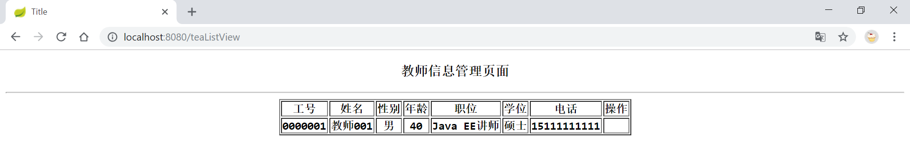
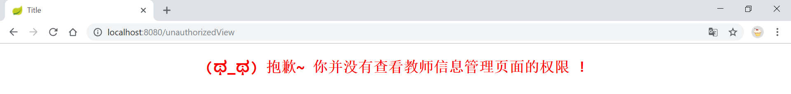

## 学习笔记 : 一个基础的SpringBoot整合Shiro案例
*前些日子写了一个[整合Shiro的基本Web案例](https://github.com/YUbuntu0109/Shiro-learning/tree/master/basic%20web%20project%20with%20shiro),然后又进阶地学习了SpringBoot整合Shiro的基本知识,继而今天总结一下 : 写一个基础的SpringBoot整合Shiro案例~ 该案例的代码仓库 : https://github.com/YUbuntu0109/Shiro-learning/tree/master/spring%20boot%20project%20with%20shiro*


### 数据库设计
*数据库ER图如下所示 :*


*数据表中用户及其分配的权限信息如下所示 :*

| 账户  | 密码(MD5加密前) |  角色   |                                   权限                                   |
| :---: | :-------------: | :-----: | :----------------------------------------------------------------------: |
| admin |      demo       |  admin  |                                    *                                     |
|  tea  |      demo       | teacher | teaListView:view , stuListView:view , stuListView:add , stuListView:edit |
|  stu  |      demo       | student |                             stuListView:view                             |


### 资源权限设计
*springboot-shiro/src/main/java/pers/huangyuhui/ss/shiro/ShiroConfig.java : 资源过滤及其权限的配置信息如下*
```java

    /**
     * @description: 配置过滤器
     * @param: securityManager
     * @date: 2019-08-05 7:59 AM
     * @return: org.apache.shiro.spring.web.ShiroFilterFactoryBean
     */
    @Bean
    public ShiroFilterFactoryBean shiroFilterFactoryBean(SecurityManager securityManager) {
        ShiroFilterFactoryBean shiroFilterFactoryBean = new ShiroFilterFactoryBean();
        //设置安全管理器
        shiroFilterFactoryBean.setSecurityManager(securityManager);
        //设置自定义过滤器
        shiroFilterFactoryBean.setFilterChainDefinitionMap(filterChainDefinitionMap());
        //设置用户登录页,默认: http://localhost:8080/login.jsp
        shiroFilterFactoryBean.setLoginUrl("/loginView");
        //设置用户未授权操作提示页
        shiroFilterFactoryBean.setUnauthorizedUrl("/unauthorizedView");
        return shiroFilterFactoryBean;
    }

    /**
     * @description: 设置资源的权限控制
     * @date: 2019-08-05 8:31 AM
     * @return: java.util.Map
     */
    private Map<String, String> filterChainDefinitionMap() {
        Map<String, String> filterMap = new LinkedHashMap<>();
        //需身份认证
        filterMap.put("/stuListView", "authc");
        filterMap.put("/teaListView", "authc");
        //无需身份认证:防止验证用户登录信息操作被'filterMap.put("/**", "authc")'拦截
        filterMap.put("/login", "anon");
        //注销过滤器:其具体的注销逻辑代码Shiro已经替我们实现了哟
        filterMap.put("/logout", "logout");
        //角色过滤:需要用户拥有'admin'角色
        filterMap.put("/teaListView", "roles[admin]");
        //权限过滤:除身份认证外,还需要用户拥有对stuListView资源的view权限
        filterMap.put("/stuListView", "perms[stuListView:view]");
        filterMap.put("/teaListView", "perms[teaListView:view]");
        //拦截需要登录(用户认证)方可访问的资源(一般将/**放在最下边,不然会导致所有url都被拦截哟)
        filterMap.put("/**", "authc");
        return filterMap;
    }

    // ······
```


### 凭证加密设计
*springboot-shiro/src/main/java/pers/huangyuhui/ss/shiro/ShiroConfig.java : 用户凭证加密的配置信息如下(盐值:用户名)*
```java
    /**
     * @description: 初始化自定义Realm
     * @param: credentialsMatcher
     * @date: 2019-08-05 7:50 AM
     * @return: pers.huangyuhui.ss.shiro.UserRealm
     */
    @Bean
    public UserRealm userRealm(HashedCredentialsMatcher hashedCredentialsMatcher) {
        UserRealm userRealm = new UserRealm();
        //设置凭证匹配器
        userRealm.setCredentialsMatcher(hashedCredentialsMatcher);
        return userRealm;
    }

    /**
     * @description: 哈希密码匹配器:比较用户登录时输入的密码,跟数据库密码配合盐值salt解密后是否一致
     * @date: 2019-08-05 9:01 PM
     * @return: org.apache.shiro.authc.credential.HashedCredentialsMatcher
     */
    @Bean
    public HashedCredentialsMatcher hashedCredentialsMatcher() {
        HashedCredentialsMatcher hashedCredentialsMatcher = new HashedCredentialsMatcher();
        hashedCredentialsMatcher.setHashAlgorithmName("md5"); //散列算法
        hashedCredentialsMatcher.setHashIterations(3); //散列的次数
        hashedCredentialsMatcher.setStoredCredentialsHexEncoded(true); //默认是true:Hex编码.false:Base64编码
        return hashedCredentialsMatcher;
    }

    // ······
```

*springboot-shiro/src/main/java/pers/huangyuhui/ss/utils/SecurityUtils.java : 密码加密逻辑如下*
```java
/**
 * @project: springboot-shiro
 * @description: 加密工具
 * @author: 黄宇辉
 * @date: 8/5/2019-9:09 PM
 * @version: 1.0
 * @website: https://yubuntu0109.github.io/
 */
public class SecurityUtils {

    public static void main(String[] args) {
        //admin-pwd [source:demo+salt:admin+hashIterations:3] :  257e3b15d67a9127d230175e43118e40
        //tea-pwd [source:demo+salt:tea+hashIterations:3] : f97ccdcf125073d5f19bd3de0b67eb40
        //stu-pwd [source:demo+salt:stu+hashIterations:3] : e1a1c9a1340d179077086b5dbee621b4
        String md5Pwd = new SimpleHash("md5", "demo", ByteSource.Util.bytes("stu"), 3).toHex();
        System.out.println(md5Pwd);
    }
}
```


### Thymeleaf整合Shiro标签
*springboot-shiro/src/main/java/pers/huangyuhui/ss/shiro/ShiroConfig.java : Thymeleaf整合Shiro标签的配置如下*
```java
    /**
     * @description: 配置ShiroDialect, 用于thymeleaf和shiro标签配合使用
     * @date: 2019-08-05 6:37 PM
     * @return: at.pollux.thymeleaf.shiro.dialect.ShiroDialect
     */
    @Bean
    public ShiroDialect shiroDialect() {
        return new ShiroDialect();
}
```


### Shiro集成EhCache缓存
*springboot-shiro/src/main/java/pers/huangyuhui/ss/shiro/ShiroConfig.java : Shiro集成EhCache的配置信息如下*
```java
    /**
     * @description: 安全事务管理器
     * @param: credentialsMatcher
     * @date: 2019-08-05 7:53 AM
     * @return: org.apache.shiro.web.mgt.DefaultWebSecurityManager
     */
    @Bean
    public SecurityManager securityManager(UserRealm userRealm, EhCacheManager ehCacheManager) {
        DefaultWebSecurityManager defaultWebSecurityManager = new DefaultWebSecurityManager();
        //关联自定义realm
        defaultWebSecurityManager.setRealm(userRealm);
        //关联缓存管理
        defaultWebSecurityManager.setCacheManager(ehCacheManager);
        return defaultWebSecurityManager;
    }

    /**
     * @description: 设置缓存管理, 缓存用户及其权限信息
     * @date: 2019-08-07 7:51 AM
     * @return: org.apache.shiro.cache.ehcache.EhCacheManager
     */
    @Bean
    public EhCacheManager ehCacheManager() {
        //注意:myEhcache对应ehcache-shiro.xml中的'<ehcache name="myEhcache">'
        CacheManager cacheManager = CacheManager.getCacheManager("myEhcache");
        if (cacheManager == null) {
            cacheManager = CacheManager.create();
        }
        EhCacheManager ehCacheManager = new EhCacheManager();
        ehCacheManager.setCacheManager(cacheManager);
        return ehCacheManager;

    // ······
}
```


### 案例截屏解析

*用户登录页,访问资源前必须先进行用户身份认证,详情参考资源拦截器中的配置信息哟*


*若要访问教师 / 学生信息管理页,需要用户拥有`teaListView:view / stuListView:view`权限*


*管理员( admin )拥有访问资源的所有权限( * ),所以可以操控学生信息页面中的任何操作*


*管理员( admin )拥有访问资源的所有权限( * ),所以可以操控教师信息页面中的任何操作*


*教师( tea )拥有学生页面的`stuListView:view , stuListView:add , stuListView:edit`权限,所以删除信息操作为不可见*


*教师( tea )仅拥有教师信息管理页面的`teaListView:view`权限,所以增,删,改,操作为不可见状态*


*学生( stu )仅拥有学生信息管理页面的`stuListView:view`权限,所以增,删,改,操作为不可见状态*


*学生( stu )没有访问教师信息管理页面的权限,所以被资源拦截器所拦截继而进入指定的'unauthorized.html'页面*



*数据库设计参考了(非常感谢) : https://www.jianshu.com/p/7716951f4d7f*