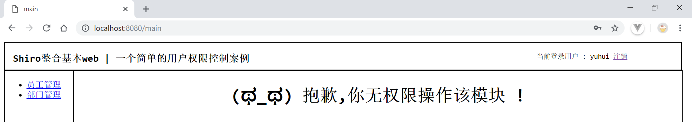

## 学习笔记 : 一个基础的Web整合Shiro案例
*总结前面`Shiro`的基本学习笔记,继而尝试整合web,来写一个基础的Web整合Shiro案例( Java web ),用户权限划分如下,该案例的代码仓库 : https://github.com/YUbuntu0109/Shiro-learning/tree/master/basic%20web%20project%20with%20shiro*

* 管理员(admin) : 具有操控部门/员工信息管理页的所有权限
* 用户(yuhui) : 仅具有部门信息的`view`权限


### 环境配置
1. *baseWebShiro\pom.xml : Maven依赖*
```xml
<project xmlns="http://maven.apache.org/POM/4.0.0"
         xmlns:xsi="http://www.w3.org/2001/XMLSchema-instance"
         xsi:schemaLocation="http://maven.apache.org/POM/4.0.0 http://maven.apache.org/xsd/maven-4.0.0.xsd">
    <modelVersion>4.0.0</modelVersion>
    <groupId>pers.huangyuhui</groupId>
    <artifactId>baseWebShiro</artifactId>
    <version>1.0.0</version>
    <packaging>war</packaging>
    <description>a simple web program for Shiro</description>

    <dependencies>
        <!-- Serlvet -->
        <dependency>
            <groupId>javax.servlet</groupId>
            <artifactId>javax.servlet-api</artifactId>
            <version>3.0.1</version>
            <scope>provided</scope>
        </dependency>
        <!-- Shiro core -->
        <dependency>
            <groupId>org.apache.shiro</groupId>
            <artifactId>shiro-core</artifactId>
            <version>1.4.0</version>
        </dependency>
        <!-- Shiro web -->
        <dependency>
            <groupId>org.apache.shiro</groupId>
            <artifactId>shiro-web</artifactId>
            <version>1.4.0</version>
        </dependency>
        <!-- logging -->
        <dependency>
            <groupId>commons-logging</groupId>
            <artifactId>commons-logging</artifactId>
            <version>1.2</version>
        </dependency>
    </dependencies>
    <build>
        <plugins>
            <plugin>
                <groupId>org.apache.maven.plugins</groupId>
                <artifactId>maven-compiler-plugin</artifactId>
                <configuration>
                    <source>1.8</source>
                    <target>1.8</target>
                </configuration>
            </plugin>
        </plugins>
    </build>
</project>
```

2. *baseWebShiro\src\main\resources\shiro.ini : 用户身份及权限信息*
```ini
[main]
# 默认登录页为:/login.jsp
authc.loginUrl = /login
# 用户没有访问指定资源的角色时所跳转的页面
roles.unauthorizedUrl = /nopermission.jsp
# 用户没有访问指定资源的权限时所跳转的页面
perms.unauthorizedUrl = /nopermission.jsp
# 登出之后重定向的页面
logout.redirectUrl = /login

[users]
admin = 666,admin
yuhui = 777,deptManager

[roles ]
admin = employee:*,department:*
deptManager = department:view

[urls]
# 静态资源可以匿名访问
/static/** = anon
# 访问员工列表需要身份认证及需要用户拥有'admin'角色
/employee = authc,roles[admin]
# 访问部门列表需要身份认证及需要用户拥有'department:view'的权限
/department = authc,perms["department:view"]
# 当请求loginOut时,会被logout捕获并清除session
/logout = logout
# 所有的请求都需要身份认证
/** = authc
```

3. *baseWebShiro\src\main\webapp\WEB-INF\web.xml*
```xml
<?xml version="1.0" encoding="UTF-8"?>
<web-app xmlns:xsi="http://www.w3.org/2001/XMLSchema-instance"
         xmlns="http://java.sun.com/xml/ns/javaee"
         xsi:schemaLocation="http://java.sun.com/xml/ns/javaee http://java.sun.com/xml/ns/javaee/web-app_3_0.xsd"
         id="WebApp_ID" version="3.0">
    <!--
       Shiro 1.2引入了Environmnet/WebEnvironment的概念,既由它们接口提供相应的SecurityManager及其相应的依赖.
       ShiroFilter会自动找到Environment,然后获取相应的依赖.
       底层实现:返回反射创建shiroEnvironmentClass对象,调用其init方法,既通过shiroEnvironmnetClass中的init方法
       创建SecurityManager实例,并将其绑定到当前运行环境
   -->

    <!-- 配置ShiroFilter环境 -->
    <context-param>
        <param-name>shiroEnvironmentClass</param-name>
        <param-value>org.apache.shiro.web.env.IniWebEnvironment</param-value>
    </context-param>
    <context-param>
        <param-name>shiroCConfigLocations</param-name>
        <param-value>classpath:shiro.ini</param-value>
    </context-param>
    <!-- Shiro监听器 -->
    <listener>
        <listener-class>org.apache.shiro.web.env.EnvironmentLoaderListener</listener-class>
    </listener>
    <!-- Shiro拦截器 -->
    <filter>
        <filter-name>shiroFilter</filter-name>
        <filter-class>org.apache.shiro.web.servlet.ShiroFilter</filter-class>
    </filter>
    <filter-mapping>
        <filter-name>shiroFilter</filter-name>
        <url-pattern>/*</url-pattern>
    </filter-mapping>

</web-app>
```


### 前端页面
1. *baseWebShiro\src\main\webapp\static\js\jquery.js : 嘿嘿,代码量你懂得,自行下载吧~*
```js
/*!
 * jQuery JavaScript Library v1.7.1
 * http://jquery.com/
 *
 * Copyright 2011, John Resig
 * Dual licensed under the MIT or GPL Version 2 licenses.
 * http://jquery.org/license
 *
 * Includes Sizzle.js
 * http://sizzlejs.com/
 * Copyright 2011, The Dojo Foundation
 * Released under the MIT, BSD, and GPL Licenses.
 *
 * Date: Mon Nov 21 21:11:03 2011 -0500
 */
(function (window, undefined) {

// Use the correct document accordingly with window argument (sandbox)
    var document = window.document,
        navigator = window.navigator,
        location = window.location;
    var jQuery = (function () {

        // ······
```

2. *baseWebShiro\src\main\webapp\static\js\main.js : 切换用户主页中的信息管理页面*
```js
$(function () {
    $(".changePage").click(function () {
        $("#rightMain").prop("src", $(this).data("url"));
    });
});
```

3. *baseWebShiro\src\main\webapp\static\style\main_css.css : 用户主页样式*
```css
.top {
    height: 50px;
    width: 99%;
    float: left;
    border: solid 1px black;
}

.logo {
    float: left;
    line-height: 20px;
}

.userinfo {
    float: right;
    line-height: 50px;
    font-size: 13px;
    margin-right: 100px;
}

.center {
    width: 100%;
    float: left;
    height: 500px;
}

.center_left {
    width: 10%;
    border: solid 1px black;
    height: 100%;
    float: left;
}

.center_content {
    width: 89%;
    border: solid 1px black;
    height: 100%;
    float: left;
    margin-left: -1px;
}
```

4. *baseWebShiro\src\main\webapp\WEB-INF\views\login.jsp : 用户登录页*
```html
<%@ page contentType="text/html;charset=UTF-8" %>
<html>
<head>
    <title>login</title>
    <style type="text/css">
        h3 {
            text-align: center;
        }

        #main {
            width: 600px;
            margin-left: 480px;
        }

        #main tr {
            height: 40px;
        }

        #main tr td {
            width: 20px;
        }

        #main tr td input {
            width: 200px;
        }

        span {
            font-size: 13px;
            color: red;
        }

        .buttom {
            text-align: center;
            padding-top: 25px;
        }

        .buttom .login {
            margin-right: 40px;
        }
    </style>
</head>
<body>
<h3>用户登录页</h3>
<hr/>
<form action="${pageContext.request.contextPath}/login" method="post">
    <table id="main">
        <tr>
            <td>账号</td>
            <td><input type="text" name="username"/></td>
        </tr>
        <tr>
            <td>密码</td>
            <td>
                <input type="password" name="password"/>
                <span>${errorMsg}</span>
            </td>
        </tr>
    </table>
    <div class="buttom">
        <input class="login" type="submit" value="登录"/>
        <input type="reset" value="重置"/>
    </div>
</form>
</body>
</html>
```

5. *baseWebShiro\src\main\webapp\WEB-INF\views\main.jsp : 用户主页*
```html
<%@ page contentType="text/html; charset=UTF-8" pageEncoding="UTF-8" %>
<!-- 引入Shiro标签 -->
<%@ taglib prefix="shiro" uri="http://shiro.apache.org/tags" %>
<!DOCTYPE html PUBLIC "-//W3C//DTD HTML 4.01 Transitional//EN" "http://www.w3.org/TR/html4/loose.dtd">
<html>
<head>
    <meta http-equiv="Content-Type" content="text/html; charset=utf-8">
    <title>main</title>
    <link type="text/css" href="${pageContext.request.contextPath}/static/style/main_css.css" rel="stylesheet"/>
    <script type="text/javascript" src="${pageContext.request.contextPath}/static/js/jquery.js"></script>
    <script type="text/javascript" src="${pageContext.request.contextPath}/static/js/main.js"></script>
</head>
<body>
<div class="top">
    <div class="logo">
        <h3 style="margin-left: 15px">Shiro整合基本web | 一个基础的Web整合Shiro案例</h3>
    </div>
    <div class="userinfo">
        当前登录用户 : <shiro:principal/>
        <a href="${pageContext.request.contextPath}/logout">注销</a>
    </div>
</div>
<div class="center">
    <div class="center_left">
        <ul>
            <li>
                <a href="javascript:;" class="changePage" data-url="/employee">员工管理</a>
            </li>
            <li>
                <a href="javascript:;" class="changePage" data-url="/department">部门管理</a>
            </li>
        </ul>
    </div>
    <div class="center_content">
        <iframe name="right" id="rightMain" src="${pageContext.request.contextPath}/welcome.jsp"
                frameborder="no" scrolling="auto" width="100%" height="100%" allowtransparency="true">
        </iframe>
    </div>
</div>
</body>
</html>
```

6. *baseWebShiro\src\main\webapp\welcome.jsp : 用户欢迎页*
```html
<%@ page contentType="text/html; charset=UTF-8" pageEncoding="UTF-8" %>
<!DOCTYPE html PUBLIC "-//W3C//DTD HTML 4.01 Transitional//EN" "http://www.w3.org/TR/html4/loose.dtd">
<html>
<head>
    <meta http-equiv="Content-Type" content="text/html; charset=UTF-8">
    <title>用户首页</title>
</head>
<body>
<h1 align="center">（づ￣3￣）づ╭❤～ 用户欢迎页</h1>
</body>
</html>
```

7. *baseWebShiro\src\main\webapp\WEB-INF\views\department\list.jsp : 部门信息管理页*
```html
<%@ page contentType="text/html; charset=UTF-8" pageEncoding="UTF-8" %>
<!-- 引入Shiro标签 -->
<%@ taglib prefix="shiro" uri="http://shiro.apache.org/tags" %>
<!DOCTYPE html PUBLIC "-//W3C//DTD HTML 4.01 Transitional//EN" "http://www.w3.org/TR/html4/loose.dtd">
<html>
<head>
    <meta http-equiv="Content-Type" content="text/html; charset=UTF-8">
    <title>部门列表</title>
</head>
<body>
<center>
    <h2>部门列表</h2>
    <!-- 当用户具有department模块的‘add’权限时才显示此按钮 -->
    <shiro:hasPermission name="department:add">
        <a href="${pageContext.request.contextPath}/department?cmd=input">新增</a>
    </shiro:hasPermission>
    <br>
    <table border="1">
        <tbody>
        <tr>
            <th>部门编号</th>
            <th>部门名称</th>
            <th>部门人数</th>
            <th>创建时间</th>
            <th>负责人</th>
            <th></th>
        </tr>
        <tr>
            <td>1</td>
            <td>研发部</td>
            <td>100</td>
            <td>2019-8-3</td>
            <td>yubuntu0109</td>
            <td>
                <!-- 当用户具有department模块的‘edit’权限时才显示此按钮 -->
                <shiro:hasPermission name="department:edit">
                    <a href="${pageContext.request.contextPath}/department?cmd=input&id=1">编辑</a>
                </shiro:hasPermission>
                <!-- 当用户具有department模块的‘del’权限时才显示此按钮 -->
                <shiro:hasPermission name="department:del">
                    <a href="${pageContext.request.contextPath}/department?cmd=delete">删除</a>
                </shiro:hasPermission>
            </td>
        </tr>
        </tbody>
    </table>
</center>
</body>
</html>
```

8. *baseWebShiro\src\main\webapp\WEB-INF\views\employee\list.jsp : 员工信息管理页*
```html
<%@ page contentType="text/html; charset=UTF-8" pageEncoding="UTF-8" %>
<!DOCTYPE html PUBLIC "-//W3C//DTD HTML 4.01 Transitional//EN" "http://www.w3.org/TR/html4/loose.dtd">
<html>
<head>
    <meta http-equiv="Content-Type" content="text/html; charset=UTF-8">
    <title>员工列表</title>
</head>
<body>
<center>
    <h1>员工列表</h1>
    <a href="${pageContext.request.contextPath}/employee?cmd=input">新增</a>
    <br>
    <table border="1">
        <tbody>
        <tr>
            <th>编号</th>
            <th>姓名</th>
            <th>邮箱</th>
            <th>年龄</th>
            <th></th>
        </tr>
        <tr>
            <td>1</td>
            <td>yubuntu0109</td>
            <td>3083968068@qq.com</td>
            <td>21</td>
            <td>
                <a href="${pageContext.request.contextPath}/employee?cmd=input&id=1">编辑</a>
                <a href="${pageContext.request.contextPath}/employee?cmd=delete">删除</a>
            </td>
        </tr>
        </tbody>
    </table>
</center>
</body>
</html>
```

9. *baseWebShiro\src\main\webapp\nopermission.jsp : 无角色/权限提示页*
```html
<%@ page contentType="text/html; charset=UTF-8" pageEncoding="UTF-8" %>
<!DOCTYPE html PUBLIC "-//W3C//DTD HTML 4.01 Transitional//EN" "http://www.w3.org/TR/html4/loose.dtd">
<html>
<head>
    <meta http-equiv="Content-Type" content="text/html; charset=UTF-8">
    <title>无角色/权限提示界面</title>
</head>
<body>
<h1 align="center">(ಥ_ಥ) 抱歉,你无权限操作该模块 !</h1>
</body>
</html>
```


### 后端控制器
1. *baseWebShiro\src\main\java\pers\huangyuhui\shiro\web\LoginServlet.java : 用户登录控制器*
```java
package pers.huangyuhui.shiro.web;

import org.apache.shiro.authc.IncorrectCredentialsException;
import org.apache.shiro.authc.UnknownAccountException;

import javax.servlet.ServletException;
import javax.servlet.annotation.WebServlet;
import javax.servlet.http.HttpServlet;
import javax.servlet.http.HttpServletRequest;
import javax.servlet.http.HttpServletResponse;
import java.io.IOException;

@WebServlet(name = "loginServlet", urlPatterns = "/login")
public class LoginServlet extends HttpServlet {
    @Override
    protected void doGet(HttpServletRequest req, HttpServletResponse resp) throws ServletException, IOException {
        doPost(req, resp);
    }

    @Override
    protected void doPost(HttpServletRequest req, HttpServletResponse resp) throws ServletException, IOException {
        //如果登录失败,则从request中获取认证异常信息,shiro异常类的全限定名为:shiroLoginFailure
        String exceptionClassName = (String) req.getAttribute("shiroLoginFailure");
        //根据Shiro返回的异常类,抛出指定的异常信息
        if (exceptionClassName != null) {
            if (UnknownAccountException.class.getName().equals(exceptionClassName)) {
                req.setAttribute("errorMsg", "账号不存在 !");
            } else if (IncorrectCredentialsException.class.getName().equals(exceptionClassName)) {
                req.setAttribute("errorMsg", "账号/密码信息错误 !");
            } else {
                req.setAttribute("errorMsg", "其它异常信息 ...");
            }
        }
        req.getRequestDispatcher("/WEB-INF/views/login.jsp").forward(req, resp);
    }

}
```

2. *baseWebShiro\src\main\java\pers\huangyuhui\shiro\web\MainAction.java : 用户主页面控制器*
```java
package pers.huangyuhui.shiro.web;

import java.io.IOException;

import javax.servlet.ServletException;
import javax.servlet.annotation.WebServlet;
import javax.servlet.http.HttpServlet;
import javax.servlet.http.HttpServletRequest;
import javax.servlet.http.HttpServletResponse;

@WebServlet(name = "mainServlet", urlPatterns = "/main")
public class MainAction extends HttpServlet {
    @Override
    protected void doGet(HttpServletRequest req, HttpServletResponse resp) throws ServletException, IOException {
        doPost(req, resp);
    }

    @Override
    protected void doPost(HttpServletRequest req, HttpServletResponse resp) throws ServletException, IOException {
        req.getRequestDispatcher("/WEB-INF/views/main.jsp").forward(req, resp);
    }
}
```

3. *baseWebShiro\src\main\java\pers\huangyuhui\shiro\web\DepartmentServlet.java : 部门信息管理页控制器*
```java
package pers.huangyuhui.shiro.web;

import javax.servlet.ServletException;
import javax.servlet.annotation.WebServlet;
import javax.servlet.http.HttpServlet;
import javax.servlet.http.HttpServletRequest;
import javax.servlet.http.HttpServletResponse;
import java.io.IOException;

@WebServlet(name = "departmentServlet", urlPatterns = "/department")
public class DepartmentServlet extends HttpServlet {
    @Override
    protected void doGet(HttpServletRequest req, HttpServletResponse resp) throws ServletException, IOException {
        doPost(req, resp);
    }

    @Override
    protected void doPost(HttpServletRequest req, HttpServletResponse resp) throws ServletException, IOException {
        String cmd = req.getParameter("cmd");
        if ("input".equals(cmd)) {
            if (req.getParameter("id") != null) {
                req.setAttribute("name", "Shiro研发部");
                req.setAttribute("cmdType", "编辑");
            } else {
                req.setAttribute("cmdType", "新增");
            }
            req.getRequestDispatcher("/WEB-INF/views/department/input.jsp").forward(req, resp);
        } else if ("savaOrUpdate".equals(cmd)) {
            // ···
        } else if ("delete".equals(cmd)) {
            // ···
        } else {
            req.getRequestDispatcher("/WEB-INF/views/department/list.jsp").forward(req, resp);
        }
    }

}
```

4. *baseWebShiro\src\main\java\pers\huangyuhui\shiro\web\EmployeeServlet.java : 员工信息管理页控制器*
```java
package pers.huangyuhui.shiro.web;

import javax.servlet.ServletException;
import javax.servlet.annotation.WebServlet;
import javax.servlet.http.HttpServlet;
import javax.servlet.http.HttpServletRequest;
import javax.servlet.http.HttpServletResponse;
import java.io.IOException;

@WebServlet(name = "employeeServlet", urlPatterns = "/employee")
public class EmployeeServlet extends HttpServlet {
    @Override
    protected void doGet(HttpServletRequest req, HttpServletResponse resp) throws ServletException, IOException {
        doPost(req, resp);
    }

    @Override
    protected void doPost(HttpServletRequest req, HttpServletResponse resp) throws ServletException, IOException {
        String cmd = req.getParameter("cmd");
        if ("input".equals(cmd)) {
            if (req.getParameter("id") != null) {
                req.setAttribute("name", "yubuntu0109");
                req.setAttribute("age", "21");
                req.setAttribute("email", "3083968068@qq.com");
                req.setAttribute("cmdType", "编辑");
            } else {
                req.setAttribute("cmdType", "新增");
            }
            req.getRequestDispatcher("/WEB-INF/views/employee/input.jsp").forward(req, resp);
        } else if ("savaOrUpdate".equals(cmd)) {
            // ······
        } else if ("delete".equals(cmd)) {
            // ······
        } else {
            req.getRequestDispatcher("/WEB-INF/views/employee/list.jsp").forward(req, resp);
        }
    }

}
```


### 案例截屏
*用户登录页面 :*


*用户主页面 :*


*管理员(`admin`)身份登录 : 部门信息管理页( 该用户拥有操控部门信息管理页的所有权限 )*


*管理员(`admin`)身份登录 : 员工信息管理页( 该用户拥有操控员工信息管理页的所有权限 )*


*普通用户(`yuhui`)身份登录 : 部门信息管理页( 该用户只具有部门信息管理页的`view`权限 )*


*普通用户(`yuhui`)身份登录 : 员工信息管理页( 该用户并没有操控员工信息管理页的权限 )*
