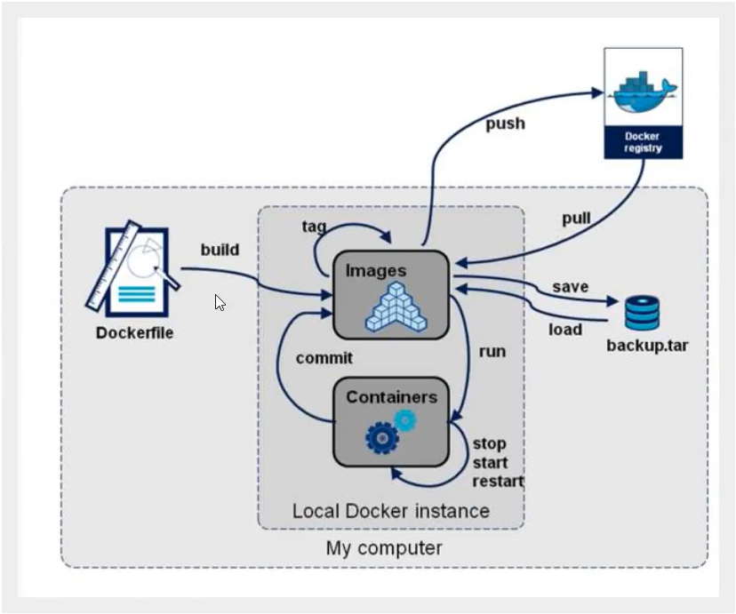
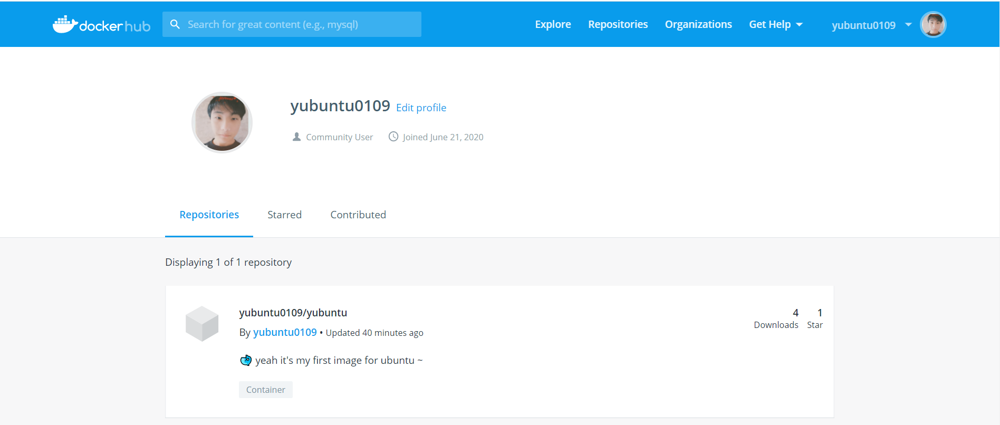

*使用 Dockerfile 构建镜像并上传到 Dockerhub 的流程图如下所示*




### 1.编写 Dockerfile
```shell
root@VM-0-4-ubuntu:/home/Dockerfile# cat Dockerfile
FROM ubuntu:18.04

MAINTAINER ishacker.net "ishacker.net@gmail.com"

# set apt-source
RUN  sed -i s@/archive.ubuntu.com/@/mirrors.aliyun.com/@g /etc/apt/sources.list

# update apt-source
RUN apt-get update -y

# insatll the common commands: ssh,vim,ping,ipconfig,curl..
RUN apt-get -y install ssh vim curl net-tools

# local path
ENV MYPATH /usr/local

# work path same as local path
WORKDIR $MYPATH

# expost port
EXPOSE 80

# ouput info
CMD echo $MYPATH
CMD echo "successfully"
CMD /bin/bash
```


### 2. 构建 Dockerfile
```shell
# -f : dockerfile文件路径，若文件名为 Dockerfile 则可以不使用 -f 来指定文件名: docker build -t yubuntu:0.1 .
# -t : 镜像名:[版本号]
root@VM-0-4-ubuntu:/home/Dockerfile# docker build -f Dockerfile -t yubuntu:0.1 . 
Sending build context to Docker daemon  2.048kB
Step 1/11 : FROM ubuntu:18.04
 ---> 8e4ce0a6ce69
Step 2/11 : MAINTAINER ishacker.net "ishacker.net@gmail.com"
 ---> Using cache
 ---> 3668bdb1a2c3
Step 3/11 : RUN  sed -i s@/archive.ubuntu.com/@/mirrors.aliyun.com/@g /etc/apt/sources.list
 ---> Running in 334aeda3e7b0
Removing intermediate container 334aeda3e7b0
 ---> e5abb449e8e3
Step 4/11 : RUN apt-get update -y
 ---> Running in 1f339d87a93a
Get:1 http://mirrors.aliyun.com/ubuntu bionic InRelease [242 kB]
Get:2 http://mirrors.aliyun.com/ubuntu bionic-updates InRelease [88.7 kB]
Get:3 http://mirrors.aliyun.com/ubuntu bionic-backports InRelease [74.6 kB]
Get:4 http://mirrors.aliyun.com/ubuntu bionic/restricted amd64 Packages [13.5 kB]
Get:5 http://mirrors.aliyun.com/ubuntu bionic/main amd64 Packages [1344 kB]
Get:6 http://mirrors.aliyun.com/ubuntu bionic/universe amd64 Packages [11.3 MB]
Get:7 http://security.ubuntu.com/ubuntu bionic-security InRelease [88.7 kB]
Get:8 http://mirrors.aliyun.com/ubuntu bionic/multiverse amd64 Packages [186 kB]
Get:9 http://mirrors.aliyun.com/ubuntu bionic-updates/main amd64 Packages [1270 kB]
Get:10 http://mirrors.aliyun.com/ubuntu bionic-updates/multiverse amd64 Packages [13.4 kB]
Get:11 http://mirrors.aliyun.com/ubuntu bionic-updates/restricted amd64 Packages [93.9 kB]
Get:12 http://mirrors.aliyun.com/ubuntu bionic-updates/universe amd64 Packages [1398 kB]
Get:13 http://mirrors.aliyun.com/ubuntu bionic-backports/universe amd64 Packages [8158 B]
Get:14 http://mirrors.aliyun.com/ubuntu bionic-backports/main amd64 Packages [8286 B]
Get:15 http://security.ubuntu.com/ubuntu bionic-security/multiverse amd64 Packages [9012 B]
Get:16 http://security.ubuntu.com/ubuntu bionic-security/main amd64 Packages [977 kB]
Get:17 http://security.ubuntu.com/ubuntu bionic-security/restricted amd64 Packages [82.2 kB]
Get:18 http://security.ubuntu.com/ubuntu bionic-security/universe amd64 Packages [862 kB]
Fetched 18.1 MB in 9s (2070 kB/s)
Reading package lists...
Removing intermediate container 1f339d87a93a
 ---> 86a5820e7867
Step 5/11 : RUN apt-get -y install ssh vim curl net-tools
 ---> Running in 3e756381ba33
Reading package lists...
Building dependency tree...
Reading state information...
The following additional packages will be installed:


. . . . . .


Setting up curl (7.58.0-2ubuntu3.9) ...
Setting up ssh (1:7.6p1-4ubuntu0.3) ...
Processing triggers for systemd (237-3ubuntu10.41) ...
Processing triggers for libc-bin (2.27-3ubuntu1) ...
Processing triggers for ca-certificates (20190110~18.04.1) ...
Updating certificates in /etc/ssl/certs...
0 added, 0 removed; done.
Running hooks in /etc/ca-certificates/update.d...
done.
Removing intermediate container 3e756381ba33
 ---> 5f1085ba9b18
Step 6/11 : ENV MYPATH /usr/local
 ---> Running in 80adec6bf6c1
Removing intermediate container 80adec6bf6c1
 ---> 03f28e984b92
Step 7/11 : WORKDIR $MYPATH
 ---> Running in e71ddbb55632
Removing intermediate container e71ddbb55632
 ---> 211e5936bfa4
Step 8/11 : EXPOSE 80
 ---> Running in 1bf8e9a3803d
Removing intermediate container 1bf8e9a3803d
 ---> 2666da51b676
Step 9/11 : CMD echo $MYPATH
 ---> Running in 77c7906abf73
Removing intermediate container 77c7906abf73
 ---> ca89ab0bf7fb
Step 10/11 : CMD echo "successfully"
 ---> Running in 108764aad3c6
Removing intermediate container 108764aad3c6
 ---> 2fd3a5a65ab5
Step 11/11 : CMD /bin/bash
 ---> Running in 92f1d57f6668
Removing intermediate container 92f1d57f6668
 ---> 4d37144f889a
Successfully built 4d37144f889a
Successfully tagged yubuntu:0.1
```


### 3. 测试运行
```shell
# 查看本地容器
root@VM-0-4-ubuntu:/home/Dockerfile# docker images
REPOSITORY            TAG                 IMAGE ID            CREATED             SIZE
yubuntu               0.1                 4d37144f889a        9 minutes ago       249MB # 这个是刚刚使用 Dockerfile 构建的 Ubuntu
<none>                <none>              7eb46e7294d5        20 minutes ago      64.2MB
yubuntu/ubuntu        0.1                 73083828dbc5        6 hours ago         73.9MB
mytomcat              0.1                 1a8ec5515a1d        19 hours ago        652MB
ubuntu                latest              74435f89ab78        9 days ago          73.9MB
ubuntu                18.04               8e4ce0a6ce69        9 days ago          64.2MB
redis                 latest              235592615444        2 weeks ago         104MB
tomcat                9                   2eb5a120304e        2 weeks ago         647MB
tomcat                9.0                 2eb5a120304e        2 weeks ago         647MB
tomcat                latest              2eb5a120304e        2 weeks ago         647MB
nginx                 latest              2622e6cca7eb        2 weeks ago         132MB
mysql                 5.7                 9cfcce23593a        2 weeks ago         448MB
mysql                 8.0.20              be0dbf01a0f3        2 weeks ago         541MB
mysql                 latest              be0dbf01a0f3        2 weeks ago         541MB
portainer/portainer   latest              cd645f5a4769        3 weeks ago         79.1MB
hello-world           latest              bf756fb1ae65        5 months ago        13.3kB

# 查看当前正在运行的容器(无)
root@VM-0-4-ubuntu:/home/Dockerfile# docker ps
CONTAINER ID        IMAGE               COMMAND             CREATED             STATUS              PORTS               NAMES

# 以后台运行的方式进入自己构建的 yubuntu 容器中
root@VM-0-4-ubuntu:/home/Dockerfile# docker run -it yubuntu:0.1
root@387fba60fd69:/usr/local#

# 查看当前所在目录为 /usr/local
# 这是因为我在 Dockerfile 中将 ENV MYPATH 设置为了 /usr/local
root@387fba60fd69:/usr/local# pwd
/usr/local

# 检查 vim 是否安装成功( success )
root@387fba60fd69:/usr/local# vim -version
VIM - Vi IMproved 8.0 (2016 Sep 12, compiled Mar 18 2020 18:29:15)
Garbage after option argument: "-version"
More info with: "vim -h"

# 检查 ssh 是否安装成功( success )
root@387fba60fd69:/usr/local# ssh -V
OpenSSH_7.6p1 Ubuntu-4ubuntu0.3, OpenSSL 1.0.2n  7 Dec 2017

# 检查 curl 是否安装成功( success )
root@387fba60fd69:/usr/local# curl -V
curl 7.58.0 (x86_64-pc-linux-gnu) libcurl/7.58.0 OpenSSL/1.1.1 zlib/1.2.11 libidn2/2.0.4 libpsl/0.19.1 (+libidn2/2.0.4) nghttp2/1.30.0 librtmp/2.3
Release-Date: 2018-01-24
Protocols: dict file ftp ftps gopher http https imap imaps ldap ldaps pop3 pop3s rtmp rtsp smb smbs smtp smtps telnet tftp
Features: AsynchDNS IDN IPv6 Largefile GSS-API Kerberos SPNEGO NTLM NTLM_WB SSL libz TLS-SRP HTTP2 UnixSockets HTTPS-proxy PSL

# 检查 net-tools 是否安装成功( success )
root@387fba60fd69:/usr/local# ifconfig -version
net-tools 2.10-alpha
```

扩 : 查看镜像的变更历史
```shell
# 退出 yubuntu 容器
root@387fba60fd69:/usr/local# exit
root@VM-0-4-ubuntu:/home/Dockerfile#

# 查看本地镜像
root@VM-0-4-ubuntu:/home/Dockerfile# docker images
REPOSITORY            TAG                 IMAGE ID            CREATED             SIZE
yubuntu               0.1                 4d37144f889a        26 minutes ago      249MB
<none>                <none>              7eb46e7294d5        37 minutes ago      64.2MB
yubuntu/ubuntu        0.1                 73083828dbc5        7 hours ago         73.9MB
mytomcat              0.1                 1a8ec5515a1d        19 hours ago        652MB
ubuntu                latest              74435f89ab78        9 days ago          73.9MB
ubuntu                18.04               8e4ce0a6ce69        9 days ago          64.2MB
redis                 latest              235592615444        2 weeks ago         104MB
tomcat                9                   2eb5a120304e        2 weeks ago         647MB
tomcat                9.0                 2eb5a120304e        2 weeks ago         647MB
tomcat                latest              2eb5a120304e        2 weeks ago         647MB
nginx                 latest              2622e6cca7eb        2 weeks ago         132MB
mysql                 5.7                 9cfcce23593a        2 weeks ago         448MB
mysql                 8.0.20              be0dbf01a0f3        2 weeks ago         541MB
mysql                 latest              be0dbf01a0f3        2 weeks ago         541MB
portainer/portainer   latest              cd645f5a4769        3 weeks ago         79.1MB
hello-world           latest              bf756fb1ae65        5 months ago        13.3kBs

# 查看 yubuntu 镜像的变更历史
root@VM-0-4-ubuntu:/home/Dockerfile# docker history 4d37144f889a
IMAGE               CREATED             CREATED BY                                      SIZE                COMMENT
4d37144f889a        26 minutes ago      /bin/sh -c #(nop)  CMD ["/bin/sh" "-c" "/bin…   0B
2fd3a5a65ab5        26 minutes ago      /bin/sh -c #(nop)  CMD ["/bin/sh" "-c" "echo…   0B
ca89ab0bf7fb        26 minutes ago      /bin/sh -c #(nop)  CMD ["/bin/sh" "-c" "echo…   0B
2666da51b676        26 minutes ago      /bin/sh -c #(nop)  EXPOSE 80                    0B
211e5936bfa4        26 minutes ago      /bin/sh -c #(nop) WORKDIR /usr/local            0B
03f28e984b92        26 minutes ago      /bin/sh -c #(nop)  ENV MYPATH=/usr/local        0B
5f1085ba9b18        26 minutes ago      /bin/sh -c apt-get -y install ssh vim curl n…   156MB
86a5820e7867        27 minutes ago      /bin/sh -c apt-get update -y                    28.8MB
e5abb449e8e3        27 minutes ago      /bin/sh -c sed -i s@/archive.ubuntu.com/@/mi…   2.77kB
3668bdb1a2c3        37 minutes ago      /bin/sh -c #(nop)  MAINTAINER ishacker.net "…   0B
8e4ce0a6ce69        9 days ago          /bin/sh -c #(nop)  CMD ["/bin/bash"]            0B
<missing>           9 days ago          /bin/sh -c mkdir -p /run/systemd && echo 'do…   7B
<missing>           9 days ago          /bin/sh -c set -xe   && echo '#!/bin/sh' > /…   745B
<missing>           9 days ago          /bin/sh -c [ -z "$(apt-get indextargets)" ]     987kB
<missing>           9 days ago          /bin/sh -c #(nop) ADD file:1e8d02626176dc814…   63.2MB
```


### 4.将镜像发布到DockerHub
#### 登录
```shell
# 查看 login 命令使用说明
ubuntu@VM-0-4-ubuntu:~$ sudo docker login --help

Usage:  docker login [OPTIONS] [SERVER]

Log in to a Docker registry.
If no server is specified, the default is defined by the daemon.

Options:
  -p, --password string   Password
      --password-stdin    Take the password from stdin
  -u, --username string   Username

# 登录 DockerHubs
ubuntu@VM-0-4-ubuntu:~$ sudo docker login -u yubuntu0109
Password:
WARNING! Your password will be stored unencrypted in /home/ubuntu/.docker/config.json.
Configure a credential helper to remove this warning. See
https://docs.docker.com/engine/reference/commandline/login/#credentials-store

Login Succeeded

# 查看我的密码信息
ubuntu@VM-0-4-ubuntu:~$ sudo cat /home/ubuntu/.docker/config.json
{
        "auths": {
                "https://index.docker.io/v1/": {
                        "auth": "xxxxxxxxxxxxxxxxxxxxxxxxxxxxxxxxxx==" # (●ˇ∀ˇ●) 字符马赛克嘿嘿~
                }
        },
        "HttpHeaders": {
                "User-Agent": "Docker-Client/19.03.11 (linux)"
        }
}
```

#### 提交镜像
```shell
# 查看本地镜像
ubuntu@VM-0-4-ubuntu:~$ sudo docker images
REPOSITORY            TAG                 IMAGE ID            CREATED             SIZE
yubuntu               0.1                 4d37144f889a        3 hours ago         249MB
· · · · · ·

# 发布镜像( 但是失败了 ! )
ubuntu@VM-0-4-ubuntu:~$ sudo docker push yubuntu0109/yubuntu:0.1
The push refers to repository [docker.io/yubuntu0109/yubuntu]
An image does not exist locally with the tag: yubuntu0109/yubuntu

# 为了解决上述异常信息，将要发布的镜像改到自己账户名下
ubuntu@VM-0-4-ubuntu:~$ sudo docker tag yubuntu:0.1 yubuntu0109/yubuntu:0.1

# 再次尝试发布镜像( 镜像发布成功 ! )
ubuntu@VM-0-4-ubuntu:~$ sudo docker push yubuntu0109/yubuntu:0.1
The push refers to repository [docker.io/yubuntu0109/yubuntu]
05165639a570: Layer already exists
5febb4f0a3d9: Layer already exists
2a9b0f5ed53e: Layer already exists
ddc500d84994: Layer already exists
c64c52ea2c16: Layer already exists
5930c9e5703f: Layer already exists
b187ff70b2e4: Layer already exists
0.1: digest: sha256:81ca2b6320b4f972bda75a800e0f7a23b50691790578079298d6de325bcacb4a size: 1783
```

*如果你当你执行 `docker push yubuntu0109/yubuntu:0.1` 时抛出 `denied: requested access to the resource is denied` 或 `An image does not exist locally with the tag: yubuntu0109/yubuntu` 错误提示，请参考如下解决方案 :*
```shell
# 首先将要发布的镜像改到自己账户名下
# tag标签如果不写，默认为latest
ubuntu@VM-0-4-ubuntu:~$ sudo docker tag yubuntu:0.1 yubuntu0109/yubuntu:0.1

# 再次查看本地镜像，会发现镜像名已经修改成功
ubuntu@VM-0-4-ubuntu:~$ sudo docker images
REPOSITORY            TAG                 IMAGE ID            CREATED             SIZE
yubuntu               0.1                 4d37144f889a        3 hours ago         249MB #( x )
yubuntu0109/yubuntu   0.1                 4d37144f889a        3 hours ago         249MB #( v )
· · · · · ·

# 然后再次发布镜像即可
ubuntu@VM-0-4-ubuntu:~$ sudo docker push yubuntu0109/yubuntu:0.1
```

镜像发布成功后，打开 https://hub.docker.com/u/yubuntu0109 会发现镜像已经成功发布到自己的 DockerHub 上，如下图所示 :




### 5.从 Dockerhub 拉取并运行镜像
```shell
# 查看本地镜像
ubuntu@VM-0-4-ubuntu:~$ sudo docker images
REPOSITORY            TAG                 IMAGE ID            CREATED             SIZE
yubuntu0109/yubuntu   0.1                 4d37144f889a        18 hours ago        249MB
. . . . . .

# 查看正在运行的容器(无)
ubuntu@VM-0-4-ubuntu:~$ sudo docker ps
CONTAINER ID        IMAGE               COMMAND             CREATED             STATUS              PORTS               NAMES

# 删除自己制作的 yubuntu 容器
ubuntu@VM-0-4-ubuntu:~$ sudo docker rmi -f yubuntu0109/yubuntu:0.1
Untagged: yubuntu0109/yubuntu:0.1
Untagged: yubuntu0109/yubuntu@sha256:81ca2b6320b4f972bda75a800e0f7a23b50691790578079298d6de325bcacb4a
Deleted: sha256:4d37144f889a2da39e342ce87c88bb8d20de7057b87e7417d46688b37124cea5
Deleted: sha256:2fd3a5a65ab5b63fb45de0f6089cb4ccb00abf5025deaa218e96efa240d8c684
Deleted: sha256:ca89ab0bf7fbb547c2119a1c8a5d85b5e6fcf06904dbef32ef8d02831917dce3
Deleted: sha256:2666da51b676414e2b60e1095df2d3f0fffd842b7d2e7a2398fa0603747e8fc6
Deleted: sha256:211e5936bfa424098940b1e35aa7c171ca2a3c54ecc5494a91c58ee3e61f21f7
Deleted: sha256:03f28e984b924015cb3f1c00dd14dec7ba82835db53d5325638886ba80707e51
Deleted: sha256:5f1085ba9b18716e374608785d6ba143cdb159139279787991321b57521dff74
Deleted: sha256:86a5820e78671222d8e586c326fea01f31446c76818967b5203c5342852aa170
Deleted: sha256:e5abb449e8e34aa30a3459373e30d6df090c9776918de3ea10f67f4fb15e71c8

# 再次查看本地镜像，发现已成功删除 yubuntu 镜像
ubuntu@VM-0-4-ubuntu:~$ sudo docker images
REPOSITORY            TAG                 IMAGE ID            CREATED             SIZE

---

# 搜索 yubuntu 镜像
ubuntu@VM-0-4-ubuntu:~$ sudo docker search yubuntu
NAME                  DESCRIPTION                               STARS               OFFICIAL            AUTOMATED
yubuntu0109/yubuntu   
mmusthafapt/yubuntu                                             0
yushiwei/yubuntu                                                0

# 从 DockerHub 拉取自己刚上传的 yubuntu 镜像
ubuntu@VM-0-4-ubuntu:~$ sudo docker pull yubuntu0109/yubuntu:0.1
0.1: Pulling from yubuntu0109/yubuntu
d7c3167c320d: Already exists
131f805ec7fd: Already exists
322ed380e680: Already exists
6ac240b13098: Already exists
4f893608b542: Already exists
38b674ba7d2c: Already exists
4e64cc6583b3: Already exists
Digest: sha256:81ca2b6320b4f972bda75a800e0f7a23b50691790578079298d6de325bcacb4a
Status: Downloaded newer image for yubuntu0109/yubuntu:0.1
docker.io/yubuntu0109/yubuntu:0.1

# 查看 yubuntu 镜像是否拉取成功
ubuntu@VM-0-4-ubuntu:~$ sudo docker images
REPOSITORY            TAG                 IMAGE ID            CREATED             SIZE
yubuntu0109/yubuntu   0.1                 4d37144f889a        19 hours ago        249MB

# 查看当前正在运行的容器(无)
ubuntu@VM-0-4-ubuntu:~$ sudo docker ps
CONTAINER ID        IMAGE               COMMAND             CREATED             STATUS              PORTS               NAMES

# 以后台运行的形式启动 yubuntu 容器
ubuntu@VM-0-4-ubuntu:~$ sudo docker run --name MyUbuntu18.04 -it -d yubuntu0109/yubuntu:0.1
c39df819132fb74093fac04957fa498922759b0949837d7baeb4d605df30d683

# 查看 yubuntu 容器是否成功在后台启动
ubuntu@VM-0-4-ubuntu:~$ sudo docker ps
CONTAINER ID        IMAGE                     COMMAND                  CREATED             STATUS              PORTS            NAMES
c39df819132f        yubuntu0109/yubuntu:0.1   "/bin/sh -c /bin/bash"   5 seconds ago       Up 2 seconds        80/tcp           MyUbuntu18.04

# 进入正在运行的 yubuntu 容器中
ubuntu@VM-0-4-ubuntu:~$ sudo docker exec -it MyUbuntu18.04 /bin/bash
root@c39df819132f:/usr/local# ls
bin  etc  games  include  lib  man  sbin  share  src
root@c39df819132f:/usr/local# exit
exit

# 关闭 yubuntu 容器
ubuntu@VM-0-4-ubuntu:~$ sudo docker ps
CONTAINER ID        IMAGE                     COMMAND                  CREATED              STATUS              PORTS           NAMES
c39df819132f        yubuntu0109/yubuntu:0.1   "/bin/sh -c /bin/bash"   About a minute ago   Up About a minute   80/tcp          MyUbuntu18.04
ubuntu@VM-0-4-ubuntu:~$ sudo docker stop c39df819132f
c39df819132f
ubuntu@VM-0-4-ubuntu:~$ sudo docker ps
CONTAINER ID        IMAGE               COMMAND             CREATED             STATUS              PORTS       NAMES
ubuntu@VM-0-4-ubuntu:~$
```

注意 : 若使用 `docker rmi <Image-Id>` 无法删除指定镜像，请参考如下解决方法 :

1. 使用 tag 删除( 若仍有镜像删除不掉，请使用法二 )
```shell
docker rmi -f [REPOSITORY]:[TAG] # -f : 强制删除
```

2. 彻底删除所有镜像 :
```shell
systemctl stop docker.service
rm -rf /var/lib/docker
systemctl start docker.service
```
