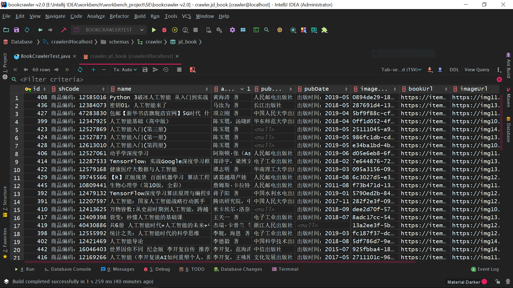

## 爬虫项目笔记 : JDBookCrawler-V2.0
*简介 : 最近在学习爬虫技术,学习`HttpClient`,`Jsoup`后,又浅薄地学习了`WebMagic`爬虫框架嘿嘿,为了总结知识点继而用其重写了`JDBookCrawler-V1.0`,其功能为 : 爬取京东商城书籍数据. 程序已Psuh到GitHub : https://github.com/YUbuntu0109/Crawler-learning/tree/master/BookCrawler-v2.0/bookcrawler-v2.0*


### 项目概述
#### 项目结构图
```
└─bookcrawler-v2.0
    │
    │  crawler.sql
    │  pom.xml
    │
    └─src
        └─main
            ├─java
            │  └─pers
            │      └─huangyuhui
            │          └─bookcrawler
            │              │  BookCrawlerTest.java
            │              │
            │              ├─dao
            │              │      BookDao.java
            │              │
            │              ├─mapper
            │              │      BookMapper.xml
            │              │
            │              ├─pojo
            │              │      Book.java
            │              │
            │              ├─task
            │              │      BookProcessor.java
            │              │
            │              └─util
            │                      HttpUtils.java
            │                      MyBatisUtils.java
            │
            └─resources
                    db.properties
                    log4j.properties
                    mybatis-config.xml
```


#### 程序运行指南
1. *crawler.sql : 数据库文件*
```
BookCrawler-v2.0/bookcrawler-v2.0/crawler.sql
```

2. *db.properties : 连接数据库的配置文件*
```
jdbc.driver.class=com.mysql.cj.jdbc.Driver
jdbc.connection.url=jdbc:mysql://localhost/crawler?useSSL=false&serverTimezone=UTC&allowPublicKeyRetrieval=true
jdbc.connection.username=x-x-x-x-x-x
jdbc.connection.password=x-x-x-x-x-x
```

3. *BookCrawlerTest.java : 爬虫启动程序*
```java
package pers.huangyuhui.bookcrawler;


import pers.huangyuhui.bookcrawler.task.BookProcessor;

/**
 * @project: bookcrawler
 * @description: 爬虫测试程序
 * @author: 黄宇辉
 * @date: 7/11/2019-9:12 PM
 * @version: 2.0
 * @website: https://yubuntu0109.github.io/
 */
public class BookCrawlerTest {
    //自定义搜索关键字
    private static final String KEY_WORD = "人工智能";
    //自定义页码数,每页可爬取三十条数据(注:下一页的页码数为前一页的页码数加二)
    private static final int END_PAGE_NUM = 6;
    private static final int CURRENT_PAGE_NUM = 1;
    //自定义存储书籍图片的文件夹路径
    private static final String IMAGE_PATH = "D:\\BookCrawler-V2.0\\download\\image\\";
    //书籍列表页面的链接
    private static final String URL = "https://search.jd.com/Search?keyword=" + KEY_WORD + "&enc=utf-8&page=";

    /**
     * @description: 🕷启动爬虫
     * @date: 2019-07-15 4:09 PM
     */
    public static void main(String[] args) {
        new BookProcessor(URL, IMAGE_PATH, CURRENT_PAGE_NUM, END_PAGE_NUM).run();
    }
}
```


4. *运行程序`BookCrawlerTest.java`,下载的图书图片如下图所示 :*


*数据库中存储的数据如下图所示 :*




*控制台输出的日志信息如下 :*
```
get page: https://search.jd.com/Search?keyword=人工智能&enc=utf-8&page=


\\\\\\\\\\第 [1] 本\\\\\\\\\\
Book{shCode='商品编码：12401871', name='人工智能（第2版）', price=0.0, author='[美] 史蒂芬·卢奇（Stephen Lucci），丹尼·科佩克（Danny Kopec） 著', publishing='人民邮电出版社', pubDate='出版时间：2018-09-01', imageName='a29ae3a5-2ea6-46ed-83d6-717b05d1f908.jpg', bookUrl='https://item.jd.com/12401871.html', imageUrl='https://img11.360buyimg.com/n1/jfs/t23818/34/1331170269/317511/8366eaf6/5b5aafaeNde873b63.jpg'}
[success]:This book data was added into the database successfully
\\\\\\\\\\\\\\\\\\\\\\\\\\\\\\\


get page: https://item.jd.com/12401871.html


\\\\\\\\\\第 [2] 本\\\\\\\\\\
Book{shCode='商品编码：12207597', name='人工智能：国家人工智能战略行动抓手', price=0.0, author='腾讯研究院，中国信息通信研究院互联网法律研究中心，腾讯AI，Lab，腾讯开放平台 著', publishing='中国人民大学出版社', pubDate='出版时间：2017-11-01', imageName='282f2e3f-09c6-4d68-8d20-346fb72f19da.jpg', bookUrl='https://item.jd.com/12207597.html', imageUrl='https://img12.360buyimg.com/n1/jfs/t19183/5/105179285/303911/1ef2b6a3/5a5daca0Nf703cf05.jpg'}
[success]:This book data was added into the database successfully
\\\\\\\\\\\\\\\\\\\\\\\\\\\\\\\


get page: https://item.jd.com/12207597.html


\\\\\\\\\\第 [3] 本\\\\\\\\\\
Book{shCode='商品编码：12479132', name='TensorFlow深度学习算法原理与编程实战 人工智能机器学习技术丛书', price=0.0, author='蒋子阳 著', publishing='中国水利水电出版社', pubDate='出版时间：2019-01-01', imageName='5790ed2b-842e-4072-84c3-3426c517a2f6.jpg', bookUrl='https://item.jd.com/12479132.html', imageUrl='https://img12.360buyimg.com/n1/jfs/t27298/82/1695620691/335423/92fe36d4/5bea3c3eN4634df6a.jpg'}
[success]:This book data was added into the database successfully
\\\\\\\\\\\\\\\\\\\\\\\\\\\\\\\


get page: https://item.jd.com/12479132.html


\\\\\\\\\\第 [4] 本\\\\\\\\\\
Book{shCode='商品编码：12128543', name='深度学习 [deep learning]', price=0.0, author='[美] Ian，Goodfellow，[加] Yoshua，Bengio，[加] Aaron ... 著', publishing='人民邮电出版社', pubDate='出版时间：2017-08-01', imageName='0e672484-b3ee-4eb4-b6a0-c7894b6303c3.jpg', bookUrl='https://item.jd.com/12128543.html', imageUrl='https://img13.360buyimg.com/n1/jfs/t5818/302/7804032226/900940/cf90b609/597564a7N18c7d131.jpg'}
[success]:This book data was added into the database successfully
\\\\\\\\\\\\\\\\\\\\\\\\\\\\\\\


get page: https://item.jd.com/12128543.html


\\\\\\\\\\第 [5] 本\\\\\\\\\\
Book{shCode='商品编码：12310899', name='极简人工智能：你一定爱读的AI通识书', price=0.0, author='[英] 理查德·温（Richard Urwin） 著', publishing='电子工业出版社', pubDate='出版时间：2018-03-01', imageName='56cbb95e-b5fa-4bc5-831a-465a84f035ff.jpg', bookUrl='https://item.jd.com/12310899.html', imageUrl='https://img14.360buyimg.com/n1/jfs/t19312/264/663214983/462154/11c8edb/5a9e359dN2d6ea39d.jpg'}
[success]:This book data was added into the database successfully
\\\\\\\\\\\\\\\\\\\\\\\\\\\\\\\


get page: https://item.jd.com/12310899.html


\\\\\\\\\\第 [6] 本\\\\\\\\\\
Book{shCode='商品编码：29499577195', name='智能时代套装共8册 李彦宏，周鸿祎等著 人工智能技术发展 智能投资顾问 智能制造 科技热点书籍', price=0.0, author='吴军，李彦宏，周鸿祎 等 著', publishing='中信出版社', pubDate='null', imageName='6d9e866f-7aee-417c-9762-8beaadf11dc6.jpg', bookUrl='https://item.jd.com/29499577195.html', imageUrl='https://img10.360buyimg.com/n1/jfs/t1/18121/1/12049/206600/5c933fa4Efe54f0f9/3ccfd31db5e42d3f.jpg'}
[success]:This book data was added into the database successfully
\\\\\\\\\\\\\\\\\\\\\\\\\\\\\\\


get page: https://item.jd.com/29499577195.html


\\\\\\\\\\第 [7] 本\\\\\\\\\\
Book{shCode='商品编码：12376742', name='人工智能产品经理——AI时代PM修炼手册', price=0.0, author='张竞宇 著', publishing='电子工业出版社', pubDate='出版时间：2018-06-01', imageName='82dde8bc-b1b4-4b49-adf3-53e59cc4ce92.jpg', bookUrl='https://item.jd.com/12376742.html', imageUrl='https://img12.360buyimg.com/n1/jfs/t25759/277/1900967055/256770/5bfe2114/5bbd70a4N60a7e82b.jpg'}
[success]:This book data was added into the database successfully
\\\\\\\\\\\\\\\\\\\\\\\\\\\\\\\


get page: https://item.jd.com/12376742.html


\\\\\\\\\\第 [8] 本\\\\\\\\\\
Book{shCode='商品编码：11343660', name='世界著名计算机教材精选·人工智能：一种现代的方法（第3版） [Artificial Intelligence: a Modern Approach, Third Edition]', price=0.0, author='[美] 罗素（Stuart J.Russell），[美] 诺维格（Peter Norvig） 著，殷建平，祝恩，刘越 等 译', publishing='清华大学出版社', pubDate='出版时间：2013-11-01', imageName='324c5505-cd8f-4ae7-bc74-7bbb6a61cea0.jpg', bookUrl='https://item.jd.com/11343660.html', imageUrl='https://img10.360buyimg.com/n1/jfs/t1954/1/2075046846/185487/e06242ac/56f0e486N4d4fc662.jpg'}
[success]:This book data was added into the database successfully
\\\\\\\\\\\\\\\\\\\\\\\\\\\\\\\


get page: https://item.jd.com/11343660.html


\\\\\\\\\\第 [9] 本\\\\\\\\\\
Book{shCode='商品编码：12555992', name='统计之美：人工智能时代的科学思维', price=0.0, author='李舰，海恩 著', publishing='电子工业出版社', pubDate='出版时间：2019-03-01', imageName='fc187f37-dcf3-48d6-81b1-fc5896d6bd55.jpg', bookUrl='https://item.jd.com/12555992.html', imageUrl='https://img12.360buyimg.com/n1/jfs/t1/14601/16/9247/614702/5c7cdf8fEa48b2815/d11cef0c74cd75d3.jpg'}
[success]:This book data was added into the database successfully
\\\\\\\\\\\\\\\\\\\\\\\\\\\\\\\


get page: https://item.jd.com/12555992.html


\\\\\\\\\\第 [10] 本\\\\\\\\\\
Book{shCode='商品编码：12347925', name='人工智能基础（高中版）', price=0.0, author='陈玉琨，汤晓鸥 著', publishing='华东师范大学出版社', pubDate='出版时间：2018-04-01', imageName='0ff1d052-4fd5-4831-913c-efc3872ed0ec.jpg', bookUrl='https://item.jd.com/12347925.html', imageUrl='https://img10.360buyimg.com/n1/jfs/t17326/266/2369121830/200016/13c83576/5af150b3N0eca610b.jpg'}
[success]:This book data was added into the database successfully
\\\\\\\\\\\\\\\\\\\\\\\\\\\\\\\


get page: https://item.jd.com/12347925.html


\\\\\\\\\\第 [11] 本\\\\\\\\\\
Book{shCode='商品编码：11867803', name='机器学习', price=0.0, author='周志华 著', publishing='清华大学出版社', pubDate='出版时间：2016-01-01', imageName='4de24b78-9154-49d8-80c0-9fab447d1851.jpg', bookUrl='https://item.jd.com/11867803.html', imageUrl='https://img13.360buyimg.com/n1/jfs/t5734/69/3225502890/67466/5e3df388/5937d6d1Nef59fd04.jpg'}
[success]:This book data was added into the database successfully
\\\\\\\\\\\\\\\\\\\\\\\\\\\\\\\


get page: https://item.jd.com/11867803.html


\\\\\\\\\\第 [12] 本\\\\\\\\\\
Book{shCode='商品编码：1027475348', name='奇点临近：一部预测人工智能和科技未来的奇书', price=0.0, author='李庆诚 著', publishing='机械工业出版社', pubDate='出版时间：2011-10-01', imageName='d6330795-f295-468b-875b-ed6118883349.jpg', bookUrl='https://item.jd.com/1027475348.html', imageUrl='https://img13.360buyimg.com/n1/jfs/t1/15/24/14880/65264/5bd938ccE7ff69361/8d5a0f5ea748f4e2.jpg'}
[success]:This book data was added into the database successfully
\\\\\\\\\\\\\\\\\\\\\\\\\\\\\\\


get page: https://item.jd.com/1027475348.html


\\\\\\\\\\第 [13] 本\\\\\\\\\\
Book{shCode='商品编码：12421469', name='人工智能导论', price=0.0, author='李德毅 著', publishing='中国科学技术出版社', pubDate='出版时间：2018-08-01', imageName='5df786d7-9ee6-48f5-a1e2-5d40c6cc55b8.jpg', bookUrl='https://item.jd.com/12421469.html', imageUrl='https://img14.360buyimg.com/n1/jfs/t25630/88/1092255641/333588/fa8d3a62/5b88b001N90fb40c7.jpg'}
[success]:This book data was added into the database successfully
\\\\\\\\\\\\\\\\\\\\\\\\\\\\\\\


get page: https://item.jd.com/12421469.html


\\\\\\\\\\第 [14] 本\\\\\\\\\\
Book{shCode='商品编码：12409581', name='Python深度学习', price=0.0, author='[美] 弗朗索瓦·肖莱（Francois Chollet） 著', publishing='人民邮电出版社', pubDate='出版时间：2018-08-01', imageName='49c88f27-12ad-4e45-8155-c56a1ea7e610.jpg', bookUrl='https://item.jd.com/12409581.html', imageUrl='https://img11.360buyimg.com/n1/jfs/t24052/162/1920127927/141357/8e47c812/5b6ce057Nb138b0da.jpg'}
[success]:This book data was added into the database successfully
\\\\\\\\\\\\\\\\\\\\\\\\\\\\\\\


get page: https://item.jd.com/12409581.html


\\\\\\\\\\第 [15] 本\\\\\\\\\\
Book{shCode='商品编码：12079958', name='终极算法：机器学习和人工智能如何重塑世界 [The Master Algorithm]', price=0.0, author='[美] 佩德罗·多明戈斯（Pedro Domingos） 著，黄芳萍 译', publishing='中信出版社', pubDate='出版时间：2017-01-01', imageName='aada6c0d-fced-4758-a662-a2ad1bdf703d.jpg', bookUrl='https://item.jd.com/12079958.html', imageUrl='https://img13.360buyimg.com/n1/jfs/t3124/275/4762074370/372795/41aa80f7/585754eaN47abddcc.jpg'}
[success]:This book data was added into the database successfully
\\\\\\\\\\\\\\\\\\\\\\\\\\\\\\\


get page: https://item.jd.com/12079958.html


\\\\\\\\\\第 [16] 本\\\\\\\\\\
Book{shCode='商品编码：12520143', name='深度学习的数学', price=0.0, author='[日] 涌井良幸，涌井贞美 著，杨瑞龙 译', publishing='人民邮电出版社', pubDate='出版时间：2019-05-01', imageName='b40d0444-627f-4e73-b90a-3eecb50ef7ff.jpg', bookUrl='https://item.jd.com/12520143.html', imageUrl='https://img13.360buyimg.com/n1/jfs/t1/40561/20/503/109626/5cc291d1E77ee1d01/290c656633cdd2be.jpg'}
[success]:This book data was added into the database successfully
\\\\\\\\\\\\\\\\\\\\\\\\\\\\\\\


get page: https://item.jd.com/12520143.html


\\\\\\\\\\第 [17] 本\\\\\\\\\\
Book{shCode='商品编码：12527061', name='动手学深度学习', price=0.0, author='阿斯顿·张（Aston Zhang），李沐（Mu Li），[美] 扎卡里·C. 立顿 等 著', publishing='人民邮电出版社', pubDate='出版时间：2019-06-01', imageName='d05e6eb8-6fb3-4b25-8e9b-fd00d9f39eb6.jpg', bookUrl='https://item.jd.com/12527061.html', imageUrl='https://img11.360buyimg.com/n1/jfs/t30334/279/1310794156/401599/fdb3f65d/5cdd1807N26004689.jpg'}
[success]:This book data was added into the database successfully
\\\\\\\\\\\\\\\\\\\\\\\\\\\\\\\


get page: https://item.jd.com/12527061.html


\\\\\\\\\\第 [18] 本\\\\\\\\\\
Book{shCode='商品编码：10162072033', name='人工智能的未来', price=0.0, author='[美] 雷·库兹韦尔（RayKurzweil）著盛杨 著', publishing='浙江人民出版社', pubDate='出版时间：2016-03-01', imageName='890ab968-c7a8-4729-ab98-52d8f8b82c7e.jpg', bookUrl='https://item.jd.com/10162072033.html', imageUrl='https://img13.360buyimg.com/n1/jfs/t18769/208/1426843696/50030/fd76e42b/5acb3fdfN9e4cd865.jpg'}
[success]:This book data was added into the database successfully
\\\\\\\\\\\\\\\\\\\\\\\\\\\\\\\


get page: https://item.jd.com/10162072033.html


\\\\\\\\\\第 [19] 本\\\\\\\\\\
Book{shCode='商品编码：12585016', name='Python 3破冰人工智能 从入门到实战', price=0.0, author='黄海涛 著', publishing='人民邮电出版社', pubDate='出版时间：2019-05-01', imageName='0894de29-1818-4110-b017-7e87b4317489.jpg', bookUrl='https://item.jd.com/12585016.html', imageUrl='https://img11.360buyimg.com/n1/jfs/t1/22785/38/15135/164500/5cad9d63E39517812/f7ac0780624e101e.jpg'}
[success]:This book data was added into the database successfully
\\\\\\\\\\\\\\\\\\\\\\\\\\\\\\\


get page: https://item.jd.com/12585016.html


\\\\\\\\\\第 [20] 本\\\\\\\\\\
Book{shCode='商品编码：14146012074', name='深度学习 DeepLearning中文版 AI经典图书 人工智能 机器学习 图灵奖', price=0.0, author='[美] IanGoodfellow（伊恩·古德费洛） 著', publishing='人民邮电出版社', pubDate='出版时间：2017-07-01', imageName='4219f971-3875-451d-89a3-5874a409f8a9.png', bookUrl='https://item.jd.com/14146012074.html', imageUrl='https://img14.360buyimg.com/n1/jfs/t1/76228/36/790/832099/5cf094bdE9a14cffb/be38f68200b6264a.png'}
[success]:This book data was added into the database successfully
\\\\\\\\\\\\\\\\\\\\\\\\\\\\\\\


get page: https://item.jd.com/14146012074.html


\\\\\\\\\\第 [21] 本\\\\\\\\\\
Book{shCode='商品编码：12413625', name='万物皆数:从史前时期到人工智能，跨越千年的数学之旅', price=0.0, author='米卡埃尔·洛奈 著', publishing='null', pubDate='出版时间：2018-09-01', imageName='dee2d70f-57ea-4422-a1df-d16c709ca8db.jpg', bookUrl='https://item.jd.com/12413625.html', imageUrl='https://img10.360buyimg.com/n1/jfs/t23812/47/2264205641/461319/1250f367/5b7a578aN7f2d84d4.jpg'}
[success]:This book data was added into the database successfully
\\\\\\\\\\\\\\\\\\\\\\\\\\\\\\\


get page: https://item.jd.com/12413625.html


\\\\\\\\\\第 [22] 本\\\\\\\\\\
Book{shCode='商品编码：12274722', name='人工智能简史', price=0.0, author='尼克 著', publishing='人民邮电出版社', pubDate='出版时间：2017-12-01', imageName='7d129014-fd06-49b5-bcf4-31c740be1477.jpg', bookUrl='https://item.jd.com/12274722.html', imageUrl='https://img12.360buyimg.com/n1/jfs/t11869/61/2218872612/272676/bb7efcc8/5a126dc9N9d314d66.jpg'}
[success]:This book data was added into the database successfully
\\\\\\\\\\\\\\\\\\\\\\\\\\\\\\\


get page: https://item.jd.com/12274722.html


\\\\\\\\\\第 [23] 本\\\\\\\\\\
Book{shCode='商品编码：12573542', name='大话自动化：从蒸汽机到人工智能', price=0.0, author='[加] 晨枫 著', publishing='机械工业出版社', pubDate='出版时间：2019-03-01', imageName='a7962c70-b673-4d3a-98d6-ccaa2b41543b.jpg', bookUrl='https://item.jd.com/12573542.html', imageUrl='https://img12.360buyimg.com/n1/jfs/t1/23336/25/13133/121361/5c9dc769Ee15853fc/f3b00959a8aad99c.jpg'}
[success]:This book data was added into the database successfully
\\\\\\\\\\\\\\\\\\\\\\\\\\\\\\\


get page: https://item.jd.com/12573542.html


\\\\\\\\\\第 [24] 本\\\\\\\\\\
Book{shCode='商品编码：28415991981', name='2本 机器学习实战+机器学习 周志华 人工智能书籍', price=0.0, author='', publishing='人民邮电出版社', pubDate='出版时间：2013-06-01', imageName='1e9590f1-d0d3-4209-b8b7-4f1a8a643de1.jpg', bookUrl='https://item.jd.com/28415991981.html', imageUrl='https://img11.360buyimg.com/n1/jfs/t21373/332/2230500781/133567/cce95104/5b4d54e1N30452686.jpg'}
[success]:This book data was added into the database successfully
\\\\\\\\\\\\\\\\\\\\\\\\\\\\\\\


get page: https://item.jd.com/28415991981.html


\\\\\\\\\\第 [25] 本\\\\\\\\\\
Book{shCode='商品编码：12287533', name='TensorFlow：实战Google深度学习框架（第2版）', price=0.0, author='郑泽宇，梁博文，顾思宇 著', publishing='电子工业出版社', pubDate='出版时间：2018-02-01', imageName='7e644876-72dc-47b7-88c3-52f09abf581c.jpg', bookUrl='https://item.jd.com/12287533.html', imageUrl='https://img13.360buyimg.com/n1/jfs/t17434/195/261082690/187949/a78ad6ce/5a66f7e9Nab382d53.jpg'}
[success]:This book data was added into the database successfully
\\\\\\\\\\\\\\\\\\\\\\\\\\\\\\\


get page: https://item.jd.com/12287533.html


\\\\\\\\\\第 [26] 本\\\\\\\\\\
Book{shCode='商品编码：41580610489', name='包邮 AI未来 人工智能科学家李开复博士新作 樊登读书官方正版', price=0.0, author='李开复 著', publishing='浙江人民出版社', pubDate='null', imageName='f4e8c7fa-b509-43f8-99d6-238da56727d0.jpg', bookUrl='https://item.jd.com/41580610489.html', imageUrl='https://img14.360buyimg.com/n1/jfs/t1/32882/35/1948/108480/5c640a94E6b20f60e/46a24f502ab529e5.jpg'}
[success]:This book data was added into the database successfully
\\\\\\\\\\\\\\\\\\\\\\\\\\\\\\\


get page: https://item.jd.com/41580610489.html


\\\\\\\\\\第 [27] 本\\\\\\\\\\
Book{shCode='商品编码：12169266', name='人工智能（李开复谈AI如何重塑个人、商业与社会的未来图谱）', price=0.0, author='李开复，王咏刚 著', publishing='文化发展出版社（原印刷工业出版社）', pubDate='出版时间：2017-05-01', imageName='2711101c-96c7-45e9-a11e-0ef7d97d0a7c.jpg', bookUrl='https://item.jd.com/12169266.html', imageUrl='https://img11.360buyimg.com/n1/jfs/t4819/45/722250163/218339/bf654418/58e738b5Nd99cca9b.jpg'}
[success]:This book data was added into the database successfully
\\\\\\\\\\\\\\\\\\\\\\\\\\\\\\\


get page: https://item.jd.com/12169266.html


\\\\\\\\\\第 [28] 本\\\\\\\\\\
Book{shCode='商品编码：12409398', name='裂变：秒懂人工智能的基础课', price=0.0, author='王天一 著', publishing='电子工业出版社', pubDate='出版时间：2018-07-01', imageName='8adc17cc-5467-41cf-8a23-2f0d997e9bf1.jpg', bookUrl='https://item.jd.com/12409398.html', imageUrl='https://img13.360buyimg.com/n1/jfs/t22231/64/2466497209/102410/530a3e94/5b56d8ecNda8180f5.jpg'}
[success]:This book data was added into the database successfully
\\\\\\\\\\\\\\\\\\\\\\\\\\\\\\\


get page: https://item.jd.com/12409398.html


\\\\\\\\\\第 [29] 本\\\\\\\\\\
Book{shCode='商品编码：11953641', name='智能时代 大数据与智能革命重新定义未来', price=0.0, author='吴军 著', publishing='null', pubDate='出版时间：2016-09-01', imageName='dbf1cbdc-9ef1-42dd-af66-4344685412c0.jpg', bookUrl='https://item.jd.com/11953641.html', imageUrl='https://img11.360buyimg.com/n1/jfs/t3184/193/3137981286/767624/7871f22a/57ec6c71Nbb8823e7.jpg'}
[success]:This book data was added into the database successfully
\\\\\\\\\\\\\\\\\\\\\\\\\\\\\\\


get page: https://item.jd.com/11953641.html


\\\\\\\\\\第 [30] 本\\\\\\\\\\
Book{shCode='商品编码：40430886437', name='共6册 人工智能时代+人工智能的未来+中国制造2025+工业大数据+机器人革命等 互联网经济书籍', price=0.0, author='杰瑞·卡普兰 等 著', publishing='浙江人民出版社', pubDate='null', imageName='13a2ee3f-5b3f-4198-8614-4a1cc32b1c4a.jpg', bookUrl='https://item.jd.com/40430886437.html', imageUrl='https://img12.360buyimg.com/n1/jfs/t1/11421/39/4122/467706/5c25b836Ed6ba55f9/dab653e81edd02a7.jpg'}
[success]:This book data was added into the database successfully
\\\\\\\\\\\\\\\\\\\\\\\\\\\\\\\


get page: https://item.jd.com/40430886437.html
get page: https://search.jd.com/Search?keyword=人工智能&enc=utf-8&page=1


\\\\\\\\\\第 [31] 本\\\\\\\\\\
Book{shCode='商品编码：31131395716', name='深度学习入门 基于Python的理论与实现 人工智能书籍', price=0.0, author='斋藤康毅 著，陆宇杰 译', publishing='人民邮电出版社', pubDate='出版时间：2018-07-01', imageName='5eb3be60-7b68-4ade-a90f-e1954190120f.jpg', bookUrl='https://item.jd.com/31131395716.html', imageUrl='https://img11.360buyimg.com/n1/jfs/t23689/23/1691623418/161900/d1cc437/5b6685deN6123cd3d.jpg'}
[success]:This book data was added into the database successfully
\\\\\\\\\\\\\\\\\\\\\\\\\\\\\\\


get page: https://item.jd.com/31131395716.html


\\\\\\\\\\第 [32] 本\\\\\\\\\\
Book{shCode='商品编码：47757445942', name='包邮 南京大学人工智能本科专业教育培养体系 南京大学人工智能学院 计算机 |8059538', price=0.0, author='南京大学人工智能学院 著', publishing='机械工业出版社', pubDate='出版时间：2019-05-07', imageName='d7e66db0-c8f0-4ede-ade2-4d9861af2ebd.jpg', bookUrl='https://item.jd.com/47757445942.html', imageUrl='https://img12.360buyimg.com/n1/jfs/t10102/31/2933036607/67354/bdf4f3c/5cdb8ef7Ne5368d06.jpg'}
[success]:This book data was added into the database successfully
\\\\\\\\\\\\\\\\\\\\\\\\\\\\\\\


get page: https://item.jd.com/47757445942.html
get page: https://search.jd.com/Search?keyword=人工智能&enc=utf-8&page=3


\\\\\\\\\\第 [33] 本\\\\\\\\\\
Book{shCode='商品编码：12579168', name='健康医疗大数据与人工智能', price=0.0, author='谭志明 著', publishing='华南理工大学出版社', pubDate='出版时间：2019-03-01', imageName='095a3156-094a-468a-abd7-b7c7498fe9d8.jpg', bookUrl='https://item.jd.com/12579168.html', imageUrl='https://img13.360buyimg.com/n1/jfs/t1/20585/13/15144/198804/5cad56b1Ede738536/ede39481252c81ac.jpg'}
[success]:This book data was added into the database successfully
\\\\\\\\\\\\\\\\\\\\\\\\\\\\\\\


get page: https://item.jd.com/12579168.html


\\\\\\\\\\第 [34] 本\\\\\\\\\\
Book{shCode='商品编码：12527869', name='人工智能入门(第三册)', price=0.0, author='陈玉琨 著', publishing='null', pubDate='出版时间：2019-05-01', imageName='25111045-a99f-4962-8ce3-76be0ba2ccf3.jpg', bookUrl='https://item.jd.com/12527869.html', imageUrl='https://img14.360buyimg.com/n1/jfs/t29668/42/1478784140/141336/1c4a81ef/5ce22885N5bf34745.jpg'}
[success]:This book data was added into the database successfully
\\\\\\\\\\\\\\\\\\\\\\\\\\\\\\\


get page: https://item.jd.com/12527869.html


\\\\\\\\\\第 [35] 本\\\\\\\\\\
Book{shCode='商品编码：12527873', name='人工智能入门(第一册)', price=0.0, author='陈玉琨 著', publishing='null', pubDate='出版时间：2019-05-01', imageName='986fc1db-cda5-4b57-9cf3-afc86af38cf1.jpg', bookUrl='https://item.jd.com/12527873.html', imageUrl='https://img13.360buyimg.com/n1/jfs/t30340/182/1490153552/121687/31237809/5ce22276N03e8db9a.jpg'}
[success]:This book data was added into the database successfully
\\\\\\\\\\\\\\\\\\\\\\\\\\\\\\\


get page: https://item.jd.com/12527873.html


\\\\\\\\\\第 [36] 本\\\\\\\\\\
Book{shCode='商品编码：12458274', name='Python编程从零基础到项目实战（微课视频版）', price=0.0, author='刘瑜 著', publishing='中国水利水电出版社', pubDate='出版时间：2018-10-01', imageName='26c0a845-de07-4b84-9e50-12d86a576121.jpg', bookUrl='https://item.jd.com/12458274.html', imageUrl='https://img14.360buyimg.com/n1/jfs/t25480/244/1868364232/520985/20f28aea/5bbecce9N302f62c4.jpg'}
[success]:This book data was added into the database successfully
\\\\\\\\\\\\\\\\\\\\\\\\\\\\\\\


get page: https://item.jd.com/12458274.html


\\\\\\\\\\第 [37] 本\\\\\\\\\\
Book{shCode='商品编码：11242112', name='机器学习实战 [Machine learning in action]', price=0.0, author='[美] Peter Harrington 著，李锐，李鹏，曲亚东 等 译', publishing='人民邮电出版社', pubDate='出版时间：2013-06-01', imageName='d3c1e1ec-eacc-424b-aff1-be2f2bf036e8.jpg', bookUrl='https://item.jd.com/11242112.html', imageUrl='https://img12.360buyimg.com/n1/jfs/t6439/92/490417530/198884/3856b75/59408659N77e984ce.jpg'}
[success]:This book data was added into the database successfully
\\\\\\\\\\\\\\\\\\\\\\\\\\\\\\\


get page: https://item.jd.com/11242112.html


\\\\\\\\\\第 [38] 本\\\\\\\\\\
Book{shCode='商品编码：47283830071', name='包邮【新华书店旗舰店官网】5G时代 什么是5G，它将如何改变世界 科技新趋势 人工智能 互联网时代', price=0.0, author='项立刚 著', publishing='中国人民大学出版社', pubDate='出版时间：2019-04-01', imageName='5bf9f88c-cfc8-4a0b-ad5c-b832bc78d7da.jpg', bookUrl='https://item.jd.com/47283830071.html', imageUrl='https://img11.360buyimg.com/n1/jfs/t1/42131/32/6014/193740/5cf71efcEc457673b/4151049b1c63e67c.jpg'}
[success]:This book data was added into the database successfully
\\\\\\\\\\\\\\\\\\\\\\\\\\\\\\\


get page: https://item.jd.com/47283830071.html


\\\\\\\\\\第 [39] 本\\\\\\\\\\
Book{shCode='商品编码：12613010', name='人工智能入门(第四册)', price=0.0, author='陈玉琨 著', publishing='null', pubDate='出版时间：2019-05-01', imageName='e34ba1bd-4bb3-4ff2-84df-ce0dae698c64.jpg', bookUrl='https://item.jd.com/12613010.html', imageUrl='https://img10.360buyimg.com/n1/jfs/t29926/364/1493483692/113740/5303f75e/5ce229aaNd55be9a4.jpg'}
[success]:This book data was added into the database successfully
\\\\\\\\\\\\\\\\\\\\\\\\\\\\\\\


get page: https://item.jd.com/12613010.html


\\\\\\\\\\第 [40] 本\\\\\\\\\\
Book{shCode='商品编码：39745566142', name='【R】正版现货 百面机器学习 算法工程师带你去面试 人工智能时代程序员面试宝典', price=0.0, author='诸葛越葫芦娃 著', publishing='人民邮电出版社', pubDate='出版时间：2018-08-01', imageName='6c3027d5-e3cd-4303-8af5-2f8f977dae07.jpg', bookUrl='https://item.jd.com/39745566142.html', imageUrl='https://img12.360buyimg.com/n1/jfs/t1/77366/37/1195/53583/5cf76ecdE5a2b6e0f/8eafd0b6e9a681d6.jpg'}
[success]:This book data was added into the database successfully
\\\\\\\\\\\\\\\\\\\\\\\\\\\\\\\


get page: https://item.jd.com/39745566142.html


\\\\\\\\\\第 [41] 本\\\\\\\\\\
Book{shCode='商品编码：12375632', name='云计算系统与人工智能应用', price=0.0, author='[美] 黄铠（Kai Hwang） 著，杜瑞颖 译', publishing='机械工业出版社', pubDate='出版时间：2018-06-01', imageName='5cf647eb-90a0-4a7b-a597-7287ef06e57a.jpg', bookUrl='https://item.jd.com/12375632.html', imageUrl='https://img12.360buyimg.com/n1/jfs/t22126/93/748719129/144639/f197de6/5b17364bNdc4e7771.jpg'}
[success]:This book data was added into the database successfully
\\\\\\\\\\\\\\\\\\\\\\\\\\\\\\\


get page: https://item.jd.com/12375632.html


\\\\\\\\\\第 [42] 本\\\\\\\\\\
Book{shCode='商品编码：33583164783', name='包邮正版【樊登推荐】 万物皆数-从史前时期到人工智能.跨越千年的数学之旅 科普读物 科学世界', price=0.0, author='[法] 米卡埃尔·洛奈 著', publishing='null', pubDate='出版时间：2018-09-01', imageName='c4ffae4b-312d-4f92-a9bf-66bd51e21775.jpg', bookUrl='https://item.jd.com/33583164783.html', imageUrl='https://img13.360buyimg.com/n1/jfs/t1/32558/24/10496/350587/5cb04564E998f676c/05be706e03c2f1b4.jpg'}
[success]:This book data was added into the database successfully
\\\\\\\\\\\\\\\\\\\\\\\\\\\\\\\


get page: https://item.jd.com/33583164783.html


\\\\\\\\\\第 [43] 本\\\\\\\\\\
Book{shCode='商品编码：37830680848', name='5本 深度学习+深度学习入门+Python编程基础+神经网络编程+TensorFlow 人工智能书籍', price=0.0, author='刘瑜 著', publishing='中国水利水电出版社', pubDate='出版时间：2018-10-01', imageName='13b098ed-45a9-40c6-902f-39a5d3d11240.jpg', bookUrl='https://item.jd.com/37830680848.html', imageUrl='https://img13.360buyimg.com/n1/jfs/t26230/260/2320028096/278322/a8dadd5f/5bff5dccNe37a5bc8.jpg'}
[success]:This book data was added into the database successfully
\\\\\\\\\\\\\\\\\\\\\\\\\\\\\\\


get page: https://item.jd.com/37830680848.html


\\\\\\\\\\第 [44] 本\\\\\\\\\\
Book{shCode='商品编码：12588974', name='区块链+人工智能 下一个改变世界的经济新模式', price=0.0, author='曲强，林益民 著', publishing='人民邮电出版社', pubDate='出版时间：2019-04-01', imageName='24c9e8a4-a54c-4806-be57-948ae0dcf840.jpg', bookUrl='https://item.jd.com/12588974.html', imageUrl='https://img14.360buyimg.com/n1/jfs/t1/35238/29/2148/150932/5cb562d0Ea66cfdfc/48ba6009a5988cb1.jpg'}
[success]:This book data was added into the database successfully
\\\\\\\\\\\\\\\\\\\\\\\\\\\\\\\


get page: https://item.jd.com/12588974.html


\\\\\\\\\\第 [45] 本\\\\\\\\\\
Book{shCode='商品编码：12397348', name='生命3.0 [Life 3.0: being human in the age of artificial int]', price=0.0, author='[美] 迈克斯·泰格马克（Max Tegmark） 著，汪婕舒 译', publishing='浙江教育出版社', pubDate='出版时间：2018-06-01', imageName='5414c386-b10a-4c3e-bb86-bf864cb0ce51.jpg', bookUrl='https://item.jd.com/12397348.html', imageUrl='https://img13.360buyimg.com/n1/jfs/t1/36812/38/1755/245651/5cb417deE1a175690/3d4dff1819643ed0.jpg'}
[success]:This book data was added into the database successfully
\\\\\\\\\\\\\\\\\\\\\\\\\\\\\\\


get page: https://item.jd.com/12397348.html


\\\\\\\\\\第 [46] 本\\\\\\\\\\
Book{shCode='商品编码：12513593', name='PyTorch深度学习', price=0.0, author='[印度] 毗湿奴·布拉马尼亚（Vishnu Subramanian） 著，王海玲，刘江峰 译', publishing='人民邮电出版社', pubDate='出版时间：2019-04-01', imageName='f7f6c51f-b56a-48b7-96fd-80941678fe9a.jpg', bookUrl='https://item.jd.com/12513593.html', imageUrl='https://img13.360buyimg.com/n1/jfs/t1/16110/24/15063/116962/5cad48bbEe6208291/9a4e129af3089764.jpg'}
[success]:This book data was added into the database successfully
\\\\\\\\\\\\\\\\\\\\\\\\\\\\\\\


get page: https://item.jd.com/12513593.html


\\\\\\\\\\第 [47] 本\\\\\\\\\\
Book{shCode='商品编码：12384073', name='密钥01：人工智能来了', price=0.0, author='马汝为 著', publishing='长江出版社', pubDate='出版时间：2018-05-01', imageName='287691d4-1392-41a2-baa8-f87f630b95e3.jpg', bookUrl='https://item.jd.com/12384073.html', imageUrl='https://img13.360buyimg.com/n1/jfs/t20317/48/2489478552/219264/10cf390/5b584703Nb1d8e713.jpg'}
[success]:This book data was added into the database successfully
\\\\\\\\\\\\\\\\\\\\\\\\\\\\\\\


get page: https://item.jd.com/12384073.html


\\\\\\\\\\第 [48] 本\\\\\\\\\\
Book{shCode='商品编码：12456940', name='机器与人：埃森哲论新人工智能', price=0.0, author='【美】保罗·多尔蒂，詹姆斯·威尔逊 著', publishing='中信出版集团,中信出版社', pubDate='出版时间：2018-10-01', imageName='fc59beef-5e99-448f-ac72-c92756777234.jpg', bookUrl='https://item.jd.com/12456940.html', imageUrl='https://img10.360buyimg.com/n1/jfs/t1/9513/17/3311/264090/5bd5bc71E44ecbe61/3745ae9f76cb8371.jpg'}
[success]:This book data was added into the database successfully
\\\\\\\\\\\\\\\\\\\\\\\\\\\\\\\


get page: https://item.jd.com/12456940.html


\\\\\\\\\\第 [49] 本\\\\\\\\\\
Book{shCode='商品编码：31329707691', name='正版 Python深度学习 deep learning深度学习 python人工智能机器学习经典教程', price=0.0, author='[美] 弗朗索瓦·肖莱 著，张亮 译', publishing='人民邮电出版社', pubDate='出版时间：2018-08-10', imageName='cada2188-dfb7-4894-8280-42f8f7eac626.png', bookUrl='https://item.jd.com/31329707691.html', imageUrl='https://img11.360buyimg.com/n1/jfs/t23251/24/1899370591/458471/efa1bee/5b6cf792N40cbf9f0.png'}
[success]:This book data was added into the database successfully
\\\\\\\\\\\\\\\\\\\\\\\\\\\\\\\


get page: https://item.jd.com/31329707691.html


\\\\\\\\\\第 [50] 本\\\\\\\\\\
Book{shCode='商品编码：12317613', name='被人工智能操控的金融业 [人工知能が金融を支配する日]', price=0.0, author='[日] 樱井丰（YUTAKA SAKURAI） 著，林华，沈美华 译', publishing='null', pubDate='出版时间：2018-03-01', imageName='9ec77966-58f6-43b2-96ec-12087f0a7a10.jpg', bookUrl='https://item.jd.com/12317613.html', imageUrl='https://img13.360buyimg.com/n1/jfs/t19735/145/839074499/262009/7cfa56f4/5aab5cabN562ad687.jpg'}
[success]:This book data was added into the database successfully
\\\\\\\\\\\\\\\\\\\\\\\\\\\\\\\


get page: https://item.jd.com/12317613.html


\\\\\\\\\\第 [51] 本\\\\\\\\\\
Book{shCode='商品编码：11998799', name='Unity人工智能游戏开发（第2版）', price=0.0, author='[美] Ray，Barrera 等 著，张颖 译', publishing='清华大学出版社', pubDate='出版时间：2016-10-01', imageName='683e3111-7bcd-4c6c-9639-303de9ab4493.jpg', bookUrl='https://item.jd.com/11998799.html', imageUrl='https://img14.360buyimg.com/n1/jfs/t3829/185/508491523/41097/836c5f98/5812b48bN6de62bad.jpg'}
[success]:This book data was added into the database successfully
\\\\\\\\\\\\\\\\\\\\\\\\\\\\\\\


get page: https://item.jd.com/11998799.html


\\\\\\\\\\第 [52] 本\\\\\\\\\\
Book{shCode='商品编码：12210115', name='艾伦·图灵传：如谜的解谜者（套装共2册） [Alan Turing—The Enigma]', price=0.0, author='[英] 安德鲁·霍齐斯 著，孙天齐 译', publishing='湖南科学技术出版社', pubDate='出版时间：2017-10-01', imageName='ce359df1-c5e6-4807-88ff-653a3f2758e2.jpg', bookUrl='https://item.jd.com/12210115.html', imageUrl='https://img10.360buyimg.com/n1/jfs/t7594/81/3287046833/126424/85b9ada/59e95808N729047fa.jpg'}
[success]:This book data was added into the database successfully
\\\\\\\\\\\\\\\\\\\\\\\\\\\\\\\


get page: https://item.jd.com/12210115.html


\\\\\\\\\\第 [53] 本\\\\\\\\\\
Book{shCode='商品编码：1604640379', name='世界因你不同 纪念版 李开复自传 推荐做最好的自己 AI未来 向死而生 人工智能', price=0.0, author='李开复，范海涛著 著', publishing='中信出版社', pubDate='出版时间：2015-07-01', imageName='925fbba4-1873-497b-a40e-f0555acedf26.jpg', bookUrl='https://item.jd.com/1604640379.html', imageUrl='https://img14.360buyimg.com/n1/jfs/t26545/258/2005258212/136674/34686624/5bf3ab9bN16ac783a.jpg'}
[success]:This book data was added into the database successfully
\\\\\\\\\\\\\\\\\\\\\\\\\\\\\\\


get page: https://item.jd.com/1604640379.html


\\\\\\\\\\第 [54] 本\\\\\\\\\\
Book{shCode='商品编码：12506430', name='教育的未来（人工智能时代的教育变革） [Robot-Proof Higher Education in the Age of Artificial Intelligence]', price=0.0, author='[美] 约瑟夫·E.奥恩（Joseph E.Aoun） 著，李海燕，王秦辉 译', publishing='机械工业出版社', pubDate='出版时间：2019-01-01', imageName='fdd869da-108d-4ad4-855f-d20608437678.jpg', bookUrl='https://item.jd.com/12506430.html', imageUrl='https://img10.360buyimg.com/n1/jfs/t1/15820/31/3091/153355/5c2438e6Ebeaa8fea/f8c0ab3e60c857c8.jpg'}
[success]:This book data was added into the database successfully
\\\\\\\\\\\\\\\\\\\\\\\\\\\\\\\


get page: https://item.jd.com/12506430.html


\\\\\\\\\\第 [55] 本\\\\\\\\\\
Book{shCode='商品编码：30150952862', name='生命3.0 人工智能中文版图书 life 3.0 湛庐文化', price=0.0, author='[美] 迈克斯·泰格马克（MaxTegmark）著汪 著', publishing='浙江教育出版社', pubDate='出版时间：2018-06-01', imageName='c99efda0-8260-474d-bba7-2b1f191f3e5c.jpg', bookUrl='https://item.jd.com/30150952862.html', imageUrl='https://img12.360buyimg.com/n1/jfs/t1/44288/38/479/392293/5cc28988E637dae92/f7e686d68153ab35.jpg'}
[success]:This book data was added into the database successfully
\\\\\\\\\\\\\\\\\\\\\\\\\\\\\\\


get page: https://item.jd.com/30150952862.html


\\\\\\\\\\第 [56] 本\\\\\\\\\\
Book{shCode='商品编码：10809441', name='生物心理学（第10版，全彩）', price=0.0, author='詹姆斯·卡拉特 著，苏彦捷 译', publishing='人民邮电出版社', pubDate='出版时间：2011-08-01', imageName='f73b471d-13bd-47e3-9af8-4e7cc429ec11.jpg', bookUrl='https://item.jd.com/10809441.html', imageUrl='https://img11.360buyimg.com/n1/19306/e7a8bb7d-2f89-4f65-b042-ddc90cc39eb2.jpg'}
[success]:This book data was added into the database successfully
\\\\\\\\\\\\\\\\\\\\\\\\\\\\\\\


get page: https://item.jd.com/10809441.html


\\\\\\\\\\第 [57] 本\\\\\\\\\\
Book{shCode='商品编码：12650548', name='大数据战争 人工智能时代不能不说的事', price=0.0, author='何渊 等 著', publishing='北京大学出版社', pubDate='出版时间：2019-06-01', imageName='71120140-0ec8-4e10-9694-be6fe8202ab3.jpg', bookUrl='https://item.jd.com/12650548.html', imageUrl='https://img13.360buyimg.com/n1/jfs/t1/68570/16/3747/471144/5d1f08e7Ea807c910/b97a32d6629a7b66.jpg'}
[success]:This book data was added into the database successfully
\\\\\\\\\\\\\\\\\\\\\\\\\\\\\\\


get page: https://item.jd.com/12650548.html


\\\\\\\\\\第 [58] 本\\\\\\\\\\
Book{shCode='商品编码：31507798685', name='AI·未来 人工智能未来趋势 李开复 著', price=0.0, author='李开复 著', publishing='浙江人民出版社', pubDate='出版时间：2018-09-01', imageName='50c5ec26-14c0-43ec-8a83-c6ddde3ca862.jpg', bookUrl='https://item.jd.com/31507798685.html', imageUrl='https://img10.360buyimg.com/n1/jfs/t1/38609/20/2770/84550/5cc2899fEd9b4d0cc/a6565b5072e093f7.jpg'}
[success]:This book data was added into the database successfully
\\\\\\\\\\\\\\\\\\\\\\\\\\\\\\\


get page: https://item.jd.com/31507798685.html


\\\\\\\\\\第 [59] 本\\\\\\\\\\
Book{shCode='商品编码：41004058588', name='侯世达：我是一个怪圈 英文原版 I Am A Strange Loop 思维哲学 认知科学 人工智能', price=0.0, author='', publishing='null', pubDate='null', imageName='6d70a689-e4a0-4e2f-bdce-bd48d8b954f0.jpg', bookUrl='https://item.jd.com/41004058588.html', imageUrl='https://img13.360buyimg.com/n1/jfs/t1/45070/26/3886/276666/5d19968aE89d5e32e/d6f3ed1ccd43bc9e.jpg'}
[success]:This book data was added into the database successfully
\\\\\\\\\\\\\\\\\\\\\\\\\\\\\\\


get page: https://item.jd.com/41004058588.html


\\\\\\\\\\第 [60] 本\\\\\\\\\\
Book{shCode='商品编码：12336003', name='万物简史', price=0.0, author='布森特 著', publishing='天津人民出版社', pubDate='出版时间：2018-04-01', imageName='3b50cda6-37fa-4fe6-b81a-21bf31f78502.jpg', bookUrl='https://item.jd.com/12336003.html', imageUrl='https://img13.360buyimg.com/n1/jfs/t19672/258/1704812465/244862/85222d3d/5ad58d5cN96a94fdb.jpg'}
[success]:This book data was added into the database successfully
\\\\\\\\\\\\\\\\\\\\\\\\\\\\\\\


get page: https://item.jd.com/12336003.html

Process finished with exit code 0
```