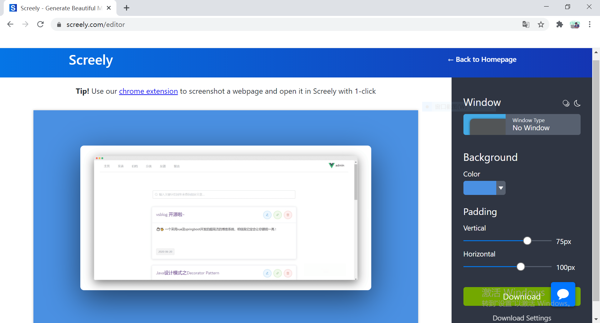
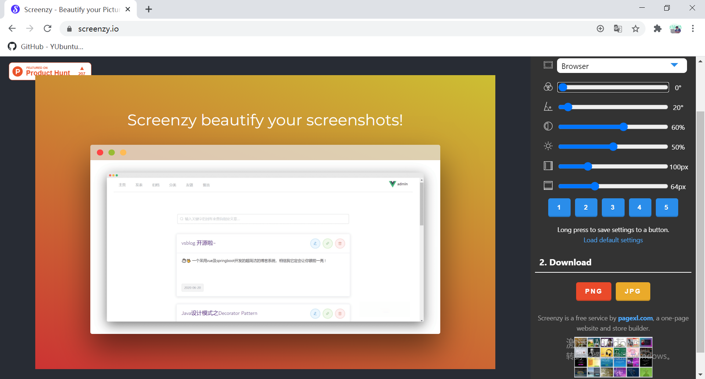

# 以下是一些不错的快速制作图片展示效果的工具，一键转换精美视觉效果，轻松用于专业展示、社交分享等.
*最近学习前后端分离开发模式，于是使用 vue 及 springboot 写了一个简洁的博客系统。为了在 `README.md` 中更好地展示该项目的截图，我在知乎上找到了两款比较好用的截图美化工具，美化后的效果如下 :*

> https://github.com/YUbuntu0109/vsblog

## Screely : https://www.screely.com/

> Screely是由荷兰UI/UX设计师、前端开发人员Jurn制作的一款在线网页展示效果生成工具，支持将你的屏幕截图和设计快速转变成精美的展示模型.
> Screely编辑展示效果支持添加或取消阴影效果、开启/关闭浏览器暗黑模式、不同浏览器窗口、不同窗口样式间进行选择，允许自定义背景颜色及透明背景效果，
> 还可以调整图像周围的填充间距更改展示效果图的尺寸.

## Screenzy : https://screenzy.io/

> Screenzy是另一个简单的图片和截图美化工具，受Screely启发并增加了一些功能，包括：使用字体选择标题、相框、粘贴图像或URL、渐变背景、内存预设等.
> 如果你不希望你的效果图有标题，只需要将标题文字删除为空，导出图时就不会有文字了. 想要删除图像背景，只需要将渐变滑块推到最左侧就可以获得透明背景～

*更多请参考( 本文摘自该篇文章 ) : [这些制作神器，让你的截图上升一个档次](https://zhuanlan.zhihu.com/p/76874920)*
