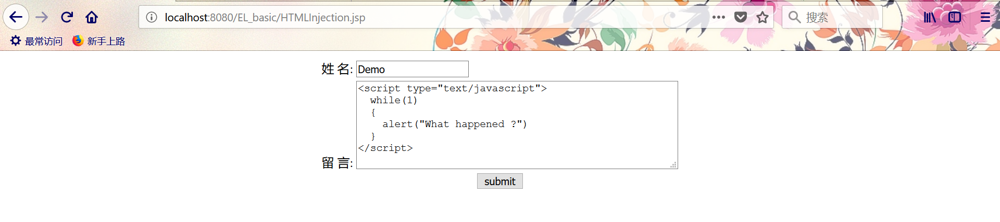

### 学习笔记 : 自定义`EL`函数防止`HTML`注入

#### 防止`HTML`注入前

1. *`JSP`程序代码*
```html
<%@ page language="java" contentType="text/html; charset=UTF-8"
    pageEncoding="UTF-8"%>
<!DOCTYPE html>
<html>
	<head>
		<meta charset="UTF-8">
		<title>`HTML`注入</title>
	</head>
	<body>
		<div align="center">
			<form action="ResultServlet" method="post">
				<table>
					<tr>
						<td>
							姓 名: <input type="text" name="username"/><br>
						</td>
					</tr>
					<tr>
						<td>
							留 言: <textarea rows="6" cols="50" name="message"></textarea><br>
						</td>
					</tr>
				</table>
			    <input type="submit" value="submit"/>
			</form>
		</div>
	</body>
</html>
```

2. *`Servlet`程序代码*
```java
package pers.huangyuhui.el.test;

import java.io.IOException;

import javax.servlet.ServletException;
import javax.servlet.annotation.WebServlet;
import javax.servlet.http.HttpServlet;
import javax.servlet.http.HttpServletRequest;
import javax.servlet.http.HttpServletResponse;

/**
 * @ClassName: ResultServlet
 * @Description: 跳转页面
 * @author: HuangYuhui
 * @date: Apr 21, 2019 3:03:53 PM
 * 
 */
@WebServlet("/ResultServlet")
public class ResultServlet extends HttpServlet {

	private static final long serialVersionUID = 6692198599916433288L;

	@Override
	protected void doPost(HttpServletRequest req, HttpServletResponse resp) throws ServletException, IOException {

		req.setCharacterEncoding("UTF-8");
		String name = req.getParameter("username");
		String message = req.getParameter("message");
		req.setAttribute("name", name);
		req.setAttribute("message", message);
		req.getRequestDispatcher("result.jsp").forward(req, resp);
	}

	@Override
	protected void doGet(HttpServletRequest req, HttpServletResponse resp) throws ServletException, IOException {
		this.doPost(req, resp);
	}

}
```

3. *所跳转的`JSP`页面的程序代码*
```html
<%@ page language="java" contentType="text/html; charset=UTF-8"
    pageEncoding="UTF-8"%>
<!DOCTYPE html>
<html>
	<head>
		<meta charset="UTF-8">
		<title>HTML注入</title>
	</head>
	<body>
		<div align="center">
			用户名: ${name }<br>
			留言内容: ${message }
		</div>
	</body>
</html>
```

4. *运行结果示例图*

- *`JSP`页面*

- *`HTML`注入结果*


#### 防止`HTML`注入后

1. *过滤`HTML`中特殊字符的程序代码*
```java
package pers.huangyuhui.el.util;

/**
 * @ClassName: HTMLFilter
 * @Description: 过滤特殊字符
 * @author: HuangYuhui
 * @date: Apr 21, 2019 3:42:04 PM
 * 
 */
public class HTMLFilter {

	public static String filter(String message) {
		if (message == null) {
			return null;
		}

		// copy
		char content[] = new char[message.length()];
		message.getChars(0, message.length(), content, 0);

		StringBuffer result = new StringBuffer(content.length + 50);
		for (int i = 0; i < content.length; i++) {

			switch (content[i]) {
			case '<':
				result.append("&lt;");
				break;
			case '>':
				result.append("&gt;");
				break;
			case '&':
				result.append("&amp;");
				break;
			case '"':
				result.append("&quot;");
				break;
			default:
				result.append(content[i]);
			}

		}
		return result.toString();
	}
}
```

2. *描述自定义`EL`函数的`mytaglib.tld`文件*
- *`<taglib>`元素是tld文件的根元素,用于声明该JSP文件使用了标签库,不需要对其进行修改,只需要从目录`<Tomacat安装目录>\webapps\examples\WEB-INF\jsp2\jsp2-example-taglib.tld`中复制即可.*

```xml
<?xml version="1.0" encoding="UTF-8"?>

<taglib xmlns="http://java.sun.com/xml/ns/j2ee"
    xmlns:xsi="http://www.w3.org/2001/XMLSchema-instance"
    xsi:schemaLocation="http://java.sun.com/xml/ns/j2ee http://java.sun.com/xml/ns/j2ee/web-jsptaglibrary_2_0.xsd"
    version="2.0">
    
    <description>A tag library exercising SimpleTag handlers.</description>
    <tlib-version>1.0</tlib-version>
    <short-name>SimpleTagLibrary</short-name>
    <uri>https://yubuntu0109.github.io</uri>
    
    <function>
    	<name>filter</name>
    	<function-class>
    		pers.huangyuhui.el.util.HTMLFilter
    	</function-class>
    	<function-signature>
    		java.lang.String filter(java.lang.String)
    	</function-signature>
    </function>
 
</taglib>
```

3. *`JSP`页面的程序代码*
```html
<%@ page language="java" contentType="text/html; charset=UTF-8"
    pageEncoding="UTF-8"%>
<%-- uri: 既tld文件中<uri>元素的内容.  prefix: 为引用的tld文件定义一个"代号"(作为自定义EL函数的前缀) --%>
<%@taglib prefix="demo" uri="https://yubuntu0109.github.io" %>
<!DOCTYPE html>
<html>
	<head>
		<meta charset="UTF-8">
		<title>防止`HTML`注入</title>
	</head>
	<body>
		<div align="center">
			姓名: ${name }<br>
			留言内容: ${demo:filter(message) }
		</div>
	</body>
</html>
```  

4. *运行效果示例图*
