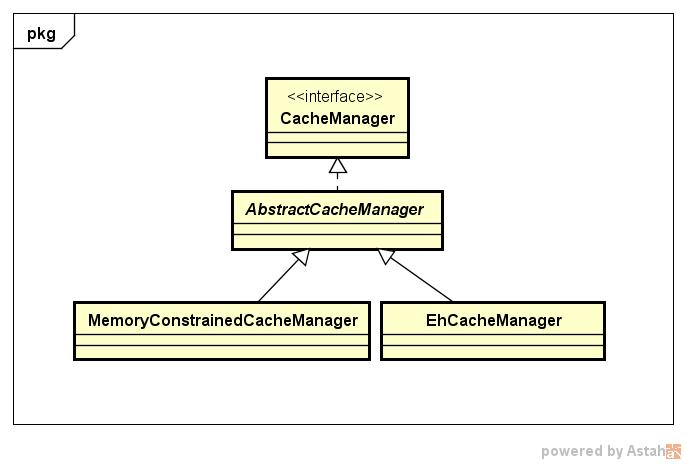

## 学习笔记 : 详解Shiro的缓存机制

### 简介
*Shiro作为一个开源的权限框架,其组件化的设计思想使得开发者可以根据具体业务场景灵活地实现权限管理方案,权限粒度的控制非常方便,Shiro框架的架构图如下所示 :*


*从上图我们可以很清晰地看到,`CacheManager`也是Shiro架构中的主要组件之一,Shiro正是通过CacheManager组件实现权限数据缓存. 
`当权限信息存放在数据库中时,对于每次前端的访问请求都需要进行一次数据库查询`. 特别是在大量使用shiro的jsp标签的场景下,对应前端的一个页面访问请求会同时出现很多的权限查询操作,这对于权限信息变化不是很频繁的场景,每次前端页面访问都进行大量的权限数据库查询是非常不经济的! 因此非常有必要对权限数据使用缓存方案~*


### Shiro权限数据的缓存方式
*关于shiro权限数据的缓存方式,可以分为以下两类 :* 
1. *将权限数据缓存到集中式存储中间件中,比如redis或者memcached*
2. *将权限数据缓存到本地*


### 如何在Shiro中使用缓存
*根据Shiro官方的说法,虽然缓存在权限框架中非常重要,但是如果实现一套完整的缓存机制会使得Shiro偏离了核心的功能(认证和授权). 因此Shiro只提供了一个可以支持具体缓存实现(如 : `Hazelcast`, `Ehcache`, `OSCache`, `Terracotta`, `Coherence`, `GigaSpaces`, `JBossCache` 等)的抽象API接口,这样就允许Shiro用户根据自己的需求灵活地选择具体的CacheManager,当然,其实Shiro也自带了一个本地内存CacheManager(`org.apache.shiro.cache.MemoryConstrainedCacheManager`),Shiro的缓存组件类图如下所示 :*



*从Shiro缓存组件类图可以看到,Shiro提供的缓存抽象API接口正是 : `org.apache.shiro.cache.CacheManager`,那么我们应该如何配置和使用CacheManager呢 ? 如下我们以使用Shiro提供的`MemoryConstrainedCacheManager`组件为例进行说明. 我们知道,SecurityManager是Shiro的核心控制器,我们来看一下其类图 :*


*`org.apache.shiro.mgt.CachingSecurityManager`是Shiro中SecurityManager接口的基础抽象类,我们来看一下其源码结构(如下所示),`发现在CachingSecurityManager中存在一个CacheManager类型的成员变量`*
```java
public abstract class CachingSecurityManager implements SecurityManager, Destroyable, CacheManagerAware, EventBusAware {

    /**
     * The CacheManager to use to perform caching operations to enhance performance.  Can be null.
     */
    private CacheManager cacheManager;

    /**
     * The EventBus to use to use to publish and receive events of interest during Shiro's lifecycle.
     * @since 1.3
     */
    private EventBus eventBus;

    /**
     * Default no-arg constructor that will automatically attempt to initialize a default cacheManager
     */
    public CachingSecurityManager() {
        //use a default event bus:
        setEventBus(new DefaultEventBus());
    }

    // ······
}
```


*另外,接口`org.apache.shiro.realm.Realm`定义了权限数据的存储方式,其类图如下所示 :*


*显然,`org.apache.shiro.realm.CachingRealm`是Shiro中Realm接口的基础实现类,我们同样来看一下其源码结构(如下所示),`发现同样在CachingRealm也存在一个CacheManager类型的成员变量`*
```java
public abstract class CachingRealm implements Realm, Nameable, CacheManagerAware, LogoutAware {

    private static final Logger log = LoggerFactory.getLogger(CachingRealm.class);

    //TODO - complete JavaDoc

    private static final AtomicInteger INSTANCE_COUNT = new AtomicInteger();

    /*--------------------------------------------
    |    I N S T A N C E   V A R I A B L E S    |
    ============================================*/
    private String name;
    private boolean cachingEnabled;
    private CacheManager cacheManager;

    /**
     * Default no-argument constructor that defaults
     * {@link #isCachingEnabled() cachingEnabled} (for general caching) to {@code true} and sets a
     * default {@link #getName() name} based on the class name.
     * <p/>
     * Note that while in general, caching may be enabled by default, subclasses have control over
     * if specific caching is enabled.
     */
    public CachingRealm() {
        this.cachingEnabled = true;
        this.name = getClass().getName() + "_" + INSTANCE_COUNT.getAndIncrement();
    }

    // ······
}
```

#### 总结
*从以上分析我们知道Shiro支持在2个地方定义缓存管理器,既可以在SecurityManager中定义,也可以在Realm中定义,任选其一即可. 通常我们都会自定义Realm实现,例如将权限数据存放在数据库中,那么在Realm实现中定义缓存管理器再合适不过了*

*那么我们不禁要问了 :*
* 第一 : 为什么Shiro要设计成既可以在Realm,也可以在SecurityManager中设置缓存管理器呢 ?
* 第二 : 分别在Realm和SecurityManager定义的缓存管理器,他们有什么区别或联系吗 ?

*怀着种种疑问让我们追踪一下`org.apache.shiro.mgt.RealmSecurityManae`的源码实现,如下所示 :*
```java
public abstract class RealmSecurityManager extends CachingSecurityManager {

    /**
     * Sets the internal {@link #getCacheManager CacheManager} on any internal configured
     * {@link #getRealms Realms} that implement the {@link org.apache.shiro.cache.CacheManagerAware CacheManagerAware} interface.
     * <p/>
     * This method is called after setting a cacheManager on this securityManager via the
     * {@link #setCacheManager(org.apache.shiro.cache.CacheManager) setCacheManager} method to allow it to be propagated
     * down to all the internal Realms that would need to use it.
     * <p/>
     * It is also called after setting one or more realms via the {@link #setRealm setRealm} or
     * {@link #setRealms setRealms} methods to allow these newly available realms to be given the cache manager
     * already in use.
     */
    protected void applyCacheManagerToRealms() {
        CacheManager cacheManager = getCacheManager();
        Collection<Realm> realms = getRealms();
        if (cacheManager != null && realms != null && !realms.isEmpty()) {
            for (Realm realm : realms) {
                if (realm instanceof CacheManagerAware) {
                    ((CacheManagerAware) realm).setCacheManager(cacheManager);
                }
            }
        }
    }

    // ······
}
```

*这下恍然大悟了吧 ! `从源码可以分析出其实在SecurityManager中设置的CacheManager都会给Realm使用,即真正使用CacheManager的组件是Realm`*


*🙏摘自(获益匪浅,非常感谢) : https://www.cnblogs.com/nuccch/p/8044226.html*